# Detection-Engineering

A CI/CD-driven detection engineering pipeline: Sigma rules → Splunk SPL → deployed saved searches → Atomic Red Team validation → verified coverage.

🔍 **[Interactive Rule Browser](https://martonbence.github.io/Detection-Engineering/)** — filterable & sortable rule table (GitHub Pages)

<!-- STATS_START -->
[](https://github.com/martonbence/Detection-Engineering/tree/main/rules)

[](https://github.com/martonbence/Detection-Engineering/tree/main/rules/sigma) [](https://github.com/martonbence/Detection-Engineering/tree/main/rules/splunk)

   

**MITRE ATT&CK Coverage**
![MITRE ATT&CK Coverage](https://quickchart.io/chart?c=%7B%22type%22%3A%22doughnut%22%2C%22data%22%3A%7B%22datasets%22%3A%5B%7B%22data%22%3A%5B11%2C211%5D%2C%22backgroundColor%22%3A%5B%22%23FFAA00%22%2C%22rgba%28128%2C128%2C128%2C0.15%29%22%5D%2C%22borderColor%22%3A%22black%22%2C%22borderWidth%22%3A0.5%7D%5D%7D%2C%22options%22%3A%7B%22rotation%22%3A3.141592653589793%2C%22circumference%22%3A3.141592653589793%2C%22cutoutPercentage%22%3A80%2C%22plugins%22%3A%7B%22legend%22%3A%7B%22display%22%3Afalse%7D%2C%22tooltip%22%3A%7B%22enabled%22%3Afalse%7D%2C%22datalabels%22%3A%7B%22display%22%3Afalse%7D%2C%22doughnutlabel%22%3A%7B%22labels%22%3A%5B%7B%22text%22%3A%22MITRE%20ATT%26CK%20Coverage%22%2C%22color%22%3A%22%23FFAA00%22%2C%22font%22%3A%7B%22size%22%3A18%2C%22weight%22%3A%22bold%22%7D%7D%2C%7B%22text%22%3A%225.0%25%22%2C%22color%22%3A%22%23FFAA00%22%2C%22font%22%3A%7B%22size%22%3A34%2C%22weight%22%3A%22bold%22%7D%7D%2C%7B%22text%22%3A%2211%20/%20222%22%2C%22color%22%3A%22%23FFAA00%22%2C%22font%22%3A%7B%22size%22%3A13%7D%7D%5D%7D%7D%7D%7D&width=500&height=300&f=svg)

**Rules by Severity**
![Rules by Severity](https://quickchart.io/chart?c=%7B%22type%22%3A%22outlabeledPie%22%2C%22backgroundColor%22%3A%22transparent%22%2C%22data%22%3A%7B%22labels%22%3A%5B%22Critical%22%2C%22High%22%2C%22Medium%22%5D%2C%22datasets%22%3A%5B%7B%22backgroundColor%22%3A%5B%22%237B0000%22%2C%22%23DC2626%22%2C%22%23FFAA00%22%5D%2C%22borderColor%22%3A%22black%22%2C%22borderWidth%22%3A0.5%2C%22hoverOffset%22%3A8%2C%22data%22%3A%5B9%2C8%2C3%5D%7D%5D%7D%2C%22options%22%3A%7B%22cutoutPercentage%22%3A45%2C%22layout%22%3A%7B%22padding%22%3A%7B%22top%22%3A5%2C%22right%22%3A30%2C%22bottom%22%3A0%2C%22left%22%3A30%7D%7D%2C%22plugins%22%3A%7B%22legend%22%3Afalse%2C%22outlabels%22%3A%7B%22text%22%3A%22%25l%3A%20%25v%20%28%25p%29%22%2C%22color%22%3A%22white%22%2C%22backgroundColor%22%3A%22rgba%2885%2C%2085%2C%2085%2C1%29%22%2C%22lineColor%22%3A%22rgba%2885%2C%2085%2C%2085%2C1%29%22%2C%22borderRadius%22%3A13%2C%22padding%22%3A6%2C%22stretch%22%3A20%2C%22font%22%3A%7B%22weight%22%3A%22bold%22%2C%22resizable%22%3Atrue%2C%22minSize%22%3A12%2C%22maxSize%22%3A22%7D%2C%22formatter%22%3A%22%28value%29%20%3D%3E%20value%20%3E%200%20%3F%20value%20%3A%20null%22%7D%7D%7D%7D&width=500&height=300&f=svg)

**Rules per MITRE ATT&CK Tactic**
![Rules per MITRE ATT&CK Tactic](https://quickchart.io/chart?c=%7B%22type%22%3A%22horizontalBar%22%2C%22data%22%3A%7B%22labels%22%3A%5B%22Execution%22%2C%22Stealth%22%2C%22Credential%20Access%22%2C%22Persistence%22%2C%22Defense%20Impairment%22%2C%22Command%20%26%20Control%22%2C%22Initial%20Access%22%5D%2C%22datasets%22%3A%5B%7B%22label%22%3A%22Rules%22%2C%22data%22%3A%5B14%2C8%2C6%2C2%2C2%2C1%2C1%5D%2C%22backgroundColor%22%3A%22%23FFAA00%22%2C%22borderColor%22%3A%22black%22%2C%22borderWidth%22%3A0.5%7D%5D%7D%2C%22options%22%3A%7B%22scales%22%3A%7B%22xAxes%22%3A%5B%7B%22display%22%3Afalse%2C%22gridLines%22%3A%7B%22display%22%3Afalse%2C%22drawOnChartArea%22%3Afalse%2C%22drawBorder%22%3Afalse%7D%2C%22ticks%22%3A%7B%22display%22%3Afalse%2C%22beginAtZero%22%3Atrue%7D%7D%5D%2C%22yAxes%22%3A%5B%7B%22display%22%3Atrue%2C%22position%22%3A%22left%22%2C%22gridLines%22%3A%7B%22display%22%3Afalse%2C%22drawOnChartArea%22%3Afalse%2C%22drawBorder%22%3Afalse%7D%2C%22ticks%22%3A%7B%22fontColor%22%3A%22%23FFAA00%22%7D%7D%5D%7D%2C%22legend%22%3A%7B%22display%22%3Afalse%7D%2C%22plugins%22%3A%7B%22datalabels%22%3A%7B%22anchor%22%3A%22end%22%2C%22align%22%3A%22start%22%2C%22color%22%3A%22black%22%2C%22font%22%3A%7B%22size%22%3A12%2C%22weight%22%3A%22bold%22%7D%7D%7D%7D%7D&width=500&height=322&f=svg)

🗺️ Interactive MITRE Navigator → [GitHub Pages](https://martonbence.github.io/Detection-Engineering/#navigator)

📋 Full rule index → [rules/RULE_SUMMARY.md](https://github.com/martonbence/Detection-Engineering/blob/main/rules/RULE_SUMMARY.md)

*Generated at 2026-06-27T11:19:47 UTC*
<!-- STATS_END -->

---

## 🏗️ How the Pipeline Works

Every detection rule in this repository goes through a fully automated pipeline the moment it lands on `main`. No manual steps, no one-off scripts — push a rule, get a deployed, tested, and documented saved search in Splunk, with the result committed back to the repo.

Two parallel workflows handle two rule types:

| Workflow | Trigger path | Rule format |
|---|---|---|
| `ci_sigma_to_splunk_workflow.yml` | `rules/sigma/**/*.yml` | MITRE Sigma YAML |
| `ci_native_spl_workflow.yml` | `rules/splunk/**/*.spl` *(not `.sigma.spl`)* | Native Splunk SPL |

Both workflows share the same end goal — deploy to Splunk, fire an attack simulation, verify the alert fired, commit the result — but differ in the conversion and validation steps at the start.

---

## 🗺️ Pipeline Flow

```mermaid
flowchart TD
    classDef trigger  fill:#1f6feb,stroke:#388bfd,color:#fff,font-weight:bold
    classDef ubuntu   fill:#21262d,stroke:#388bfd,color:#cae8ff,font-weight:bold
    classDef delab    fill:#0d2035,stroke:#58a6ff,color:#cae8ff,font-weight:bold
    classDef windows  fill:#2d1f3e,stroke:#8b5cf6,color:#ddd6fe,font-weight:bold
    classDef script   fill:#161b22,stroke:#484f58,color:#adbac7
    classDef artifact fill:#1c2128,stroke:#e3b341,color:#f0d06c
    classDef splunk   fill:#2b1400,stroke:#ff6600,color:#ffb380,font-weight:bold
    classDef commit   fill:#1a4731,stroke:#2ea043,color:#aff3c5
    classDef pages    fill:#1a1a0a,stroke:#FFAA00,color:#ffd966,font-weight:bold

    SigmaPush["🔀 git push\nrules/sigma/**.yml"]:::trigger
    NativePush["🔀 git push\nrules/splunk/**.spl"]:::trigger

    %% ── SIGMA WORKFLOW ──────────────────────────────────────────
    subgraph SW[" ⚙️  ci_sigma_to_splunk_workflow.yml "]
        direction TB

        subgraph J1["🐧  Job 1 · prepare_validate_convert · ubuntu-latest"]
            direction TB
            s1["🔍 Detect changed .yml files\n(changed only, or all on schema change)"]:::script
            s2["✅ validate_sigma.py\nJSON Schema Draft-07 validation\nmax 25 errors reported"]:::script
            s3["🔄 sigma_to_spl.py  ·  pySigma splunk backend\npipeline: sysmon → splunk_sysmon_acceleration\n         security → splunk_windows\nInjects META block + index prefix"]:::script
            s4["💾 Commit: rules/splunk/*.sigma.spl\n`chore(splunk): update sigma-converted SPL outputs`"]:::commit
            s5["📦 Artifact: spl-pipeline-bundle"]:::artifact
            s1 --> s2 --> s3 --> s4 --> s5
        end

        subgraph J2["🖥️  Job 2 · deploy_to_splunk · de-lab self-hosted"]
            direction TB
            d1["⬇️ Download spl-pipeline-bundle"]:::script
            d2["🚀 deploy_spl_to_splunk.py\nSplunk REST API  ·  POST /saved/searches\nCreate or Update saved search\nSet ACL: read=* write=admin,ci_deploy_savedsearches\nalert mode: cron + trigger on events > 0"]:::splunk
            d1 --> d2
        end

        subgraph J3A["🪟  Job 3 · atomic_verify · windows-victim self-hosted"]
            direction TB
            a1["⬇️ Download bundle"]:::script
            a2["🧪 run_atomic.ps1\nAtomic Red Team  ·  type: atomic\nPreflight check → full execution\nRuns per-rule T*/test_number atomics"]:::windows
            a1 --> a2
        end

        subgraph J3B["🪟  Job 4 · emulation_verify · windows-victim self-hosted"]
            direction TB
            e1["⬇️ Download bundle"]:::script
            e2["🎭 run_atomic.ps1\nScript emulation  ·  type: emulation\nCustom payload execution"]:::windows
            e1 --> e2
        end

        subgraph J4["🖥️  Job 5 · splunk_verify · de-lab self-hosted"]
            direction TB
            v1["⏱️ Wait for Splunk indexing\ndefault: 60 seconds"]:::script
            v2["🔎 check_saved_search_hits.py\nDispatch each saved search via REST\nPoll until DONE · collect events\nWrite hits.json per detect_id"]:::script
            v3["⚖️ pass_fail_eval.py\nPASS: 1 ≤ event_count ≤ 10\nFAIL: outside range or error\nWrite result.json per detect_id"]:::script
            v4["📊 generate_stats.py\nAggregate all results\nUpdate README · RULE_SUMMARY\ndocs/index.html · navigator_layer.json"]:::script
            v5["💾 Commit: outputs/results/  outputs/reports/\nREADME.md  docs/index.html\n`chore(verify): update verification results and stats`"]:::commit
            v1 --> v2 --> v3 --> v4 --> v5
        end

        J1 --> J2
        J2 --> J3A & J3B
        J3A & J3B --> J4
    end

    %% ── NATIVE SPL WORKFLOW ─────────────────────────────────────
    subgraph NW[" ⚙️  ci_native_spl_workflow.yml "]
        direction TB

        subgraph N1["🐧  Job 1 · prepare_validate_bundle · ubuntu-latest"]
            direction TB
            ns1["🔍 Detect changed native .spl files\n(excludes *.sigma.spl)"]:::script
            ns2["✅ validate_spl.py\nMETA JSON block  ·  Schema Draft-07\nmax 25 errors reported"]:::script
            ns3["🔧 update_spl_meta.py\nFrissíti: git_sha · rule_version · convert_time"]:::script
            ns4["💾 Commit: META updates\n`chore(native spl): update META git_sha/rule_version`"]:::commit
            ns5["📦 Artifact: spl-pipeline-bundle-native"]:::artifact
            ns1 --> ns2 --> ns3 --> ns4 --> ns5
        end

        subgraph N2["🖥️  Job 2 · deploy_to_splunk · de-lab self-hosted"]
            direction TB
            nd1["⬇️ Download bundle"]:::script
            nd2["🚀 deploy_spl_to_splunk.py\nSplunk REST API — azonos logika\na Sigma workflow-val"]:::splunk
            nd1 --> nd2
        end

        subgraph N3["🪟  Job 3 · atomic_verify · windows-victim self-hosted"]
            direction TB
            na1["⬇️ Download bundle"]:::script
            na2["🧪 run_atomic.ps1\nAtomic Red Team tests"]:::windows
            na1 --> na2
        end

        subgraph N4["🖥️  Job 4 · splunk_verify · de-lab self-hosted"]
            direction TB
            nv1["⏱️ Wait (60s)"]:::script
            nv2["🔎 check_saved_search_hits.py"]:::script
            nv3["⚖️ pass_fail_eval.py"]:::script
            nv4["📊 generate_stats.py"]:::script
            nv5["💾 Commit results + docs"]:::commit
            nv1 --> nv2 --> nv3 --> nv4 --> nv5
        end

        N1 --> N2 --> N3 --> N4
    end

    %% ── PAGES ───────────────────────────────────────────────────
    subgraph PG["🐧  Job · deploy_pages · ubuntu-latest"]
        direction LR
        p1["📤 Upload docs/ directory"]:::script
        p2["🌐 GitHub Pages\nmartonbence.github.io/Detection-Engineering\nInteractive rule browser + MITRE Navigator"]:::pages
        p1 --> p2
    end

    SigmaPush --> J1
    NativePush --> N1
    J4  --> PG
    N4  --> PG
```



---

## 🔵 Workflow 1 — Sigma to Splunk

**File:** `.github/workflows/ci_sigma_to_splunk_workflow.yml`
**Trigger:** push / PR on `rules/sigma/**`, `scripts/validate/**`, `scripts/convert/sigma_to_spl.py`, `scripts/deploy/**`, `scripts/verify/**`, `docs/schemas/sigma_schema.json`

### Job 1 · `prepare_validate_convert` · `ubuntu-latest`

The brain of the Sigma pipeline. Runs on every push.

**Smart change detection:** compares `BASE_SHA` → `HEAD_SHA` and only processes files that actually changed. If the schema or validation scripts are modified, it falls back to `mode=all` and revalidates every rule in the repo.

| Step | What happens |
|---|---|
| Detect changes | Git diff extracts changed `.yml` files from `rules/sigma/` |
| Install deps | `pyyaml jsonschema sigma-cli pysigma-backend-splunk` |
| **Validate** | `validate_sigma.py` checks every rule against `docs/schemas/sigma_schema.json` (JSON Schema Draft-07) — max 25 errors, exits 1 on failure |
| **Convert** | `sigma_to_spl.py` calls `sigma convert -t splunk`, selects pipeline by `logsource.service`, injects index prefix, prepends META block |
| Commit SPL | Pushes `rules/splunk/*.sigma.spl` with `[skip ci]` tag — 3 retries |
| Bundle | Copies SPL + scripts into `pipeline_bundle/`, uploads as artifact `spl-pipeline-bundle` |

**Sigma pipeline selection:**

| `logsource.service` | pySigma pipeline |
|---|---|
| `sysmon` | `splunk_sysmon_acceleration` |
| `security` | `splunk_windows` |
| anything else | *(no pipeline)* |

### Job 2 · `deploy_to_splunk` · `de-lab` self-hosted runner

Downloads the artifact and calls `deploy_spl_to_splunk.py`. For each rule:

1. Extracts the META block and SPL query (everything after `---`)
2. `POST /servicesNS/{owner}/{app}/saved/searches` — creates the saved search
3. On 409 conflict: `POST /saved/searches/{name}` — updates it
4. `POST /saved/searches/{name}/acl` — sets `read=*`, `write=admin,ci_deploy_savedsearches`

**Deployment modes** (set via `custom.splunk.mode` in the Sigma rule):

| Mode | Splunk behavior |
|---|---|
| `alert` | Scheduled by cron, fires alert when `events > 0` |
| `report` | Not scheduled, manual query only |

**Severity mapping** (Sigma → Splunk alert severity):

| Sigma | Splunk |
|---|---|
| `low` | 2 |
| `medium` | 3 |
| `high` | 4 |
| `critical` | 5 |

### Job 3 · `atomic_verify` · `windows-victim` self-hosted runner

Runs only if `custom.testing.type: atomic` is set on at least one rule. Executes `run_atomic.ps1` in two phases:
1. **Preflight** (`-PreflightOnly`) — checks prerequisites, installs missing modules
2. **Full execution** — runs the specified Atomic Red Team test numbers against the live victim VM

The atomics to run are defined per-rule in `custom.testing.atomics`:
```yaml
atomics:
  - technique: T1003.003
    test_numbers: [2, 3, 6, 7]
```

### Job 4 · `emulation_verify` · `windows-victim` self-hosted runner

Runs only if `custom.testing.type: emulation`. Same runner, but executes custom script payloads instead of Atomic Red Team.

### Job 5 · `splunk_verify` · `de-lab` self-hosted runner

The verdict job. Runs after both test jobs complete (even on failure).

| Step | Detail |
|---|---|
| Wait | `SPLUNK_VERIFY_WAIT_SECONDS` (default: 60s) — gives Splunk time to index events from the attack |
| **Query** | `check_saved_search_hits.py` dispatches each saved search via REST, polls until `DONE`, collects matched events → `hits.json` |
| **Evaluate** | `pass_fail_eval.py` applies verdict: **PASS** if `1 ≤ event_count ≤ 10`, **FAIL** otherwise — writes `result.json` |
| **Document** | `generate_stats.py` regenerates all documentation from the aggregated results |
| Commit | Results + docs committed with `[skip ci]` tag — race-condition-safe via snapshot + `reset --hard` + re-stat strategy |

### Job 6 · `deploy_pages` · `ubuntu-latest`

Runs after `splunk_verify` completes. Uploads `docs/` to GitHub Pages → `martonbence.github.io/Detection-Engineering`.

---

## 🟠 Workflow 2 — Native SPL

**File:** `.github/workflows/ci_native_spl_workflow.yml`
**Trigger:** push / PR on `rules/splunk/**/*.spl` *(excluding `*.sigma.spl`)*, `scripts/validate/validate_spl.py`, `scripts/docs/update_spl_meta.py`, `docs/schemas/spl_schema.json`

Structurally identical to the Sigma workflow, but with a different first job:

### Job 1 · `prepare_validate_bundle` · `ubuntu-latest`

| Step | What happens |
|---|---|
| Detect changes | Git diff extracts changed native `.spl` files (`.sigma.spl` explicitly excluded) |
| **Validate** | `validate_spl.py` extracts the `META_START … META_END` JSON block and validates it against `docs/schemas/spl_schema.json` |
| **Update META** | `update_spl_meta.py` refreshes `git_sha`, `rule_version`, and `convert_time` in-place |
| Commit | Pushes updated META fields — 3 retries |
| Bundle | Uploads as `spl-pipeline-bundle-native` |

Remaining jobs (`deploy_to_splunk`, `atomic_verify`, `splunk_verify`, `deploy_pages`) are functionally identical to the Sigma workflow.

---

## 📁 Repository Structure

```
Detection-Engineering/
│
├── rules/
│   ├── sigma/                          # Source of truth: Sigma rules
│   │   └── DETECT-YYYY-NNNN_*.sigma.yml
│   ├── splunk/                         # Generated + native SPL
│   │   ├── DETECT-YYYY-NNNN_*.sigma.spl    # Auto-generated by CI (do not edit)
│   │   └── DETECT-YYYY-NNNN_*.spl          # Native SPL rules (hand-written)
│   └── RULE_SUMMARY.md                 # Auto-generated rule index
│
├── docs/
│   ├── index.html                      # Auto-generated GitHub Pages dashboard
│   └── schemas/
│       ├── sigma_schema.json           # JSON Schema for Sigma YAML validation
│       └── spl_schema.json             # JSON Schema for SPL META block validation
│
├── outputs/
│   ├── reports/
│   │   ├── stats.json                  # Live stats (used by shields.io badges)
│   │   ├── navigator_layer.json        # MITRE Navigator layer
│   │   └── mitre_technique_map.json    # Cached MITRE STIX data (7-day TTL)
│   └── results/
│       └── DETECT-YYYY-NNNN/
│           └── result.json             # Per-rule verdict (PASS/FAIL, event_count)
│
├── scripts/
│   ├── convert/
│   │   └── sigma_to_spl.py             # Sigma → SPL conversion + META injection
│   ├── deploy/
│   │   └── deploy_spl_to_splunk.py     # Splunk REST API deployment
│   ├── validate/
│   │   ├── validate_sigma.py           # Sigma YAML schema validation
│   │   ├── validate_spl.py             # SPL META schema validation
│   │   └── validate_sigma.ps1          # PowerShell wrapper for CI
│   ├── verify/
│   │   ├── check_saved_search_hits.py  # Dispatch + collect Splunk results
│   │   └── pass_fail_eval.py           # PASS/FAIL verdict logic
│   ├── docs/
│   │   ├── generate_stats.py           # Main doc generator (README, HTML, Navigator)
│   │   └── update_spl_meta.py          # Native SPL META field updater
│   └── atomic/
│       └── run_atomic.ps1              # Atomic Red Team + emulation runner
│
├── mitre_obsidian/                     # Obsidian vault: MITRE ATT&CK notes
│
└── .github/
    └── workflows/
        ├── ci_sigma_to_splunk_workflow.yml
        └── ci_native_spl_workflow.yml
```

---

## 🛠️ Scripts Reference

| Script | Runner | Inputs | Outputs |
|---|---|---|---|
| `validate_sigma.py` | ubuntu | `rules/sigma/*.yml`, `docs/schemas/sigma_schema.json` | stdout pass/fail, exit code |
| `sigma_to_spl.py` | ubuntu | Sigma YAML files, Git history, `$GITHUB_SHA` | `rules/splunk/*.sigma.spl` |
| `validate_spl.py` | ubuntu | `rules/splunk/*.spl`, `docs/schemas/spl_schema.json` | stdout pass/fail, exit code |
| `update_spl_meta.py` | ubuntu | Native `.spl` files | Updated `git_sha`, `rule_version`, `convert_time` in-place |
| `deploy_spl_to_splunk.py` | de-lab | SPL files from bundle, `SPLUNK_*` env vars | Splunk saved searches via REST API |
| `run_atomic.ps1` | windows-victim | SPL files (for test metadata), `ATOMIC_*` env vars | Attack simulation on victim host |
| `check_saved_search_hits.py` | de-lab | SPL file names, `SPLUNK_*` env vars | `outputs/verify/*/hits.json` |
| `pass_fail_eval.py` | de-lab | `hits.json` per rule, `--min-pass 1 --max-pass 10` | `outputs/results/*/result.json`, `$GITHUB_STEP_SUMMARY` |
| `generate_stats.py` | de-lab / local | All rules, all `result.json` files, MITRE STIX API | `README.md`, `RULE_SUMMARY.md`, `docs/index.html`, `stats.json`, `navigator_layer.json` |

---

## 🖥️ Runners & Environments

| Label | Type | Role |
|---|---|---|
| `ubuntu-latest` | GitHub-hosted | Validation, conversion, artifact packaging, Pages deploy |
| `de-lab` | Self-hosted Linux | Splunk deployment and verification (network access to Splunk instance) |
| `windows-victim` | Self-hosted Windows | Attack simulation — Atomic Red Team and emulation payloads |

---

## 🔐 Secrets & Variables

### Required secrets (GitHub Actions → Settings → Secrets)

| Secret | Used by | Description |
|---|---|---|
| `SPLUNK_BASE_URL` | `deploy_spl_to_splunk.py`, `check_saved_search_hits.py` | Splunk instance base URL |
| `SPLUNK_USERNAME` | same | Splunk user account |
| `SPLUNK_PASSWORD` | same | Splunk user password |
| `SPLUNK_APP` | same | Target Splunk app context |
| `SPLUNK_OWNER` | same | Splunk owner namespace |
| `SPLUNK_VERIFY_TLS` | same | TLS cert verification (`true`/`false`, default: `false`) |

### Optional variables

| Variable | Default | Description |
|---|---|---|
| `ATOMIC_RED_TEAM_MODULE_PATH` | — | Path to ART PowerShell module on windows-victim |
| `ATOMIC_RED_TEAM_PATH` | — | Path to Atomic Red Team repository on windows-victim |
| `ATOMIC_DISABLE_REALTIME_MONITORING` | `true` | Disable Windows Defender real-time protection during tests |
| `SPLUNK_VERIFY_WAIT_SECONDS` | `60` | Seconds to wait before querying Splunk after attack simulation |

---

## ⚡ Key Pipeline Behaviors

**Smart incremental processing** — On each push, the pipeline only processes files that changed in that commit. If the schema or validation scripts change, it automatically falls back to reprocessing all rules.

**Retry logic** — Every git commit step retries up to 3 times with increasing sleep (2s, 4s, 6s) to handle concurrent runs pushing to the same branch.

**Race-condition-safe commits** — The `splunk_verify` job uses a snapshot strategy: it saves results locally, resets to `origin/main`, overlays the fresh results, re-runs `generate_stats.py` to aggregate everything, then commits. This ensures multiple concurrent runs don't overwrite each other's verdicts.

**Concurrency control** — Both workflows share the concurrency group `detection-pipeline-${{ github.ref }}`, so only one pipeline per branch runs at a time.

**`[skip ci]` commits** — All automated commits (SPL outputs, META updates, results, docs) include `[skip ci]` in the message to prevent infinite trigger loops.

**Persistent verdicts** — `outputs/results/` is committed to the repository. Every rule's last known PASS/FAIL result survives across runs and is always available to `generate_stats.py` without querying Splunk.
