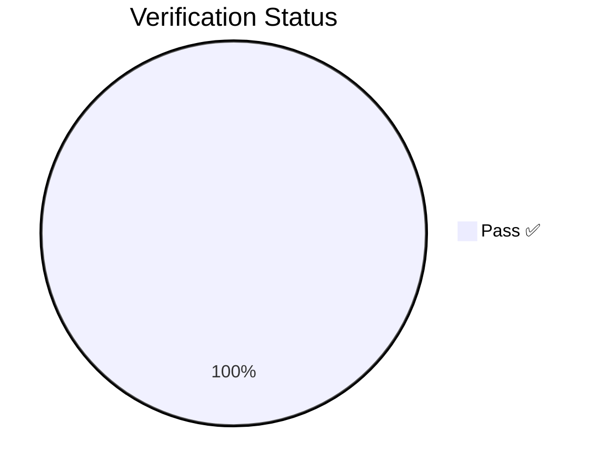
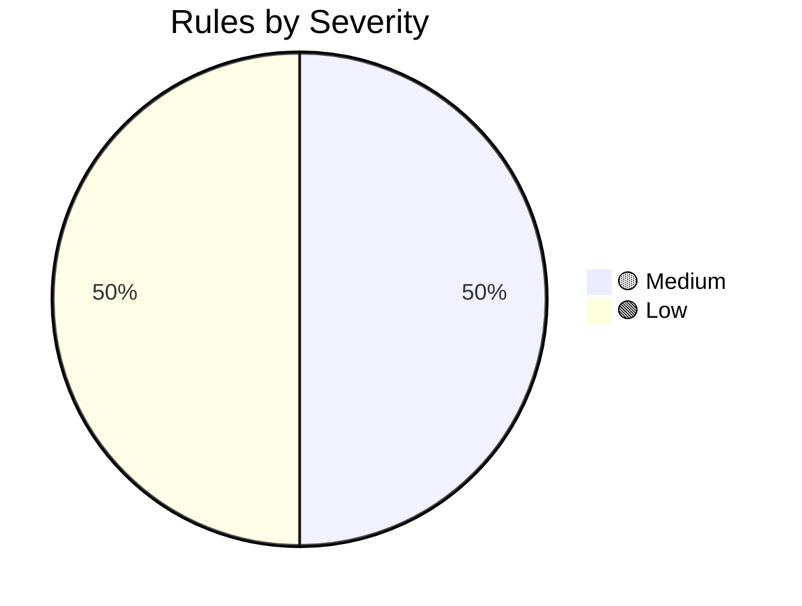
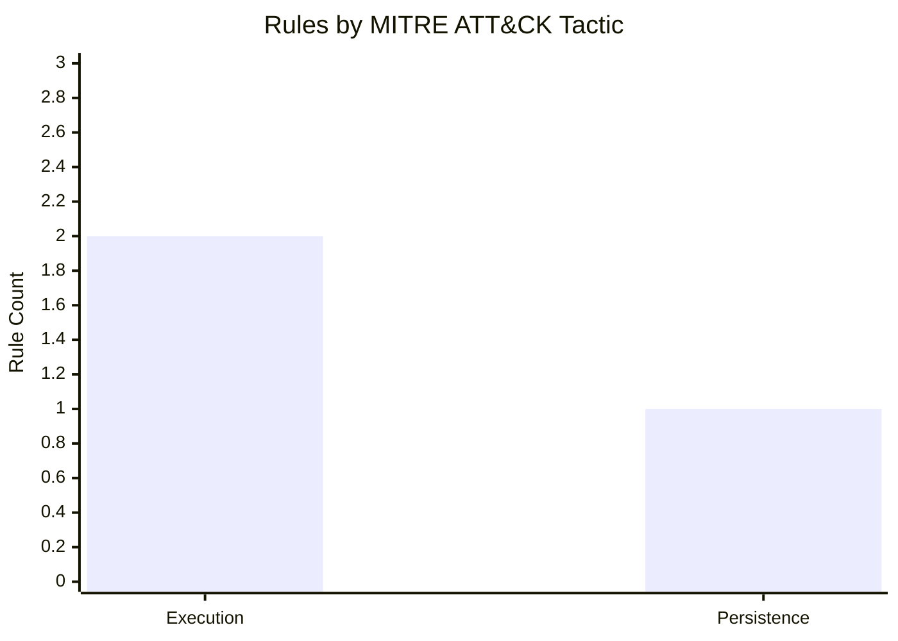

# Detection-Engineering

A CI/CD-driven detection engineering pipeline: Sigma rules → Splunk SPL → deployed saved searches → Atomic Red Team validation → verified coverage.

<!-- STATS_START -->
    

| ID | Title | Severity | Status | Verdict |
|:---|:------|:--------:|:------:|:-------:|
| `DETECT-2026-0004` | Test Sigma Rule | 🟢 Low | test | ✅ PASS |
| `DETECT-2026-0005` | Scheduled Task Creation via schtasks.exe | 🟡 Medium | test | ✅ PASS |

*Generated at 2026-04-17T11:20:02 UTC*
<!-- STATS_END -->
