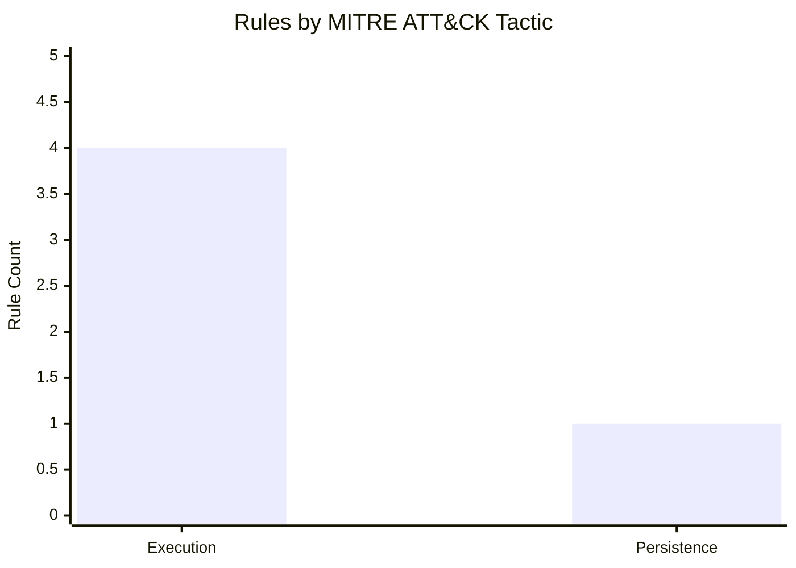

# Detection-Engineering

A CI/CD-driven detection engineering pipeline: Sigma rules → Splunk SPL → deployed saved searches → Atomic Red Team validation → verified coverage.

🔍 **[Interactive Rule Browser](https://martonbence.github.io/Detection-Engineering/)** — filterable & sortable rule table (GitHub Pages)

<!-- STATS_START -->

 

   

**Rules by Severity**

📋 Full rule index → [rules/RULE_SUMMARY.md](https://github.com/martonbence/Detection-Engineering/blob/main/rules/RULE_SUMMARY.md)

*Generated at 2026-04-18T09:39:59 UTC*
<!-- STATS_END -->
