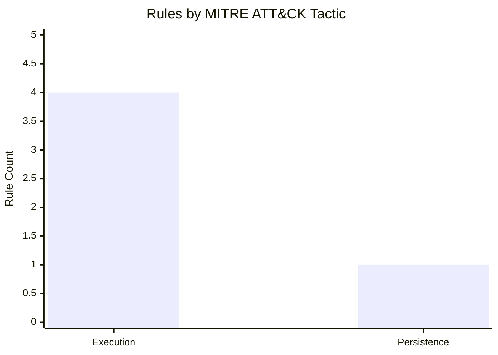

# Detection-Engineering

A CI/CD-driven detection engineering pipeline: Sigma rules → Splunk SPL → deployed saved searches → Atomic Red Team validation → verified coverage.

🔍 **[Interactive Rule Browser](https://martonbence.github.io/Detection-Engineering/)** — filterable & sortable rule table (GitHub Pages)

<!-- STATS_START -->

 

   

**MITRE ATT&CK Coverage**
![MITRE ATT&CK Coverage](https://quickchart.io/chart?c=%7Btype%3A%27doughnut%27%2Cdata%3A%7Bdatasets%3A%5B%7Bdata%3A%5B2%2C214%5D%2CbackgroundColor%3A%5B%27%237B0000%27%2C%27rgba%28128%2C128%2C128%2C0.15%29%27%5D%2CborderColor%3A%27black%27%2CborderWidth%3A0.5%2CborderRadius%3A10%2Cspacing%3A1%7D%5D%7D%2Coptions%3A%7Brotation%3AMath.PI%2Ccircumference%3AMath.PI%2CcutoutPercentage%3A80%2Cplugins%3A%7Blegend%3A%7Bdisplay%3Afalse%7D%2Ctooltip%3A%7Benabled%3Afalse%7D%2Cdatalabels%3A%7Bdisplay%3Afalse%7D%7D%7D%2Cplugins%3A%5B%7BafterDraw%3Afunction%28c%29%7Bvar%20ctx%3Dc.ctx%2Ccx%3D%28c.chartArea.left%2Bc.chartArea.right%29/2%2Ccy%3D%28c.chartArea.top%2Bc.chartArea.bottom%29/2%3Bvar%20labels%3D%5B%7Bt%3A%27MITRE%20ATT%5Cu0026CK%20Coverage%27%2Cs%3A16%2Cb%3Afalse%2Cdy%3A-52%7D%2C%7Bt%3A%270.9%25%27%2Cs%3A34%2Cb%3Atrue%2Cdy%3A2%7D%2C%7Bt%3A%272%20/%20216%27%2Cs%3A13%2Cb%3Afalse%2Cdy%3A53%7D%5D%3Blabels.forEach%28function%28l%29%7Bctx.save%28%29%3Bctx.font%3D%28l.b%3F%27bold%20%27%3A%27%27%29%2Bl.s%2B%27px%20sans-serif%27%3Bvar%20tw%3Dctx.measureText%28l.t%29.width%2Cp%3D8%2Cr%3D13%2Crx%3Dcx-tw/2-p%2Cry%3Dcy%2Bl.dy-l.s%2A0.65-p%2Crw%3Dtw%2Bp%2A2%2Crh%3Dl.s%2A1.3%2Bp%2A2%3Bctx.fillStyle%3D%27rgba%2885%2C85%2C85%2C1%29%27%3Bctx.beginPath%28%29%3Bctx.moveTo%28rx%2Br%2Cry%29%3Bctx.lineTo%28rx%2Brw-r%2Cry%29%3Bctx.quadraticCurveTo%28rx%2Brw%2Cry%2Crx%2Brw%2Cry%2Br%29%3Bctx.lineTo%28rx%2Brw%2Cry%2Brh-r%29%3Bctx.quadraticCurveTo%28rx%2Brw%2Cry%2Brh%2Crx%2Brw-r%2Cry%2Brh%29%3Bctx.lineTo%28rx%2Br%2Cry%2Brh%29%3Bctx.quadraticCurveTo%28rx%2Cry%2Brh%2Crx%2Cry%2Brh-r%29%3Bctx.lineTo%28rx%2Cry%2Br%29%3Bctx.quadraticCurveTo%28rx%2Cry%2Crx%2Br%2Cry%29%3Bctx.closePath%28%29%3Bctx.fill%28%29%3Bctx.fillStyle%3D%27white%27%3Bctx.textAlign%3D%27center%27%3Bctx.textBaseline%3D%27middle%27%3Bctx.fillText%28l.t%2Ccx%2Ccy%2Bl.dy%29%3Bctx.restore%28%29%3B%7D%29%3B%7D%7D%5D%7D&width=500&height=300&f=svg)

**Rules by Severity**
![Rules by Severity](https://quickchart.io/chart?c=%7B%22type%22%3A%22outlabeledPie%22%2C%22backgroundColor%22%3A%22transparent%22%2C%22data%22%3A%7B%22labels%22%3A%5B%22Critical%22%2C%22High%22%2C%22Medium%22%2C%22Low%22%5D%2C%22datasets%22%3A%5B%7B%22backgroundColor%22%3A%5B%22%237B0000%22%2C%22%23DC2626%22%2C%22%23FFAA00%22%2C%22%232EA44F%22%5D%2C%22borderColor%22%3A%22black%22%2C%22borderWidth%22%3A0.5%2C%22hoverOffset%22%3A8%2C%22data%22%3A%5B1%2C1%2C1%2C1%5D%7D%5D%7D%2C%22options%22%3A%7B%22cutoutPercentage%22%3A45%2C%22layout%22%3A%7B%22padding%22%3A%7B%22top%22%3A5%2C%22right%22%3A30%2C%22bottom%22%3A0%2C%22left%22%3A30%7D%7D%2C%22plugins%22%3A%7B%22legend%22%3Afalse%2C%22outlabels%22%3A%7B%22text%22%3A%22%25l%3A%20%25v%20%28%25p%29%22%2C%22color%22%3A%22white%22%2C%22backgroundColor%22%3A%22rgba%2885%2C%2085%2C%2085%2C1%29%22%2C%22lineColor%22%3A%22rgba%2885%2C%2085%2C%2085%2C1%29%22%2C%22borderRadius%22%3A13%2C%22padding%22%3A6%2C%22stretch%22%3A20%2C%22font%22%3A%7B%22weight%22%3A%22bold%22%2C%22resizable%22%3Atrue%2C%22minSize%22%3A12%2C%22maxSize%22%3A22%7D%2C%22formatter%22%3A%22%28value%29%20%3D%3E%20value%20%3E%200%20%3F%20value%20%3A%20null%22%7D%7D%7D%7D&width=500&height=300&f=svg)

📋 Full rule index → [rules/RULE_SUMMARY.md](https://github.com/martonbence/Detection-Engineering/blob/main/rules/RULE_SUMMARY.md)

*Generated at 2026-04-25T07:37:27 UTC*
<!-- STATS_END -->
