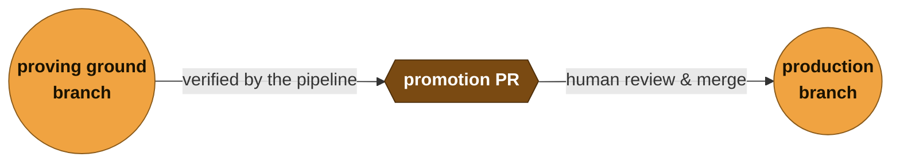

# Detection-Engineering

*<small>What isn't proven is assumption.</small>*

<!-- STATS_START -->

 

    
<!-- STATS_END -->

## The live picture

Generated views of where the rule library actually stands right now — regenerated and published by both the `dev` and `prod` workflows, and recomputed against the current date on every load.

<table>
<tr>
<td></td>
<td><strong><a href="https://martonbence.github.io/Detection-Engineering/">Rule Browser</a></strong> Every rule in the repo — searchable, filterable, sortable, each carrying the verdict the pipeline last measured for it.</td>
</tr>
<tr>
<td></td>
<td><strong><a href="https://martonbence.github.io/Detection-Engineering/#tab=navigator">MITRE Navigator</a></strong> The coverage and the gaps, laid over the full ATT&amp;CK matrix — and exportable straight into MITRE's own Navigator.</td>
</tr>
<tr>
<td></td>
<td><strong><a href="https://martonbence.github.io/Detection-Engineering/#tab=dashboards">Dashboards</a></strong> The big-picture view of the detection program — what the library adds up to today, and how it got there.</td>
</tr>
</table>

## Under the hood

When the live views prompt a "but how?", these go down to the mechanics — every stage, the artefacts that move between them, the threat model, and a per-file map of the pipeline.

<table>
<tr>
<td></td>
<td><strong><a href="docs/architecture/">Architecture</a></strong> How every moving part actually works, in prose and diagrams — from a Sigma file to a prod deploy.</td>
</tr>
</table>

## The team behind it

This repo is maintained largely by a small team of scoped AI agents under a human lead — each owning one surface. The rules of engagement — every agent's scope, the review gates, and what stays the human's call — are in [`CLAUDE.md`](CLAUDE.md).

<table>
<tr>
<td></td>
<td><strong><a href="https://martonbence.github.io/Detection-Engineering/team-ops.html">Team Dashboard</a></strong> Every agent, their scope, their place in the org chart, and what they've actually shipped.</td>
</tr>
</table>

## The problem this repo solves

Most "detection-as-code" projects stop at the linter: once a rule's YAML parses, it counts as finished. That leaves unanswered the questions that actually matter to a security team — is the rule still live in the SIEM, does it fire when the technique it targets is genuinely executed, and does anyone find out the moment that stops being true?

This repository closes that loop end to end, automatically, on every change:

- **Authored once.** Each detection is a single file carrying its full definition: logic, severity, MITRE ATT&CK mapping, and test plan.
- **Deployed for real.** The rule is installed as a live saved search in a running SIEM (Splunk), not merely validated on paper.
- **Exercised by a real attack.** The technique the rule targets is executed against a live host — through Atomic Red Team, or a custom emulation script where the technique needs one — and the SIEM is then queried for the resulting detection.
- **Promoted only on evidence.** A rule reaches the production environment only after clearing that entire loop in an isolated proving ground first.
- **Revalidated over time.** A passing verdict has a shelf life: it is invalidated when the rule's logic changes, and it expires when too long passes without a re-test. A stale result does not count as proof.

Nothing here about whether a detection works is self-reported. Every verdict is a measurement the pipeline made — and it can show its work.

## How it fits together

The five-phase shape of the pipeline, end to end — Strategic phase through Development, Continuous Integration (with its nested Testing phase), and Measurement & Reporting, plus the "Tune" feedback loop that runs verification results back into Development. The diagram spans both CI workflows: `ci_dev_workflow.yml` (the full validate → deploy → attack → verify → report loop, on `dev`) and `ci_prod_workflow.yml` (the deploy of already-verified rules to the prod Splunk app, once a promotion PR merges to `main`):

  

Click the diagram to open the full-size vector in a new tab (browser zoom works cleanly on it).

The exact job graph below is the same pipeline drawn from `ci_dev_workflow.yml`'s own dependency structure:

This is the real job graph of `ci_dev_workflow.yml` — every node is an actual GitHub Actions job, every arrow an actual `needs:` dependency, including ones that look transitively redundant (e.g. the attack-test jobs each depend on both "Prepare, Validate, Convert" *and* "Deploy to Splunk" even though the latter already depends on the former) — that's how GitHub's own UI draws it, so this does too. "Persist Verification Results (fallback)" has a dashed border because it's conditional: it only does anything if verification ran but the dashboard update didn't succeed, so on a normal green run it executes zero steps. A push to the repo runs this whole graph without a human clicking through any of it.

One caveat about that green checkmark: the lab it deploys to isn't always online. A repository variable, `LAB_ONLINE`, gates the entire lab-dependent half of the pipeline — deploy to Splunk, the attack tests, verification. When it's set to `false`, a push still validates, converts and commits its SPL, and the run still goes green, but the deploy/attack/verify stages skip themselves and nothing is re-measured. That's exactly why the "Last live verification" line in the stats block and the coverage badge exist: a green run on its own doesn't tell you anything was tested — the date and the coverage percentage do.

That whole loop first runs in a low-stakes proving-ground environment. Only once a batch of rules has actually survived it does the repo open a pull request offering to promote them to the environment that matters — a human still has to look at that PR and merge it; nothing ships to production purely because a script said so.

```mermaid
flowchart LR
    dev(("proving ground<br/>branch")) -- "verified by the pipeline" --> pr{{"promotion PR"}}
    pr -- "human review & merge" --> main(("production<br/>branch"))

    classDef auto fill:#f0a341,stroke:#8a5a1a,color:#1a1200,font-weight:bold;
    classDef human fill:#7a4a12,stroke:#4d2e0a,color:#ffffff,font-weight:bold;
    class dev,main auto
    class pr human
```

## What "pass" actually means here

A checkmark in this repo is not a claim the rule's author made about their own work. It's the output of a pipeline that deployed the rule for real, ran a real attack technique, and queried the SIEM for a real hit. And a verdict doesn't stay valid forever by default: edit the rule and the old result stops applying to it; let too much time pass without re-testing and the result ages out on its own. A rule only counts as "proven" while there's still a recent measurement that actually matches the logic currently sitting in the file. The exact mechanics of how that's computed — and there's a fair amount of nuance to it — live in [`docs/architecture/`](docs/architecture/) rather than here.

## Building a new detection, in broad strokes

1. **Write** the detection as a single Sigma-format rule file — logic, severity, MITRE mapping, and test plan all live together in that one file. If the underlying idea genuinely can't be expressed in Sigma's own syntax, the same file can carry the raw SIEM query directly instead; either way there is one authoring format and one pipeline, not two.
2. **Open a pull request.** The pipeline validates and compiles the rule before anything else happens, and shows you the result before it's merged.
3. **Merge, and the pipeline takes over**: it deploys the rule, runs the attack technique it's meant to catch, and checks whether it actually fired.
4. **Watch it show up** in the [rule browser](https://martonbence.github.io/Detection-Engineering/) with a real verdict and its place on the ATT&CK matrix.
5. **Once proven**, the rule becomes eligible to be promoted from the proving-ground branch to production — via a pull request the pipeline opens for a human to review and merge, never automatically.

The full step-by-step version of this — exact filenames, the scaffold command, which checks gate what — is in [`CONTRIBUTING.md`](CONTRIBUTING.md), with the deeper mechanics in [`docs/architecture/`](docs/architecture/).

## Repository layout

| Path | What's there |
|---|---|
| [`rules/sigma/`](rules/sigma/) | The source of truth — every detection rule, as Sigma YAML |
| [`rules/splunk/`](rules/splunk/) | The compiled, deployable query for every rule |
| [`scripts/`](scripts/) | The pipeline itself, one subdirectory per stage (validate, convert, deploy, atomic, verify, docs, state) — see [`docs/architecture/scripts_reference.md`](docs/architecture/scripts_reference.md) for what each file does |
| [`config/`](config/) | Pipeline configuration as data, not code |
| [`tests/`](tests/) | The pipeline's own automated test suite |
| [`docs/index.html`](https://martonbence.github.io/Detection-Engineering/) | The generated rule browser and MITRE Navigator — live on GitHub Pages |
| [`docs/architecture/`](docs/architecture/) | Deeper technical references, with diagrams |
| [`outputs/reports/`](outputs/reports/) & [`outputs/results/`](outputs/results/) | Generated stats and per-rule verification results |
| [`.github/workflows/`](.github/workflows/) | The automation that runs the whole pipeline |

## Run by GitHub's own tooling, too

Part of what this repo is meant to demonstrate is disciplined use of GitHub itself as the engineering platform, not just as a place to host YAML: planned work is tracked as Issues, sequenced on a GitHub Project board, and the pipeline's own promotion pull requests are wired into that same board automatically rather than living in a separate tracker. For a newcomer, the polished starting point is the [Rule Browser](https://martonbence.github.io/Detection-Engineering/), followed by [`CONTRIBUTING.md`](CONTRIBUTING.md) and the deeper references in [`docs/architecture/`](docs/architecture/).

## Further reading

- [`CONTRIBUTING.md`](CONTRIBUTING.md) — the end-to-end flow for adding a new detection, plus [how to run the lint + test checks locally](CONTRIBUTING.md#running-the-checks-locally)
- [`docs/architecture/`](docs/architecture/) — pipeline overview, data flow, threat model, a per-file scripts reference, and the agent-workflow guide, all with Mermaid diagrams
- [`LICENSE`](LICENSE) — MIT
