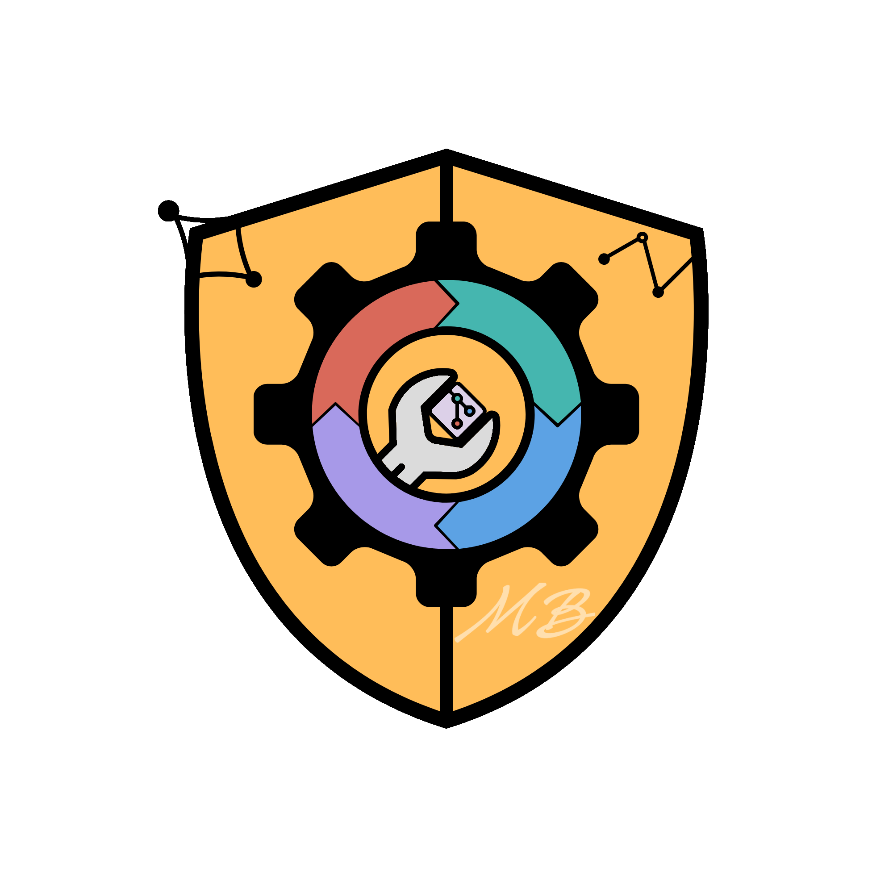
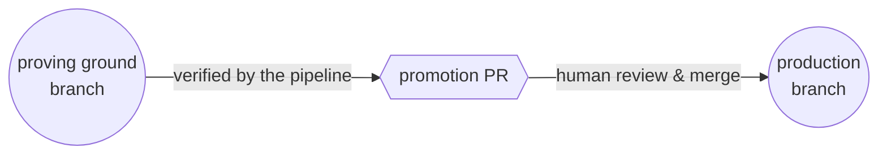

  

<h1 align="center">Detection-Engineering</h1>

<i>What isn't proven is assumption.</i>

<!-- STATS_START -->

 

    

*Generated at 2026-08-25T17:46:39 UTC*
<!-- STATS_END -->

  🔍 <a href="https://martonbence.github.io/Detection-Engineering/"><b>Rule Browser</b></a>
  &nbsp;·&nbsp;
  🛡️ <a href="https://martonbence.github.io/Detection-Engineering/#tab=navigator"><b>MITRE Navigator</b></a>
  &nbsp;·&nbsp;
  📊 <a href="https://martonbence.github.io/Detection-Engineering/#tab=dashboards"><b>Dashboards</b></a>

  📚 <a href="docs/architecture/"><b>Architecture docs</b></a>
  &nbsp;·&nbsp;
  📖 <a href="../../wiki">Wiki</a>

## The problem this repo solves

Most "detection as code" projects stop at linting YAML: a rule is considered finished the moment it parses. That answers almost nothing security teams actually care about — does the rule still exist in the SIEM, does it fire when the technique it claims to catch actually happens, and does anyone find out the moment that stops being true?

This repo is an attempt at closing that loop end to end, automatically, on every change:

- A detection is **written once**, in one format, with everything about it — logic, severity, MITRE ATT&CK mapping, test plan — in a single file.
- It's **shipped for real**, deployed as a live saved search in an actual SIEM (Splunk), not just validated on paper.
- It's **attacked on purpose**, using real adversary emulation (Atomic Red Team) against a real host, and then checked for whether the deployed rule actually caught it.
- Only a rule that survives that whole loop is allowed to move from a proving-ground environment into the one that matters.
- And because software rots, a "yes, this worked" verdict has a shelf life — it stops counting as evidence once the rule changes or enough time passes, rather than sitting there forever as a stale green checkmark.

Nothing about "does this detection work" is self-reported here. It's a measurement the pipeline makes and can show its work for.

## How it fits together

```mermaid
flowchart LR
    A["✍️ Author<br/>Sigma rule"] --> B["✅ Validate<br/>schema check"]
    B --> C["🔄 Convert<br/>Sigma → SPL"]
    C --> D["🚀 Deploy<br/>to Splunk"]
    D --> E["💥 Attack<br/>Atomic Red Team"]
    E --> F["🔎 Verify<br/>did it fire?"]
    F --> G["📊 Report<br/>stats & MITRE coverage"]
    G --> H["🌐 Publish<br/>rule browser"]

    classDef phase1 fill:#2ea44f,stroke:#238636,color:#fff,font-weight:bold;
    classDef phase2 fill:#1f6feb,stroke:#0d419d,color:#fff,font-weight:bold;
    classDef phase3 fill:#8f95d6,stroke:#6a70b8,color:#fff,font-weight:bold;
    classDef phase4 fill:#d9695a,stroke:#b8503f,color:#fff,font-weight:bold;

    class A,B phase1
    class C,D phase2
    class E,F phase3
    class G,H phase4
```

Every one of those arrows is a real, automated step — not a diagram of an aspiration. A push to the repo runs validation, deployment, a live attack, and verification in sequence, without a human clicking through any of it.

That whole loop first runs in a low-stakes proving-ground environment. Only once a batch of rules has actually survived it does the repo open a pull request offering to promote them to the environment that matters — a human still has to look at that PR and merge it; nothing ships to production purely because a script said so.

```mermaid
flowchart LR
    dev(("proving ground<br/>branch")) -- "verified by the pipeline" --> pr{{promotion PR}}
    pr -- "human review & merge" --> main(("production<br/>branch"))
```

## See it live

| | |
|---|---|
| 🔍 **[Rule Browser](https://martonbence.github.io/Detection-Engineering/)** | Every rule in the repo, searchable and filterable, with its ATT&CK mapping and its current pass/fail verdict — generated straight from the pipeline's own output, published on GitHub Pages. |
| 🛡️ **[MITRE ATT&CK Navigator](https://martonbence.github.io/Detection-Engineering/#tab=navigator)** | The same coverage plotted against the full ATT&CK matrix, exportable as a Navigator layer for use in the official MITRE tool. |

*The badges near the top of this page are a live, regenerated snapshot, not something typed by hand — treat them, not any number written into the prose on this page, as current.*

## What "pass" actually means here

A checkmark in this repo is not a claim the rule's author made about their own work. It's the output of a pipeline that deployed the rule for real, ran a real attack technique, and queried the SIEM for a real hit. And a verdict doesn't stay valid forever by default: edit the rule and the old result stops applying to it; let too much time pass without re-testing and the result ages out on its own. A rule only counts as "proven" while there's still a recent measurement that actually matches the logic currently sitting in the file. The exact mechanics of how that's computed — and there's a fair amount of nuance to it — live in [`docs/architecture/`](docs/architecture/) rather than here.

## Building a new detection, in broad strokes

1. **Write** the detection as a single Sigma-format rule file — logic, severity, MITRE mapping, and test plan all live together in that one file. If the underlying idea genuinely can't be expressed in Sigma's own syntax, the same file can carry the raw SIEM query directly instead; either way there is one authoring format and one pipeline, not two.
2. **Open a pull request.** The pipeline validates and compiles the rule before anything else happens, and shows you the result before it's merged.
3. **Merge, and the pipeline takes over**: it deploys the rule, runs the attack technique it's meant to catch, and checks whether it actually fired.
4. **Watch it show up** in the [rule browser](https://martonbence.github.io/Detection-Engineering/) with a real verdict and its place on the ATT&CK matrix.
5. **Once proven**, the rule becomes eligible to be promoted from the proving-ground branch to production — via a pull request the pipeline opens for a human to review and merge, never automatically.

The full step-by-step version of this — exact filenames, workflow names, job graphs — belongs in the [Wiki](../../wiki) and [`docs/architecture/`](docs/architecture/), not here.

## Built partly by an AI agent team

One thing worth knowing about how this repo itself gets maintained: a chunk of the day-to-day work on it — pipeline changes, rule authoring, quality review, documentation, security auditing — is carried out by a small team of scoped AI agents working under a human lead, each responsible for one surface of the repo rather than one generalist touching everything. That division of labor, and how work moves between agents, is itself documented in the repo (`CLAUDE.md`, `TEAM.md`) — treated as a real engineering practice worth being transparent about, not a hidden implementation detail.

The team even tracks its own activity: an internal dashboard (`.claude/team-ops.html`, viewable after cloning the repo) shows what each agent has been doing. It's deliberately *not* published alongside the public rule browser — it's an internal working tool, not something meant for outside visitors.

## Repository layout

| Path | What's there |
|---|---|
| [`rules/sigma/`](rules/sigma/) | The source of truth — every detection rule, as Sigma YAML |
| [`rules/splunk/`](rules/splunk/) | The compiled, deployable query for every rule |
| [`scripts/`](scripts/) | The pipeline itself, one subdirectory per stage (validate, convert, deploy, atomic, verify, docs, state) — see [`docs/architecture/scripts_reference.md`](docs/architecture/scripts_reference.md) for what each file does |
| [`config/`](config/) | Pipeline configuration as data, not code |
| [`tests/`](tests/) | The pipeline's own automated test suite |
| [`docs/index.html`](https://martonbence.github.io/Detection-Engineering/) | The generated rule browser and MITRE Navigator — live on GitHub Pages |
| [`docs/architecture/`](docs/architecture/) | Deeper technical references, with diagrams |
| [`outputs/reports/`](outputs/reports/) & [`outputs/results/`](outputs/results/) | Generated stats and per-rule verification results |
| [`.github/workflows/`](.github/workflows/) | The automation that runs the whole pipeline |

## Run by GitHub's own tooling, too

Part of what this repo is meant to demonstrate is disciplined use of GitHub itself as the engineering platform, not just as a place to host YAML: planned work is tracked as Issues, sequenced on a GitHub Project board, and the pipeline's own promotion pull requests are wired into that same board automatically rather than living in a separate tracker. A GitHub Wiki is planned as the newcomer-facing companion to the technical docs in this repo; it hasn't been switched on for this project yet, which is exactly why the polished starting point right now is the [Rule Browser](https://martonbence.github.io/Detection-Engineering/) plus the docs linked below.

## Further reading

- [`docs/architecture/`](docs/architecture/) — pipeline overview, data flow, threat model, and a per-file scripts reference, all with Mermaid diagrams
- [GitHub Wiki](../../wiki) — planned newcomer-facing walkthrough (not yet initialized)
- [`LICENSE`](LICENSE) — MIT
