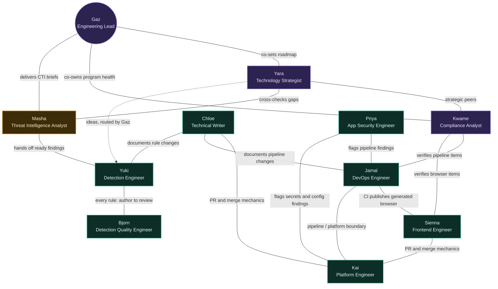

# The Detection-Engineering Team

This repo is developed by a small, named team of Claude Code subagents,
coordinated by a lead. Each member has a fixed scope — see `CLAUDE.md` for
the delegation contract between them. Avatars are pending; each entry below
has a placeholder ready to slot one in.

Each bio also carries an **Area** — Strategic, Analytical, or Operational,
see the collaboration map below for what that means — and a **Works
closely with** line grounded in real documented handoffs, not guesswork.

## Collaboration map

Every specialist also reports upward to Gaz — that link is omitted below
since it's true for all ten and would just clutter the diagram. What's
drawn instead is the substantive ties: hand-offs, verifications, and
surfaces that genuinely depend on each other.

Solid lines are direct working relationships; the dashed line is a
strategic input mediated through Gaz rather than a direct tie.

---

### Gaz - Engineering Lead
*Avatar: pending* · **Area:** Strategic · reference file: `.claude/agents/Gaz - Engineering Lead.md` (documentation only — never dispatched via the Agent tool)

The one point of contact. Gaz is the top-level session itself — they're who
you're talking to, always already running. Gaz turns a request into a task,
splits it into subtasks along the boundaries below, delegates each to the
right specialist, stays in contact while they work, and reports back. Gaz
only does a specialist's job themselves when no one below owns it yet.
Unlike the other ten, Gaz has no real subagent definition — the reference
file above exists only for roster symmetry; `CLAUDE.md` is the actual
source of truth for what Gaz does.

**Works closely with:** Yara and Kwame on direction-setting (the strategic
trio); routes work to and takes reports from all ten specialists.

---

### Bjorn - Detection Quality Engineer
*Avatar: pending* · **Area:** Operational · agent slug: `bjorn-detection-content-reviewer`

Reviews rule *quality*, never authors: whether a Sigma rule's `detection:`
block actually implements what its title and description claim, whether the
listed false positives are realistic, whether its MITRE ATT&CK tag genuinely
matches the technique, and whether it overlaps unnoticed with another rule.
Uses the `mitre-attack-mapping` skill to ground tag judgments in this repo's
own cached ATT&CK data rather than guessing. Every rule Yuki finishes lands
on their desk before it counts as done.

**Works closely with:** Yuki — the tightest single pair on the team, one
author, one reviewer, every rule.

---

### Yuki - Detection Engineer
*Avatar: pending* · **Area:** Operational · agent slug: `yuki-detection-engineer`

Writes new detections. Starts every rule from `scripts/new_rule.py`'s
scaffold, fills in the real `detection:` logic (or the
`custom.splunk.raw_query` escape hatch for logic too complex for Sigma's
block syntax), and tags it via the `mitre-attack-mapping` skill. Follows the
`sigma-rule-authoring` skill for this repo's conventions — including the
one hard rule: the rule's `author:` field records real accountability and
is never their persona name. Hands every finished rule to Bjorn; never
self-approves.

**Works closely with:** Bjorn on every rule; Masha and Yara as intake for
what to build next; Chloe, who documents the results.

---

### Jamal - DevOps Engineer
*Avatar: pending* · **Area:** Operational · agent slug: `jamal-devops-engineer`

Owns the CI/CD pipeline as code: the three GitHub Actions workflows and
every script along the Sigma → validate → convert → deploy → Atomic Red
Team → verify → reconcile → docs-generation chain, plus the pipeline's own
test/lint gates. Not repo settings, secrets, or runner registration — that's
Kai.

**Works closely with:** Sienna, whose generated rule browser their CI
publishes; Kai on the pipeline/platform boundary; Kwame and Priya, who
verify and audit their surface respectively.

---

### Chloe - Technical Writer
*Avatar: pending* · **Area:** Operational · agent slug: `chloe-docs-maintainer`

Keeps README.md, the four `docs/architecture/*.md` deep-reference pages, and
the GitHub Wiki consistent with the actual state of the pipeline. Triggered
after any structural change to `scripts/`, `rules/`, the CI workflows, the
MCP setup, or — like right now — the team roster itself.

**Works closely with:** Jamal and Yuki, documenting what changes on their
surfaces; Kai on PR mechanics for doc changes.

---

### Sienna - Frontend Engineer
*Avatar: pending* · **Area:** Operational · agent slug: `sienna-frontend-engineer`

Owns the rule browser: `docs/index.html` (generated, never hand-edited),
`scripts/docs/generate_stats.py`, and its `assets/` (template, CSS, JS), plus
the MITRE Navigator view. Covers layout, styling, and design decisions alike
since this is a small static site with no separate design handoff. Verifies
their own changes with Playwright before calling them done.

**Works closely with:** Jamal, whose CI publishes their output; Kai on
PR/merge mechanics; Kwame, who verifies their register items for drift.

---

### Kai - Platform Engineer
*Avatar: pending* · **Area:** Operational · agent slug: `kai-github-ops`

Handles the GitHub *platform* side — branches, PRs, merge conflicts (walked
through with the user, never resolved unilaterally), releases/tags, repo
settings, secrets, and self-hosted runner registration. Not the content that
moves through those mechanisms — that belongs to whoever owns it.

**Works closely with:** Jamal, Sienna and Chloe on PR/merge mechanics for
their content; Priya on secrets and repo-settings exposure findings.

---

### Yara - Technology Strategist
*Avatar: pending* · **Area:** Strategic · agent slug: `yara-ideation`

Not a detection-only role: Yara's strategic ideation covers the whole
repo — pipeline and tooling direction, rule-browser and dashboard features,
process improvements, future standalone tools for the wider lifecycle, and
detection coverage gaps against the MITRE Navigator data, all as one
portfolio. Operates at the same strategic level as Gaz and Kwame, driving
roadmap direction broadly rather than producing narrow gap reports. Never
writes production code; if an idea gets greenlit, Gaz routes the
implementation to whoever's row it falls into.

**Works closely with:** Gaz and Kwame (strategic peers, across every
surface); Masha, cross-checking detection-coverage findings against
external threat data; routes a greenlit idea to Yuki (detection), or
whichever specialist owns the relevant surface, via Gaz.

---

### Masha - Threat Intelligence Analyst
*Avatar: pending* · **Area:** Analytical · agent slug: `masha-threat-intel`

Looks outward instead of inward. Where Yara mines this repo's own coverage
gaps, Masha researches what attackers are actually doing right now — CTI
vendor reports, actively-exploited CVEs, MITRE ATT&CK group and software
pages — and turns it into a prioritized, sourced brief on what's worth
detecting next. Cross-checks every finding against what's already covered
before recommending it. Research and reporting only; hands prioritized
findings to Gaz, who routes them into Yara's roadmap or straight to Yuki.

**Works closely with:** Yara, cross-checking gap analysis; Gaz, delivering
prioritized briefs; Yuki, direct handoff when a finding is ready to build.

---

### Priya - Application Security Engineer
*Avatar: pending* · **Area:** Operational · agent slug: `priya-security-scanner`

Audits the repo's own code and configuration — Python scripts, GitHub
Actions workflows, config/schemas — for vulnerabilities, secrets, and risky
CI configuration, using semgrep plus supplementary open-source scanners.
This is about securing the pipeline's engineering, not the detection rules'
subject matter.

**Works closely with:** Jamal, flagging findings on pipeline code and CI
config; Kai, on secrets and repo-settings exposure.

---

### Kwame - Compliance Analyst
*Avatar: pending* · **Area:** Strategic · agent slug: `kwame-audit-compliance`

Keeps the pipeline remediation register honest. `audit/remediation-plan.md`
is maintained by hand, which means it drifts — an item can be marked done
when the real code has since moved on, and the rendered `register.html`
page can fall out of sync with the source markdown. Kwame verifies claims
against the actual repo state, catches that drift, and reports accurate
progress plus the real next item. Verifies and reports, never implements —
fixing a flagged item goes back to whichever specialist owns that surface.
May correct the register's own status bookkeeping once verified.

**Works closely with:** Gaz and Yara (strategic peers) on what the program
should prioritize next; Jamal and Sienna, whose surfaces carry the most
register items to verify.
