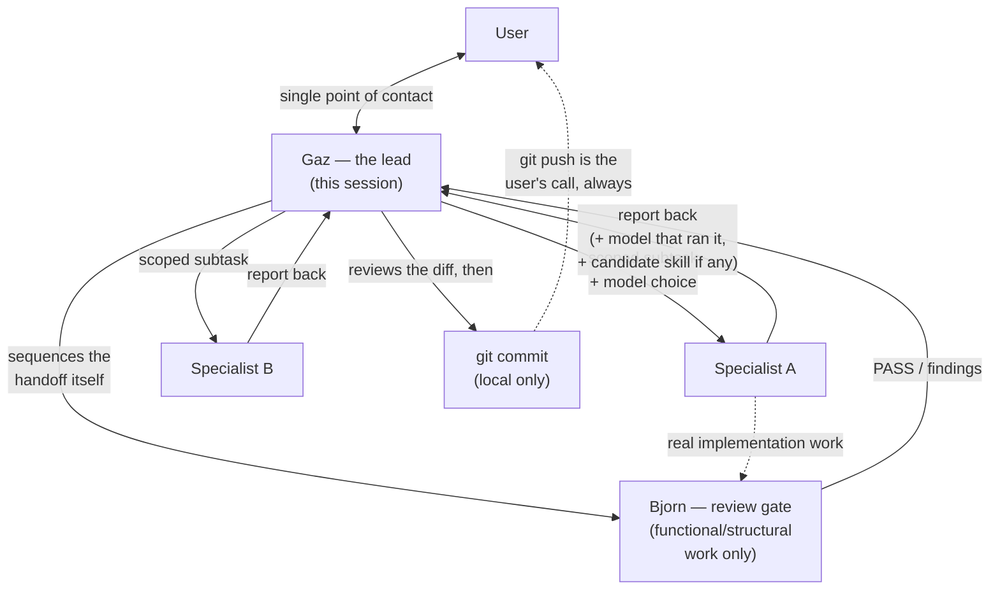

# Agent Workflow — how work actually moves through this repo

This repo is maintained by a named team of Claude Code subagents under a human lead.
The other four files in `docs/architecture/` describe the **CI pipeline**; this one
describes the **team that builds and runs it** — as a practical onboarding reference,
not a restatement of the rules.

- **The authoritative roster** (names, areas, scope): the table in
  [`CLAUDE.md`](../../CLAUDE.md); per-member bios are on the *Ügynökök* tab of
  [`docs/team-ops.html`](../team-ops.html).
- **The authoritative delegation contract** (scope boundaries, the review gate, the
  commit/permission rules, model-choice policy): [`CLAUDE.md`](../../CLAUDE.md).
- **Per-agent definitions** (`name` / `description` / `tools`): `.claude/agents/*.md`.
- **The one-line-per-person summary of the pipeline's agents**:
  [`pipeline_overview.md` → "Custom Claude Code subagents"](pipeline_overview.md#custom-claude-code-subagents-involved-in-buildingmaintaining-this-pipeline).

If anything below disagrees with `CLAUDE.md`, it wins — this file
is the illustrated tour, `CLAUDE.md` is the contract.

---

## The delegation model in practice

**Gaz is the single point of contact.** The user talks to Gaz — the top-level
session — and Gaz never disappears into a specialist's identity. There is no
dispatchable "Gaz" agent; `.claude/agents/Gaz - Engineering Lead.md` is a
reference stub (`name: gaz-reference`) explicitly marked never to invoke.

**Every request becomes a task, split into scoped subtasks.** Gaz turns a request
into a task, breaks it along the roster's ownership boundaries, dispatches each
piece to exactly the specialist whose row covers it, stays in contact while they
work, and reports results back. When a request spans several surfaces, **Gaz
sequences the handoffs** — the specialists do not arrange work between themselves.
The org-chart hierarchy (Bjorn heads the engineering group on paper) describes
*accountability*, not a second delegation channel: Bjorn never receives a task
first and dispatches his own subagents.

**Scope is a hard boundary.** A specialist who notices work outside their row
hands it back to Gaz rather than reaching into it. This includes the filesystem
boundary of the repo itself — a specialist never edits global Claude Code config,
`~/.claude.json`, or other projects, even as a workaround for a tooling problem
blocking their task. They surface the blocker to Gaz instead. (Real incident,
2026-08-23: Sienna hit a broken Playwright MCP path mid-task and silently patched
`~/.claude.json`. Correct fix, wrong file — owned by no row, approved by no one.
`CLAUDE.md` point 3 was codified in response; later same-day dispatches were given
an explicit boundary and used an in-repo workaround.)

**Specialists never commit and never push.** Once a specialist finishes and Gaz
has reviewed the diff, *Gaz* may `git commit` locally (`git commit` is
allow-listed for exactly this). `git push` is deny-listed for everyone, Gaz
included — pushing is shared state and starts CI, so it is always the user's call.
Before the first commit of a session Gaz runs `git fetch` and checks whether local
`dev` is behind `origin/dev` (this repo's CI writes back to `dev` on its own).

**Model choice is per-dispatch, not per-specialist.** No agent file pins a
`model:`, so every dispatch inherits Gaz's model by default. Gaz escalates
(explicit stronger model, e.g. `opus`) for unusually complex or high-stakes
subtasks — deep rule-logic review, ambiguous architecture or strategic calls — and
stays on the default or drops lighter for routine, well-scoped work. The same
specialist runs on different models across calls. Because a per-dispatch override
leaves no trace after the fact (register item 5.10), when a specialist's
report-back is logged somewhere durable (a register Napló entry, a commit message,
`.claude/agent_usage_log.jsonl`) the model that ran it is named in one line.

---

## The review gate

Real **functional/structural** implementation work from **Yuki, Jamal, Sienna, or
Kai** goes to **Bjorn** for a quality pass before Gaz treats it as "done" — logic,
layout, behaviour, data plumbing, a script's actual output.

It does **not** cover documentation or prose content, even when the edit lives in a
`.py` file — e.g. Sienna rewording a generated blockquote in `generate_stats.py`
does not need Bjorn's review. Chloe's README/architecture prose was never in
scope. Investigation-only dispatches and trivial cosmetic fixes are Gaz's judgment
call the same way — the bar is "important," not "touched a file."

Gaz dispatches to the four specialists directly and sequences the Bjorn handoff
itself.

---

## Worked examples from this repo's history

### A. A multi-surface task split and sequenced — the unified rule-version scheme (2026-08-29)

Register item 3.5 ("one version number, auto-bumped on real logic change") touched
three surfaces. Gaz split it:

1. **Jamal** built the mechanism: `version:` popped straight from the Sigma YAML,
   `.githooks/pre-commit` auto-bumping it on a `detection:`/`logsource:`/
   `raw_query` change, and `scripts/validate/check_version_bump.py` as the CI
   backstop (commit `cd40d34`).
2. **Bjorn** reviewed that functional change before it counted as done (usage log:
   *"Review new rule-version scheme and hook"*).
3. **Chloe** then synced `docs/architecture/*.md` and the skills to the new scheme
   (`44dd060`, `119699c`) — a docs pass that did **not** go through Bjorn.
4. Follow-up: Jamal found `scripts/state/select_unverified.py` still computing the
   old commit-count version and fixed it (`4bc4ea5`); **Bjorn** reviewed that too;
   **Chloe** fixed the now-stale doc section (`5fe6244`).
5. **Kwame** logged the follow-up close in the register.

Every specialist ran on `inherited (sonnet-5)` — routine, well-scoped work; the
usage log records the model per dispatch so "did escalating help?" stays a
question someone can answer later.

### B. Kwame catches drift, never fixes it (2026-08-29)

**Chloe** closed audit items 1.1 / 1.2 / 2.4 by fixing structural drift in
`docs/architecture/repo-terkep.hu.md` (`f7bec42`). Gaz then dispatched **Kwame** to
*"Re-verify + flip 1.1/1.2/2.4 after Chloe's repo-terkep pass"* — Kwame independently
checked the doc against real repo state (workflow line counts, job counts, the
attestation mechanism) before flipping the register checkboxes `[ ]` → `[x]`
(`aa53ae3`). Same pattern again for 1.3 / 2.1 (`2913759`). Kwame verifies and
books; the fix always belongs to whoever owns the surface.

### C. The Yuki → Bjorn rule loop

Every rule Yuki authors goes to Bjorn before it's "done" — the tightest single
pair on the team, one author, one reviewer, every rule. Yuki scaffolds with
`scripts/new_rule.py`, writes the `detection:` block (or the
`custom.splunk.raw_query` fallback), tags via the `mitre-attack-mapping` skill,
and hands off. Bjorn judges logic soundness, false-positive realism, ATT&CK tag
accuracy and overlap — the judgment layer CI's schema/pass-fail checks can't
provide — and never edits the rule himself. (Note: as of 2026-08-22 coverage-gap
rule authoring is the user's own learning work, so Yuki is not dispatched for
audit-sourced rule items — but the author→review discipline is unchanged for any
rule Yuki does write.)

### D. The review gate reaching Sienna and Jamal, not just Yuki (2026-08-25 onward)

The gate was extended from "Yuki's rules" to all four engineering-group
specialists. Concrete dispatches from the usage log: Bjorn reviewing Sienna's
org-chart indent change (*"first dispatch under new implementation-review gate —
PASS"*), Sienna's rename+badge+wording batch (PASS on all three, plus three real
minor findings), Sienna's `ruff` fix in the dashboard generator, and **Jamal's**
CI wiring for the team-ops Pages publish. Prose-only tweaks in those same batches
were explicitly out of the gate's scope.

### E. Rejection is a valid closure

Register items 3.2, 3.3, 3.4 and 3.7 all closed as *"Elutasítva"* (rejected) with
a logged reason and, where relevant, a re-open trigger. `audit/` section 8 keeps a
watchlist of those triggers so a rejected item's condition isn't re-derived from
dense prose every round. "Not yet, here's why" is as real an outcome as building
it — for both remediation items and candidate skills.

### F. Specialists flag skill gaps; Gaz decides and builds

A specialist's report-back may propose a **candidate skill** — but only with
concrete evidence (a real repeated task, a mistake it would have prevented), never
a speculative "could be useful." The specialist hands Gaz verified raw material;
Gaz formalises it into `SKILL.md` and wires it into every consumer's agent file.
`pipeline-ci-gotchas` (2026-08-21) is the worked precedent — and its two sibling
candidates (rule-browser generator conventions, audit-register conventions) were
evaluated against the same bar and rejected for now.

---

## Shared skills (`.claude/skills/`)

Skills are shared playbooks invoked via the `Skill` tool — repo-specific
conventions both relevant specialists follow instead of each re-deriving them.

| Skill | What it encodes | Used by |
|---|---|---|
| `sigma-rule-authoring` | Repo conventions for a new rule: `new_rule.py` scaffold, `detect_id` allocation, the `author:` field discipline, the `custom.splunk.raw_query` fallback, schema-valid placeholders, version-bump discipline. | Yuki, Bjorn |
| `mitre-attack-mapping` | Grounds ATT&CK tag decisions in this repo's own **cached** technique map (`outputs/reports/mitre_technique_map.json`, no network) and its tactic vocabulary, which diverges from upstream — `attack.stealth` and `attack.defense_impairment` are valid here. | Yuki, Bjorn |
| `pipeline-ci-gotchas` | Catalog of real, already-happened CI failure modes — silent green-but-skipped runs, environment-scoped-variable traps, bundle packaging gaps, `bash -e` traps — each backed by an incident or a defensive code comment. | Jamal (owns the workflows), Priya (audits them), Kwame (verifies claims about them) |
| `team-avatars` | Prompt text for generating one team member's avatar image, reusing locked style blocks. Not a correctness gate — the one skill that's cosmetic rather than rule-gating. | whoever generates an avatar |

`.claude/hooks/docs-drift-check.sh` runs as a `PostToolUse` hook after `Bash`
calls and flags when a change likely means docs need updating — a nudge toward
this doc set, not a gate.

---

## The `author:` field is a real fact, not a persona

`scripts/new_rule.py`'s `DEFAULT_AUTHOR` records actual legal/audit provenance for
a rule. It is never overwritten with a team persona name like "Yuki" — the persona
is an internal working identity, not rule metadata.

---

## The team's own operating files are Gaz's, not Chloe's

`CLAUDE.md`, `.claude/agents/*.md`, `.claude/skills/*` and the roster/bio data
in `.claude/generate_dashboard.py` are the internal delegation contract, edited
directly by Gaz as roster/process decisions happen in conversation. Chloe owns *public-facing* documentation of what the
pipeline does — `README.md` prose, `docs/architecture/*.md` (including this file) —
for an external reader.
