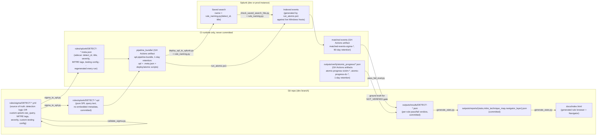

# Data Flow

This document tracks the concrete files, GitHub Actions artifacts, and Splunk objects that move between pipeline stages — not the abstract stage names (see `pipeline_overview.md` for those). For the branch/promotion structure these files move through, see that document first.

## File formats and paths, source to Splunk

## Rules with no compiled Sigma logic still live in `rules/sigma/*.yml`

There is one authoring format, not two. A rule whose detection logic can't be expressed as a Sigma `detection:` block still gets a `rules/sigma/DETECT-*.yml` file — the `detection:` key is present (the schema requires it) but is a never-evaluated placeholder. What actually carries the query is `custom.splunk.raw_query`, a literal SPL string. `sigma_to_spl.py` checks for that field and, when present, emits it into the `.spl` file **verbatim** instead of running the Sigma→SPL compiler. Every other field — `title`, `severity`, `tags` (MITRE), `falsepositives`, `custom.testing` — is read from the same YAML the same way regardless of which path was taken. Downstream, `validate_sigma.py`, the `.meta.json` sidecar, deploy, and verify all treat converted and raw-query rules identically; there is no separate "native SPL" file format or pipeline branch left in the current workflows (both `ci_dev_workflow.yml` and `ci_prod_workflow.yml` only ever glob `rules/sigma/**/*.yml`).

## GitHub Actions artifacts: what crosses the job boundary, and why retention differs

Self-hosted runners (`de-lab`, `windows-victim`, `windows-dc`) don't do a full `actions/checkout` for every job — they receive what they need via `actions/upload-artifact` / `actions/download-artifact` from `prepare_validate_convert`, `atomic_verify`, and `atomic_verify_dc`. Three distinct artifacts exist, and each has a retention policy tied to how it's actually used downstream:

| Artifact | Produced by | Consumed by | Retention | Why |
|---|---|---|---|---|
| `spl-pipeline-bundle` | `prepare_validate_convert` | `deploy_to_splunk`, `atomic_verify`, `atomic_verify_dc`, `emulation_verify`, `splunk_verify` | 1 day | Purely intra-run handoff — every consumer runs within the same workflow run that produced it. Nothing downloads it after the run finishes. |
| `atomic-progress-victim-${{ github.run_id }}` / `atomic-progress-dc-${{ github.run_id }}` | `atomic_verify` / `atomic_verify_dc` | `splunk_verify` (as ground truth for the `NOT_VERIFIED` gate in `pass_fail_eval.py`, in case the "Run Atomic Red Team tests" step got killed by its `timeout-minutes` before finishing) | 1 day | Same reasoning — run-scoped handoff only, uploaded with `if: always()` so even a killed/timed-out job still leaves a marker, but still nothing reads it after that run's `splunk_verify` job completes. |
| `matched-events-sigma-${{ github.run_id }}` | `splunk_verify` | Nobody automatically — this is for humans to inspect after the fact | 90 days | The one artifact with genuine post-run diagnostic value: the actual Splunk events that were matched to justify each Pass/Fail verdict, kept around for review/audit long after the run finishes. |

This distinction (short retention for purely intra-run handoff artifacts vs. long retention for the one artifact with real post-run diagnostic value) was made explicit in commit `cd2e0a3`, which set `retention-days: 1` on `spl-pipeline-bundle` and dropped `atomic-progress-{victim,dc}-*` from 7 days to 1 day, while leaving `matched-events-sigma-*` at 90 days.

## Commits the pipeline makes back to itself

CI pushes to `dev` twice per successful run, both tagged `[skip ci]` so they don't re-trigger the workflow:

1. **`chore(splunk): update sigma-converted SPL outputs [skip ci]`** — from `prepare_validate_convert`'s `Commit converted SPL outputs to dev` step, right after conversion. Stages `rules/splunk/` but explicitly excludes `*.meta.json` (`git reset -q -- 'rules/splunk/**/*.meta.json'`) so the sidecar never lands in git.
2. **`chore(verify): update verification results and stats [skip ci]`** — from `splunk_verify`'s `Commit verification results and stats` step, after Pass/Fail evaluation and stats regeneration. Stages `outputs/results/`, `outputs/reports/`, `README.md`, `docs/index.html`. Both commit steps retry up to 3 times with a hard reset to `origin/dev` between attempts to survive races with concurrent pipeline runs.

`ci_prod_workflow.yml` makes **no** commits back to `main` — it only regenerates the gitignored `.meta.json` sidecar in the runner's working copy for `deploy_spl_to_splunk.py` to read, and deploys. The `.spl` files it deploys are exactly what `dev` already committed and what the promotion PR carried.

## Splunk objects

- **Saved search name**: computed once by `scripts/lib/rule_naming.py` from `detect_id` + title, imported by both `deploy_spl_to_splunk.py` (to know what to create/update) and `check_saved_search_hits.py` (to know what to query) — this is the single point of agreement that keeps deploy and verify from drifting apart if a rule's filename changes.
- **Sharing/permissions**: `deploy_spl_to_splunk.py` is invoked with `SPLUNK_SHARING=app`, `SPLUNK_PERMS_READ="*"`, `SPLUNK_PERMS_WRITE=admin,ci_deploy_savedsearches` in both the dev and prod deploy steps — identical policy in both environments, only the target Splunk instance (`SPLUNK_BASE_URL` etc., via the `dev`/`prod` GitHub environment secrets) differs.
- **Dev vs. prod instances are physically separate Splunk deployments** reachable from the same `self-hosted, linux, de-lab` runner — the environment selection is what determines which one a given job talks to, not the runner itself.
