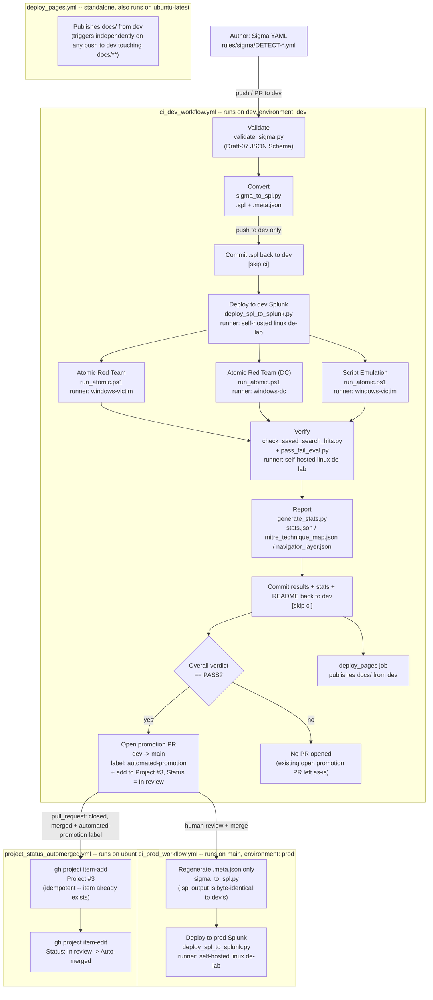

# Pipeline Overview

This is the end-to-end path a detection takes from a Sigma YAML file in `rules/sigma/` to a verified, production-deployed Splunk saved search. It is driven entirely by two GitHub Actions workflows plus two small automation workflows — there is no manual deploy step anywhere in the happy path.

## The two-branch model: dev proves it, main ships it

Every change is authored against `dev`. The full validate → convert → deploy → attack → verify loop runs there, against a **dev** Splunk instance. Only after that loop reports an overall PASS does CI open a pull request promoting the change to `main`, which triggers a second, much smaller workflow that deploys the same already-verified SPL to a **prod** Splunk instance. `main` never runs Atomic Red Team tests or verification itself — it trusts what `dev` already proved.

**Known duplication, not a diagramming simplification:** `docs/` gets published to GitHub Pages by *two* independent triggers — the `deploy_pages` job inside `ci_dev_workflow.yml` (runs after `splunk_verify`, gated on that job's result being `success` or `failure`) and the standalone `deploy_pages.yml` workflow (fires on any push to `dev` touching `docs/**`, independent of the rest of the pipeline). Both check out `dev` and publish the same `docs/` tree to the same Pages site.

## Stage by stage

**1. Author.** Detections are written as Sigma YAML under `rules/sigma/`. Most rules have a real `detection:` block Sigma can compile. Rules too sophisticated to express that way still live in `rules/sigma/*.yml` (with a required-but-unused placeholder `detection:` block) and instead set `custom.splunk.raw_query` to the literal SPL text.

**2. Validate — `scripts/validate/validate_sigma.py`.** Checks the changed rules (or, if the schema, `scripts/validate/**`, or the converter itself changed, *every* rule in the repo — see the `mode` logic in the `Determine changed Sigma files` step) against `docs/schemas/sigma_schema.json`, a Draft-07 JSON Schema. Invoked from CI via a PowerShell wrapper, `scripts/validate/validate_sigma.ps1`. Nothing downstream runs on a rule that fails schema validation.

**3. Convert — `scripts/convert/sigma_to_spl.py`.** Compiles each validated rule into `rules/splunk/<name>.spl` (pure query text, via `pysigma` with the Splunk backend, or emitted verbatim for `custom.splunk.raw_query` rules) plus a `<name>.meta.json` sidecar carrying the metadata that deploy/verify/atomic-runner need (`detect_id`, title, severity, MITRE tags, testing config), all sourced from the Sigma YAML. Only the `.spl` file is committed to git (back to `dev`, by the `Commit converted SPL outputs to dev` step); `.meta.json` is regenerated fresh on every run and never committed.

**4. Deploy — `scripts/deploy/deploy_spl_to_splunk.py`.** Pushes each SPL file to a live Splunk instance as a saved search, via Splunk's REST API, using credentials injected as GitHub Actions secrets scoped to a `dev` or `prod` GitHub **environment**. The saved search name is computed by the shared `scripts/lib/rule_naming.py` helper from `detect_id` + title (never the filename), so the deploy step and the verify step (`check_saved_search_hits.py`, which imports the same helper) always agree on what to look for.

**5. Attack — `scripts/atomic/run_atomic.ps1`.** Executes the Atomic Red Team test(s), or a script-emulation-style test, referenced in a rule's `custom.testing` metadata against a live Windows host — always a `-PreflightOnly` dry run first, then the real execution. This is what generates the telemetry the deployed saved search is supposed to catch. `atomic_verify` and `atomic_verify_dc` have no checkout/clean step — they just download the pipeline bundle artifact and run `run_atomic.ps1` directly in the self-hosted Windows runner's own persistent workspace disk, so nothing resets `outputs/verify/atomic_progress` between runs on its own. To keep that directory honest, the real (non-preflight) run clears every existing `*.json` marker out of `$ProgressDir` immediately after the preflight-only early exit and before writing any `started` markers for the current run's rules — otherwise a marker left over from an earlier, unrelated run (for a `detect_id` not even in this run's `$SplFiles` scope) would still be sitting there, get swept into this run's uploaded progress-marker artifact alongside the genuine ones, and be misread downstream as this run's own ground truth. This stage only runs on `dev`; the prod deploy is never attacked.

**6. Verify — `scripts/verify/check_saved_search_hits.py` + `pass_fail_eval.py`.** After a fixed wait for Splunk indexing (`Wait for Splunk indexing` step, default 60s), `check_saved_search_hits.py` queries Splunk for events matching each saved search in the minutes following the attack. `pass_fail_eval.py` turns those matches — plus each atomic job's own progress markers (now guaranteed, per stage 5 above, to reflect only `detect_id`s actually in scope for that run), which act as ground truth for a `NOT_VERIFIED` gate when a test job was killed by its `timeout-minutes` before finishing — into a per-rule verdict written to `outputs/results/` as `DETECT-*` result files, and returns a process exit code that gates the promotion PR step.

**7. Report — `scripts/docs/generate_stats.py`.** Aggregates every rule and result into `outputs/reports/stats.json`, `mitre_technique_map.json`, and `navigator_layer.json`. Also regenerates the README stats block and `docs/index.html`.

**8. Promote — the `Open promotion PR to main on PASS` step.** If, and only if, `pass_fail_eval.py`'s exit code was `0`, this step (part of the `splunk_verify` job) checks whether a `dev`→`main` PR is already open and, if not, runs `gh pr create --base main --head dev --title "Promote verified detections from dev to main" --label automated-promotion`. This PR does not auto-merge — a human reviews and merges it, and that merge is what actually ships to prod. The same step then immediately runs `gh project item-add 3 --owner martonbence --url <PR URL>` to add the new PR to [Project #3](https://github.com/users/martonbence/projects/3) (`PVT_kwHOA_8eh84BeHTL`), followed by `gh project item-edit --field-id PVTSSF_lAHOA_8eh84BeHTLzhYj6O0 --single-select-option-id 4fdb6324` to set that item's Status field to `In review` (verified against the live Project #3 schema via `gh project field-list`). So an auto-opened promotion PR is labeled **and** placed on the board pre-triaged, in one step.

**9. Ship to prod — `ci_prod_workflow.yml`.** Triggered on `push` to `main` touching `rules/sigma/**` (in practice: merging a promotion PR, though any other direct push to `main` under that path filter also triggers it). Regenerates `.meta.json` sidecars from the Sigma source already on `main` (deterministic — the `.spl` text doesn't change) and deploys every `rules/splunk/*.spl` file to the prod Splunk instance. No validation, testing, or verification runs here — it trusts the `dev`-branch run that already passed.

**10. Track promotion on the project board at merge — `project_status_automerged.yml`.** A separate workflow triggered on `pull_request: closed` (any PR, any branch), independent of both pipeline workflows. Its one job, `set_automerged_status`, only runs when `github.event.pull_request.merged == true` **and** `github.event.pull_request.labels.*.name` contains `automated-promotion`. When that holds, it runs `gh project item-add 3 --owner martonbence --url <PR URL>` again (idempotent — the item was already added in stage 8, above; `item-add` on an existing item is a no-op that just returns its id), then `gh project item-edit --field-id PVTSSF_lAHOA_8eh84BeHTLzhYj6O0 --single-select-option-id be04d00f` to move that item's Status field from `In review` to `Auto-merged`. Together, stages 8 and 10 give a promotion PR's board item a full lifecycle: `In review` the moment it's opened, `Auto-merged` once it's actually merged — there is no `Auto-merged` transition for a promotion PR that gets closed without merging (the job's `if` condition requires `merged == true`).

**11. Publish — GitHub Pages.** `docs/index.html`, a self-contained rule browser and MITRE ATT&CK Navigator, is published from `dev` (see the duplicate-publish note above).

## Named workflow jobs and steps

### `ci_dev_workflow.yml`

| Job | Runner | Key steps (literal `name:` values, bolded ones are the substantive work) |
|---|---|---|
| `prepare_validate_convert` | `ubuntu-latest` | Checkout, Setup Python, Determine changed Sigma files, Install Python deps, **Validate Sigma rules**, **Convert Sigma rules to Splunk SPL**, Build pipeline bundle, Commit converted SPL outputs to dev, Detect test types in pipeline bundle, Upload pipeline bundle |
| `deploy_to_splunk` | `self-hosted, linux, de-lab` | Download pipeline bundle, Setup Python, Install deploy deps, **Deploy selected SPL files to Splunk** |
| `atomic_verify` | `self-hosted, X64, Windows, victim, atomic, windows-victim` | Download pipeline bundle, **Run Atomic Red Team tests embedded in deployed SPL metadata**, Upload atomic progress markers |
| `atomic_verify_dc` | `self-hosted, X64, Windows, dc, windows-dc` | Download pipeline bundle, **Run Atomic Red Team tests on Domain Controller**, Upload atomic progress markers |
| `emulation_verify` | `self-hosted, X64, Windows, victim, windows-victim` | Download pipeline bundle, **Run Script Emulation tests embedded in deployed SPL metadata** |
| `splunk_verify` | `self-hosted, linux, de-lab` | Checkout, Download pipeline bundle, Download atomic progress markers (victim), Download atomic progress markers (DC), Setup Python, Install deps, Wait for Splunk indexing, **Query Splunk for matched events**, **Evaluate Pass/Fail**, Upload matched events artifact, **Generate stats and update README**, Commit verification results and stats, **Open promotion PR to main on PASS**, Report verification verdict |
| `deploy_pages` | `ubuntu-latest` | Checkout (ref: `dev`), configure-pages, upload-pages-artifact, deploy-pages (no explicit step `name:`s — these are third-party actions) |

`atomic_verify`, `atomic_verify_dc`, and `emulation_verify` each only run if `prepare_validate_convert`'s `has_atomic_tests` / `has_atomic_dc_tests` / `has_emulation_tests` output is `true` for the changed rules, and all three are `continue-on-error: true` so a single flaky test host doesn't block `splunk_verify` from running (it treats `success` or `skipped` as acceptable for each).

### `ci_prod_workflow.yml`

| Job | Runner | Key steps |
|---|---|---|
| `deploy_to_prod` | `self-hosted, linux, de-lab` | Checkout, Setup Python, Install deps, **Regenerate SPL + meta sidecars from Sigma source**, **Deploy all SPL files to prod Splunk** |

### `project_status_automerged.yml`

| Job | Runner | Key steps |
|---|---|---|
| `set_automerged_status` | `ubuntu-latest` | **Add/update project item status** (a single step running `gh project item-add` then `gh project item-edit`) |

### `deploy_pages.yml` (standalone)

A single job named `deploy` on `ubuntu-latest`: checkout (ref: `dev`) → configure-pages → upload-pages-artifact → deploy-pages. Functionally near-identical to the `deploy_pages` job embedded in `ci_dev_workflow.yml` — see the duplication note above; this is worth flagging explicitly rather than glossing over, since both workflows can independently republish Pages from the same branch.

## Runners, named

| Label set (as written in the YAML) | Role |
|---|---|
| `ubuntu-latest` | GitHub-hosted. Used for `prepare_validate_convert`, both `deploy_pages` jobs, and `project_status_automerged.yml`'s `set_automerged_status` — nothing here needs lab network access. |
| `self-hosted, linux, de-lab` | Self-hosted Linux box with a network path to Splunk. Used by `deploy_to_splunk` and `splunk_verify` (dev) and by `deploy_to_prod` (prod) — the same runner role serves both environments; what differs is the GitHub Actions `environment:` (`dev` vs `prod`) and therefore which `SPLUNK_*` secrets get injected. |
| `self-hosted, X64, Windows, victim, atomic, windows-victim` | The Windows victim host that executes Atomic Red Team tests, used by `atomic_verify`. |
| `self-hosted, X64, Windows, victim, windows-victim` | The same physical victim host, used by `emulation_verify` for script-emulation-style tests — note the label set here omits `atomic` compared to `atomic_verify`'s; that's what the workflow file actually specifies, not a documentation inconsistency. |
| `self-hosted, X64, Windows, dc, windows-dc` | The domain-controller host, used only by `atomic_verify_dc` for techniques that specifically require DC context. |

## Custom Claude Code subagents involved in building/maintaining this pipeline

Not part of the runtime CI pipeline, but the tooling used to build and maintain it — see `.claude/agents/*.md` for the authoritative frontmatter (`name`/`description`); re-read that directory if this list looks stale:

- **devops-engineer** — owns `.github/workflows/*.yml` and the scripts they invoke; the agent that would implement changes like the dev/prod split or the promotion-PR step itself.
- **github-ops** — owns GitHub-platform mechanics (branch protection, secrets, self-hosted runner registration, PR/merge conflict resolution, the wiki-enablement gap) as opposed to workflow YAML content.
- **docs-maintainer** — this document's own maintainer; keeps README/docs/architecture/Wiki in sync with the pipeline described above.
- **detection-content-reviewer** — reviews Sigma/SPL rule *content* quality (logic soundness, false-positive risk, MITRE tag accuracy, test coverage) — the judgment layer CI's schema/pass-fail checks don't provide.
- **frontend-engineer** — owns `docs/index.html` and `scripts/docs/generate_stats.py` (the rule browser / Navigator), using the Playwright and Chrome DevTools MCP tools for verification.
- **security-scanner** — audits this repo's own code/config (not rule content) for vulnerabilities and secrets, using the semgrep MCP tools, `pip-audit`, and GitHub's secret-scanning MCP tool.
- **ideation** — brainstorming-only; proposes new rules or tools, never edits pipeline code.

See `docs/architecture/data_flow.md` for the concrete files/artifacts moving between these stages, and `docs/architecture/threat_model.md` for what's in/out of scope from a security standpoint.
