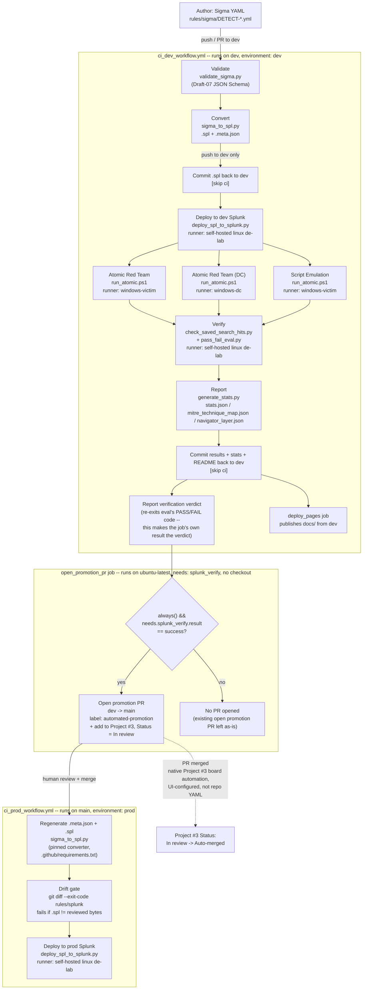
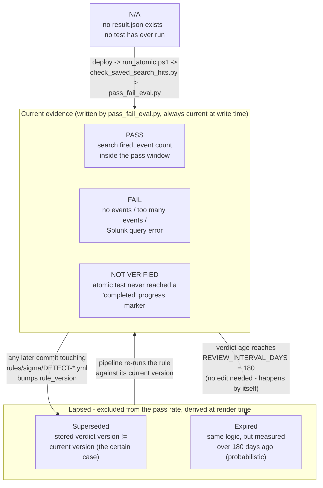

# Pipeline Overview

This is the end-to-end path a detection takes from a Sigma YAML file in `rules/sigma/` to a verified, production-deployed Splunk saved search. It is driven entirely by two GitHub Actions workflows (`ci_dev_workflow.yml`, `ci_prod_workflow.yml`) — there is no manual deploy step anywhere in the happy path. (A promotion PR's board item does pick up one further, purely cosmetic transition after merge — Status `In review` → `Auto-merged` — but that's done by Project #3's own native, UI-configured board automation, not by any workflow YAML in this repo; see stage 10 below.)

## The two-branch model: dev proves it, main ships it

Every change is authored against `dev`. The full validate → convert → deploy → attack → verify loop runs there, against a **dev** Splunk instance. Only after that loop reports an overall PASS does CI open a pull request promoting the change to `main`, which triggers a second, much smaller workflow that deploys the same already-verified SPL to a **prod** Splunk instance. `main` never runs Atomic Red Team tests or verification itself — it trusts what `dev` already proved.



**Single Pages publish path (as of commit `84d6588`):** `docs/` is published to GitHub Pages by exactly one job — `deploy_pages`, the last job in `ci_dev_workflow.yml`, `needs: [splunk_verify, atomic_verify, atomic_verify_dc, emulation_verify]` and gated on `splunk_verify`'s result being `success` or `failure` (i.e. it runs whenever `splunk_verify` actually ran, pass or fail, but not when the whole run was skipped for lack of SPL to verify). A previously-existing standalone `deploy_pages.yml` workflow — which fired independently on any push to `dev` touching `docs/**` — was deleted for exactly this reason: it existed to catch docs-only edits that don't match `ci_dev_workflow.yml`'s own trigger paths (`rules/sigma/**`, several `scripts/**` paths, `docs/schemas/sigma_schema.json` — notably *not* `docs/**` broadly), but in practice `splunk_verify`'s own `Commit verification results and stats` step touches `docs/index.html` on every real pipeline run, which re-triggered the standalone workflow independently and made a normal successful run publish Pages twice. The accepted tradeoff: a genuinely docs-only edit (e.g. hand-editing a file under `docs/architecture/`) no longer triggers its own Pages publish on its own — it simply waits for the next real `rules/sigma/**`-triggered pipeline run to publish alongside it.

**Platform quirk worth knowing before you add another job downstream of `splunk_verify` (two fix attempts, only the second one actually worked):** `open_promotion_pr` currently gates on `always() && needs.splunk_verify.result == 'success'` — both the `always()` and the explicit `result` check are load-bearing, and this took two separate commits to get right.

*First fix attempt (commit `34d7afc`) — necessary but not sufficient.* The original gate read `needs.splunk_verify.result == 'success' && needs.splunk_verify.outputs.exit_code == '0'`. `splunk_verify`'s own `if:` starts with `always()` — it must still run even when an upstream atomic-test job failed or was skipped — and cross-job `outputs:` declared on an `always()`-gated job were observed, empirically, to not reliably propagate into a downstream job's `if:` context: a run with a genuine 5/5 PASS and "Final verdict: PASS" already printed in `splunk_verify`'s own log still had `open_promotion_pr` skip with zero steps recorded when its gate read that `outputs.exit_code` check. Commit `34d7afc` dropped the `outputs.exit_code` clause, leaving just `needs.splunk_verify.result == 'success'`, and removed the now-unread `outputs.exit_code` job-level output from `splunk_verify` entirely. This was a real bug fix — the `outputs.exit_code` read genuinely was unreliable — but it turned out **not** to fully solve the skip.

*Second fix attempt (commit `54a2759`) — the actual fix.* Even after dropping the `outputs:` read, `open_promotion_pr` was *still* observed to skip on a confirmed-good run (run `30154222981`, run_attempt 1: `splunk_verify` had a real 5/5 PASS, `result: success`, and `open_promotion_pr` still recorded zero steps). The remaining cause: `open_promotion_pr`'s `if:` at that point (`needs.splunk_verify.result == 'success'`) contained none of `always()`/`success()`/`failure()`/`cancelled()`, so GitHub Actions auto-added an implicit `success()` check ANDed onto it — and that implicit `success()` was still evaluating false in this scenario, where `atomic_verify_dc` (one of `splunk_verify`'s own upstream `needs`) had been `skipped` because the batch had no DC-targeted tests. `deploy_pages`, later in the same file, has run reliably every single time — including runs with a skipped `atomic_verify_dc` — because it already used an explicit `always() && (needs.splunk_verify.result == 'success' || needs.splunk_verify.result == 'failure')` gate rather than leaning on implicit `success()`. `open_promotion_pr` was changed to mirror that proven pattern: `always() && needs.splunk_verify.result == 'success'`.

The exact GitHub Actions mechanism connecting an upstream-skip several hops back in the DAG to an implicit-`success()` failure several jobs downstream hasn't been independently verified beyond what's observed here — treat this as an empirically-confirmed workaround (matching the uncertainty the workflow's own comments already flag), not a fully-proven platform mechanism. **Forward-looking guidance for any future job you add that depends on `splunk_verify` (or on any job that itself has `always()` and a `needs:` chain containing jobs that can legitimately be `skipped`): always write an explicit `always()` in the job's own `if:` plus an explicit `needs.<job>.result == '...'` check — never rely on GitHub Actions' implicit `success()`, and never read cross-job `outputs:` from a job whose own `if:` starts with `always()`.**

## Stage by stage

**1. Author.** Detections are written as Sigma YAML under `rules/sigma/`. Most rules have a real `detection:` block Sigma can compile. Rules too sophisticated to express that way still live in `rules/sigma/*.yml` (with a required-but-unused placeholder `detection:` block) and instead set `custom.splunk.raw_query` to the literal SPL text.

**2. Validate — `scripts/validate/validate_sigma.py`.** Checks the rules against `docs/schemas/sigma_schema.json`, a Draft-07 JSON Schema. Invoked from CI via a PowerShell wrapper, `scripts/validate/validate_sigma.ps1`. Nothing downstream runs on a rule that fails schema validation.

Normally only the rules the push changed are processed. The run widens to *every* rule in the repo when the push touches one of five files that can change what a rule converts to or what it is called in Splunk — `sigma_schema.json`, `validate_sigma.py`, `validate_sigma.ps1`, `sigma_to_spl.py`, `rule_naming.py` — because each of those invalidates every `.spl` already converted. That is an explicit list, not a directory glob: widening the run means re-deploying and re-attacking all 27 rules on the lab VMs, so it should happen for files that genuinely change rule output and no others. See the `mode` logic in the `Determine changed Sigma files` step.

A manual run (`workflow_dispatch`, Actions tab) picks its own scope, because it has no before/after to diff:

- **`unverified`** (the default) — only rules whose verification is missing or stale. Each committed `outputs/results/<detect_id>/result.json` records the `rule_version` it was measured against, and a rule's version is its commit count, so "needs a run" is answerable without a diff. This is the normal way to catch up after rules were merged while the lab was switched off; see `LAB_ONLINE` below. Selecting nothing is a legitimate outcome and the run says so.
- **`all`** — every rule. Still the right choice after a converter or schema change, because those invalidate previously converted SPL *without* changing any rule's version, so the staleness check cannot see them.

The selection is computed by `scripts/state/select_unverified.py`, which biases towards selecting: if the current version cannot be established at all — no git history, a shallow clone, an unreadable rule — the rule is included rather than skipped. A needless re-run costs lab time; a wrong skip leaves a rule everyone believes was verified and was not.

**3. Convert — `scripts/convert/sigma_to_spl.py`.** Compiles each validated rule into `rules/splunk/<name>.spl` (pure query text, via `pysigma` with the Splunk backend, or emitted verbatim for `custom.splunk.raw_query` rules) plus a `<name>.meta.json` sidecar carrying the metadata that deploy/verify/atomic-runner need (`detect_id`, title, severity, MITRE tags, testing config), all sourced from the Sigma YAML. Only the `.spl` file is committed to git (back to `dev`, by the `Commit converted SPL outputs to dev` step); `.meta.json` is regenerated fresh on every run and never committed.

**4. Deploy — `scripts/deploy/deploy_spl_to_splunk.py`.** Pushes each SPL file to a live Splunk instance as a saved search, via Splunk's REST API, using credentials injected as GitHub Actions secrets scoped to a `dev` or `prod` GitHub **environment**. The saved search name is computed by the shared `scripts/lib/rule_naming.py` helper from `detect_id` + title (never the filename), so the deploy step and the verify step (`check_saved_search_hits.py`, which imports the same helper) always agree on what to look for.

**5. Attack — `scripts/atomic/run_atomic.ps1`.** Executes the Atomic Red Team test(s), or a script-emulation-style test, referenced in a rule's `custom.testing` metadata against a live Windows host — always a `-PreflightOnly` dry run first, then the real execution. This is what generates the telemetry the deployed saved search is supposed to catch. `atomic_verify` and `atomic_verify_dc` have no checkout/clean step — they just download the pipeline bundle artifact and run `run_atomic.ps1` directly in the self-hosted Windows runner's own persistent workspace disk, so nothing resets `outputs/verify/atomic_progress` between runs on its own. To keep that directory honest, the real (non-preflight) run clears every existing `*.json` marker out of `$ProgressDir` immediately after the preflight-only early exit and before writing any `started` markers for the current run's rules — otherwise a marker left over from an earlier, unrelated run (for a `detect_id` not even in this run's `$SplFiles` scope) would still be sitting there, get swept into this run's uploaded progress-marker artifact alongside the genuine ones, and be misread downstream as this run's own ground truth. This stage only runs on `dev`; the prod deploy is never attacked.

**6. Verify — `scripts/verify/check_saved_search_hits.py` + `pass_fail_eval.py`.** After a fixed wait for Splunk indexing (`Wait for Splunk indexing` step, default 60s), `check_saved_search_hits.py` queries Splunk for events matching each saved search. The search window is anchored to when testing actually began: every test job stamps its own start (`Mark test-phase start`, epoch seconds) as a job output, and the `Compute verification time window` step takes the earliest of them, minus a 60s clock-skew margin, as `--earliest`. That matters because the test phase regularly outlasts any fixed window — each atomic job may run to its `timeout-minutes: 10`, the victim runner is shared so atomic and emulation serialise, and the indexing wait comes on top; a fixed `-5m` measured back from query time excluded whatever ran first, failing rules for being early rather than for missing the attack. Note this is the *verification dispatch* window only — a rule's own `custom.splunk.earliest` still defines the schedule of the deployed saved search in Splunk and is untouched by this. `pass_fail_eval.py` turns those matches — plus each atomic job's own progress markers (now guaranteed, per stage 5 above, to reflect only `detect_id`s actually in scope for that run), which act as ground truth for a `NOT_VERIFIED` gate when a test job was killed by its `timeout-minutes` before finishing — into a per-rule verdict. `NOT_VERIFIED` has a second route, on the measurement side rather than the attack side: `check_saved_search_hits.py` classifies every query error as either `unmeasured` (the search never reached `DONE` within its 120s budget, the network dropped, Splunk answered unparseably) or `rule_error` (the saved search isn't deployed, or the search job errored inside Splunk). The first becomes `NOT_VERIFIED`, the second stays `FAIL`. The distinction matters because a search that never finished says nothing about the detection, while a missing saved search is a real defect that should stay red. Results are read only in `DONE` state — `FINALIZING` still has an incomplete result set, and counting it would undercount events and fail working rules. That verdict is written to `outputs/results/` as `DETECT-*` result files, and returns a process exit code that gates the promotion PR step. Each `result.json` also carries forward the `rule_version` and `git_sha` that came down the chain from the `.meta.json` sidecar via `hits.json`, which is what lets stage 7 tell later whether the verdict still describes the rule as it exists now. `pass_fail_eval.py` itself has no notion of a verdict lapsing — at the moment of measurement, every verdict is current by definition.

**7. Report — `scripts/docs/generate_stats.py`.** Aggregates every rule and result into `outputs/reports/stats.json`, `mitre_technique_map.json`, and `navigator_layer.json`. Also regenerates the README stats block and `docs/index.html`. This is where a verdict's *standing* is derived (see the next section): `compute_rule_version()` recomputes each rule's version from git history at render time and compares it with the `rule_version` recorded in that rule's `result.json` (a mismatch = **Superseded**), and `_verdict_age_days()` checks the recorded `run_timestamp` against `REVIEW_INTERVAL_DAYS` (past it = **Expired**). Either one excludes the verdict from the pass rate without counting it as a failure.

**8. Promote — the `open_promotion_pr` job.** A separate job from `splunk_verify` (not a step inside it), running on plain `ubuntu-latest` with no checkout — pure `gh` CLI. It's gated with `needs: splunk_verify` and `if: always() && needs.splunk_verify.result == 'success'`. When that holds — i.e. `splunk_verify` completed and its last step, `Report verification verdict`, re-exited `pass_fail_eval.py`'s real PASS/FAIL code as `0` — its single step, `Open promotion PR to main and mark it In review`, checks whether a `dev`→`main` PR is already open and, if not, runs `gh pr create --base main --head dev --title "Promote verified detections from dev to main" --label automated-promotion`. This PR does not auto-merge — a human reviews and merges it, and that merge is what actually ships to prod. The same step then immediately runs `gh project item-add 3 --owner martonbence --url <PR URL>` to add the new PR to [Project #3](https://github.com/users/martonbence/projects/3) (`PVT_kwHOA_8eh84BeHTL`), followed by `gh project item-edit --field-id PVTSSF_lAHOA_8eh84BeHTLzhYj6O0 --single-select-option-id 4fdb6324` to set that item's Status field to `In review` (verified against the live Project #3 schema via `gh project field-list`). So an auto-opened promotion PR is labeled **and** placed on the board pre-triaged, in one step. See the "Platform quirk" callout above for why this job was split out of `splunk_verify`, why its gate reads `result` rather than a cross-job `outputs:` value, and why the `always()` in front of that `result` check is not optional.

**9. Ship to prod — `ci_prod_workflow.yml`.** Triggered on `push` to `main` touching `rules/sigma/**` (in practice: merging a promotion PR, though any other direct push to `main` under that path filter also triggers it). Re-runs `sigma_to_spl.py` over the Sigma source already on `main`. The step exists for the gitignored `.meta.json` sidecars that `deploy_spl_to_splunk.py` needs, but it rewrites the `.spl` files too — the converter has no sidecar-only mode — and the deploy step reads file contents from the working tree (`git ls-files` supplies only the path list). So what reaches prod Splunk is what this run produced, not literally the reviewed bytes. Two things make that safe: both workflows install the same pinned converter from `.github/requirements.txt`, and a **drift gate** (`git diff --exit-code -- rules/splunk`) fails the job if the regenerated `.spl` differs from the committed, reviewed, atomic-tested one. Prod deploys only after that check passes. No validation, testing, or verification runs here — it trusts the `dev`-branch run that already passed, and the drift gate is what makes that trust checkable rather than assumed. (The stronger form — promoting dev's bundle as a digest-addressed artifact instead of rebuilding — is register item 3.2.)

**10. Track promotion on the project board at merge — Project #3's native board automation (not repo YAML).** Once the promotion PR is merged, its Project #3 item's Status field moves from `In review` to `Auto-merged` automatically. This is done entirely by Project #3's own built-in "Workflow" automation (GitHub Projects' native, UI-configured rule — set once under the Project's own Settings → Workflows: "Pull request merged" → set Status to `Auto-merged`), not by any GitHub Actions workflow in this repo. A repo workflow (`project_status_automerged.yml`) previously attempted to do this same thing from CI, but its run history (checked via the GitHub API) shows it only ever executed once in the repo's whole history — and that one run was skipped — while every real `dev`→`main` promotion PR since has still correctly landed on `Auto-merged`, because the native Project workflow was doing the job the entire time. The dead workflow file has been removed; nothing in `.github/workflows/` is involved in this transition. Because this is platform-side Project configuration rather than code in this repo, its exact trigger semantics aren't something this document can further describe beyond what's stated on the Project's own Settings page.

**11. Publish — GitHub Pages.** `docs/index.html`, a self-contained rule browser and MITRE ATT&CK Navigator, is published from `dev` by the `deploy_pages` job inside `ci_dev_workflow.yml` — the single publish path (see the note above).

## Retirement: the reverse path

Stages 1–11 describe a rule arriving. Nothing in them describes one leaving, and for most of this
pipeline's life nothing did: deleting a rule, or merely editing its `title`, left objects behind
that kept running, scheduling and alerting, with no step anywhere noticing. Retirement is therefore
not a stage in the forward chain but a pair of cleanups hanging off it, one on each side of the
boundary — Splunk and the repo.

**Why it needs its own mechanism at all.** The `Determine changed Sigma files` step diffs with
`--diff-filter=AMRC`, which excludes deletions. A commit that only deletes a rule produces an empty
`rule_files` list, `has_rules=false`, and every downstream job skips. The single event that creates
the mess is precisely the one the forward pipeline cannot see.

**Splunk side — `scripts/state/reconcile.py`.** Runs at the end of `splunk_verify`, `always()` and
`continue-on-error`, so drift is still reported when verification itself failed and a Splunk hiccup
in a reporting step can never fail a run whose real work succeeded. It builds desired state from
`rules/sigma/*.yml` (not the gitignored `.meta.json` sidecars, which don't exist outside a run)
using the same `saved_search_name()` the deploy uses, reads actual state from
`servicesNS/{owner}/{app}/saved/searches` with `count=0` (without which Splunk's default 30-row page
would make every rule past the first page look missing), and sorts every name into five buckets:

| Bucket | Meaning | What happens |
|---|---|---|
| `in_sync` | repo and Splunk agree | nothing |
| `missing` | the repo defines it, Splunk doesn't | reported; usually a rule that hasn't completed a full dev run yet |
| `orphan_renamed` | the `detect_id` is still in the repo, only the title-slug moved | **deleted automatically** by `--apply` |
| `orphan_removed` | the `detect_id` is gone from the repo entirely | **disabled and marked**, and only when a human passes `--apply-removals` |
| `unmanaged` | no CI marker in the description — someone's hand-built search | reported so the numbers add up, never touched |

The asymmetry between the two orphan buckets is the whole design. A rename orphan's rule is alive
under a new name, so the leftover is safe to delete unattended — but only once the replacement is
verified present in Splunk, because a failed deploy plus an eager cleanup would leave a
just-edited rule with no saved search at all. A removal orphan's rule is gone, which is not always
intentional, so it is disabled (reversible, and it keeps the object's Splunk-side scheduling and
alert configuration) rather than deleted, and never without someone asking. Objects the pipeline
did not create are reported and left alone.

Rename orphans are a *standing* condition rather than a migration: the Splunk object name
deliberately includes the title slug, because that is what an analyst sees in the search bar and in
alert lists, so every title edit produces one. That is why `--apply` runs unattended on every dev
run.

**Repo side — `scripts/state/prune_orphans.py`.** Runs in `prepare_validate_convert`, with its own
trigger condition and its own commit rather than riding along with the SPL commit step, which is
gated on `has_spl` and would never be reached on a deletion-only push. It removes
`rules/splunk/*.spl` files and `outputs/results/<detect_id>/` directories with no corresponding
rule — leftovers that otherwise keep being deployed to prod (which reads `git ls-files`) and keep
counting towards the dashboard's coverage. It compares current state rather than a diff, so it is
idempotent and picks up anything an earlier run missed, and it refuses to run against an empty
rules directory rather than treating the entire library as orphaned.

**`status: deprecated` closes the loop.** The schema always allowed it, but nothing read it, so a
rule parked as deprecated deployed and ran exactly like a stable one. The deploy now skips those
rules — in prod too, since prod regenerates the sidecars and runs the same script — and
`reconcile.py` drops them from desired state, so an object left live for a deprecated rule surfaces
as a removal orphan and can be retired deliberately. Their `.spl` and results are *not* pruned: the
rule is still in the repo, and its measurement history is still its own.

## Verdict lifecycle: the states, and a pass rate with a moving denominator

The pipeline's whole claim is that its numbers are measured rather than asserted. That claim only survives if a measurement can stop counting — a verdict describes the rule as it was at the moment the attack ran, and nothing that happens afterwards re-runs it. Two different things end a verdict's standing, and it is worth treating them as one concept with two diagnoses: a verdict is a certificate that can be **superseded** (the rule was replaced under it — certain) or **expire** (it simply got too old — probabilistic). Same consequence, same remedy, therefore the same bucket in every calculation; only the label and the reasoning differ.



Precedence: a rule that is both superseded and expired counts as **Superseded** — it's the stronger, more certain claim.

### The states, precisely

| State | Written by | Meaning | Counted in `pass_rate_pct`? |
|---|---|---|---|
| **PASS** | `pass_fail_eval.py` (`evaluate()`: `min_pass ≤ event_count ≤ max_pass`; the `Evaluate Pass/Fail` step invokes it with `--min-pass 1 --max-pass 10`, matching the script's own defaults) | The deployed saved search actually fired on the telemetry the Atomic test generated, and didn't fire so much that it's obviously noisy. | Numerator and denominator — if current. |
| **FAIL** | `pass_fail_eval.py` (`event_count < min_pass`, `event_count > max_pass`, or a non-null `error`) | A real, negative result about the rule as it currently stands. | Denominator only — if current. |
| **NOT VERIFIED** | `pass_fail_eval.py`'s `atomic_test_completed()` gate, reading the merged `atomic-progress-*` markers | *We don't know.* The Atomic Red Team test never flushed a `{"status": "completed"}` marker — most commonly the `Run Atomic Red Team tests...` step was killed by its `timeout-minutes` partway through a multi-rule batch. The detection logic was never exercised, so neither PASS nor FAIL would be an honest answer. Note that for CI **gating** purposes it is still treated like a non-PASS (`all_pass` goes false, exit code 1) — the distinction is about reporting honesty, not about letting an unverified rule through the promotion gate. | Denominator only — if current. |
| **Superseded** | Not written anywhere — *derived* in `generate_stats.py` at render time (`verdict_is_superseded`) and re-derived in the browser (`isVerdictSuperseded()`) | The stored `rule_version` in `outputs/results/<detect_id>/result.json` differs from `compute_rule_version()`'s current answer for that rule's YAML. The verdict itself is a genuine past measurement; it just isn't about the current logic. The certain case: what was tested is provably not what is deployed. | Excluded from both numerator and denominator. |
| **Expired** | Also derived, never written (`verdict_is_expired` / `isReviewDue()`) | The rule hasn't changed, but `_verdict_age_days(run_timestamp) >= REVIEW_INTERVAL_DAYS` (180). The probabilistic case: nothing in the rule moved, but telemetry, Splunk config and attacker tooling may have. Checked only when the verdict isn't already superseded — superseded wins. | Excluded from both. |
| **N/A** | Absence of `result.json` | No test has ever run for this rule. | Excluded from both. |

### The two inputs, and why both are derived at render time

Superseding needs a version; expiry needs a timestamp. Both travel in the same `result.json`, and both are compared against a *present-day* value that the result file cannot know:

```
sigma_to_spl.py::_compute_rule_version()     git log --follow --format=%H -- rules/sigma/X.yml  ->  "1.<commits-1>"
      |
      v   rules/splunk/X.meta.json  { "rule_version": "1.7", "git_sha": ... }   (CI-runtime only)
check_saved_search_hits.py                   copies rule_version/git_sha into hits.json
      |
      v
pass_fail_eval.py                            copies them into outputs/results/<detect_id>/result.json,
                                             and stamps run_timestamp
      |
      v
generate_stats.py                            SUPERSEDED: compute_rule_version() recomputes from git
                                                         at render time, compares with the stored one
                                             EXPIRED:    _verdict_age_days(run_timestamp) >= 180
      |
      v
docs/index.html (browser)                    same two predicates re-evaluated against the READER's
                                             clock: isVerdictSuperseded() / isReviewDue()
```

Two independent implementations of the same version scheme (`sigma_to_spl.py::_compute_rule_version()` and `generate_stats.py::compute_rule_version()`) produce `1.0` on a rule's first commit, `1.1` on its second, and so on, both via `git log --follow` so a rename never resets the count. Age is computed by `_verdict_age_days()` in whole UTC calendar days, written deliberately to match the page's `verdictAgeDays()` arithmetic so the build-time figure and the browser's live one can only differ by the elapsed time between them, never by how the subtraction is done.

Deriving both in `generate_stats.py` rather than in `pass_fail_eval.py` isn't an implementation convenience — it's the only place they *can* live. Both are properties of the gap between measurement time and read time; at write time that gap is zero. `pass_fail_eval.py` therefore stays untouched by this concept: it records what it measured, the version it measured against, and when, and nothing else.

**Expiry goes one step further and is re-derived in the reader's browser.** A superseded verdict changes state only when someone commits, which the pipeline sees; an expired one changes state simply because time passed, which the pipeline cannot see after it has finished. So `docs/index.html` recomputes both the pass rate and the coverage fraction client-side from `RULES` on every page load, using the same predicates the table rows and the `Evidence` facet use — the `@@PASS_RATE@@` value baked into the overlay by the template is only a starting value the JS overwrites. `stats.json` and the README badges deliberately stay build-time snapshots (a badge is a snapshot by definition). This means a months-old page can legitimately report a *lower* pass rate than the badge generated alongside it; the page is the more current of the two, and that divergence is intended rather than a bug to reconcile.

Three consequences worth stating plainly:

- **`splunk_verify`'s own exit code — and therefore the promotion gate — is not lapse-aware.** `pass_fail_eval.py` only sees the rules in *this run's* scope, and for those the verdicts are current by construction. A rule superseded three runs ago, or one whose verdict quietly expired, doesn't block promotion; it just stops contributing to the published pass rate. This is a reporting property, not a gate.
- **The version bumps on any commit to the rule file.** A fixed typo in `description:` supersedes a verdict exactly like a rewritten `detection:` block. That over-sensitivity is deliberate on the safe side — it can only understate confidence, never overstate it — but the correct fix is an explicit, author-bumped `version:` field in the Sigma YAML with a CI check that it moved when the logic did (audit item 3.5). Until then, `Superseded` should be read as "not re-measured since the file last changed," not "the logic definitely changed."
- **The review interval is one global constant.** `REVIEW_INTERVAL_DAYS = 180` in `generate_stats.py`, injected into the page as `@@REVIEW_DAYS@@` and reused for the verification-age chart's band edges (quarter/half/full interval). There is no per-rule or per-severity override: a fast-moving technique and a stable one expire on the same schedule.

### What the published numbers mean now

`pass_rate_pct` is **current PASS ÷ rules whose verdict is still current evidence**, not "all PASS ÷ all rules." The old denominator silently inherited every verdict ever recorded, so the headline stayed high while the measurements under it aged out; at the time of this change 15 of 27 rules carried verdicts from an older version of themselves, which is the difference between a reported 96% and a measured 92% (11 current PASS out of 12 current verdicts).

Adding the age test to the same denominator is what stops the number from freezing in the other direction: with only the version check, a library nobody edits and a pipeline that stopped running would together report the same green figure indefinitely. Now that scenario decays to zero within 180 days on its own. As of today that half of the rule hasn't fired — every lapsed verdict is superseded (15) and none has expired (0) — but the formula no longer depends on anyone noticing.

`stats.json` carries both readings, so nothing downstream has to recompute anything:

The verdict-related keys form three layers. Which layer a key belongs to is the only thing you need to know to read it correctly:

**Layer 1 — whole library, lapsing ignored.** Raw verdict counts over every rule, lapsed or not. These meanings have never changed and are deliberately frozen, so anything already querying them (older badges, external references) keeps returning the same quantity.

| Key | Definition | Today |
|---|---|---|
| `verified_pass` / `verified_fail` | Every PASS / FAIL verdict on record. | 26 / 1 |
| `verified_not_verified` | NOT_VERIFIED verdicts (attempted, test never completed). | 0 |
| `never_tested` | Rules with no `result.json` at all. | 0 |
| `not_verified` | `verified_not_verified + never_tested`, kept for the existing "Not Verified" badge's URL query. | 0 |

**Layer 2 — current verdicts only.** Counted with one consistent rule applied uniformly: a verdict that has been superseded or has expired doesn't count, whatever it said. There is no per-verdict-type exception here — that symmetry is the point.

| Key | Definition | Today |
|---|---|---|
| `verified_pass_current` | PASS verdicts that are neither superseded nor expired. Backs the "Pass" badge. | 11 |
| `verified_fail_current` | FAIL verdicts that are neither superseded nor expired. Backs the "Fail" badge. | 1 |
| `verified_superseded` | Rules whose stored verdict version ≠ current version. | 15 |
| `verified_expired` | Rules whose verdict is not superseded but is ≥ `REVIEW_INTERVAL_DAYS` old at generation time. | 0 |
| `verified_stale` | `verified_superseded + verified_expired` — every verdict that has stopped being evidence, by either route. Backs the "Needs Re-run" badge (`BC8CFF`). | 15 |
| `verified_current` | `total_verifiable − verified_stale − never_tested` — rules holding a current verdict of any kind. The pass rate's denominator; a current `NOT_VERIFIED` counts here but not in the numerator, which is why `verified_pass_current + verified_fail_current` need not equal it. | 12 |

**Layer 3 — derived percentages.**

| Key | Definition | Today |
|---|---|---|
| `pass_rate_pct` | `verified_pass_current ÷ verified_current`. | 92 |
| `verification_current_pct` | `verified_current ÷ total_verifiable` — how much of the library the pass rate is even speaking for. Backs the "Verified Current %" badge, coloured via `verification_current_color`. | 44 |
| `confirmed_working_pct` | `verified_pass_current ÷ total_verifiable` — the strictest reading, with no denominator selection at all. Published in `stats.json` for consumers, but deliberately not surfaced anywhere on the README badge row or the rule browser: as a headline it would re-fuse the two questions the pair above separates. | 41 |

Note what the pass rate deliberately does **not** do: lapsed verdicts are dropped from the denominator rather than counted as failures. Counting them as failures would be the mirror image of the bug being fixed — they aren't broken, they're unmeasured — and it would make the headline get *worse* every time someone tidies a rule, which is how a metric teaches people to ignore it.

The reason `verification_current_pct` is published as its own README badge next to Pass Rate, rather than being left for a reader to derive: a single percentage is always quoted alone. Screenshot, chat message, slide — whatever context said "of what we measured" gets stripped, and the caveat disappears with it. Two adjacent badges make the coverage of the measurement travel with the measurement. For the same reason the count badges were moved onto layer 2 together — **Pass** from `verified_pass` to `verified_pass_current`, **Fail** from `verified_fail` to `verified_fail_current` — and a **Needs Re-run** badge (`verified_stale`, drift purple `BC8CFF`) was added. That badge is labeled for the consequence, not the diagnosis: the page deliberately never coined an umbrella term for superseded + expired, and a badge holds one word — the thing the two cases genuinely share is the to-do, not a category. Moving only one of the two counts would have been worse than moving neither: Pass and Fail read side by side as a ratio, so counting them over different populations would invent an apparent discrepancy out of nothing. The layer-1 keys still exist and still mean what they always meant; the badges simply no longer ask them.

### Two rings, two denominators: the `Evidence` and `Verification` charts

The rule browser used to answer both questions with one doughnut — what the measurement found *and* whether it still holds — which forced single slices to carry two meanings at once. They are now two charts, side by side in the Rule Overview section's second row:

| Card | Population | Segments | Center overlay |
|---|---|---|---|
| **Evidence** | The whole library (27) | `Current` (12, `#3fb950`) / `Superseded` (15, `#bc8cff`) / `Expired` (0, `#2dd4bf`) / `Never tested` (0, `#8b949e`) | `44%` / `Current` |
| **Verification** | Current verdicts only (12) | `Pass` (11) / `Not Verified` (0, `#d29922`) / `Fail` (1, `#f85149`) | `92%` / `Pass Rate`, with `12 of 27 current` on the sub-line |

**The differing denominators are the design, not an inconsistency.** A lapsed PASS is not a pass that happens to be old — it's an absence of present-tense evidence, so it is counted once, on Evidence, and never as a pass on Verification. This is what finally makes the headline honest against its own picture: `92% Pass Rate` describes exactly the ring it sits in, with nothing for the reader to correct mentally. Had Verification kept all 27 verdicts, summing its slices would yield 26/27 = 96% — the inherited figure this whole change exists to retire. Hence the overlay naming its own denominator on the sub-line, *inside the same overlay element* (`.verify-overlay-sub`) rather than in a tile of its own, so percentage and fraction screenshot together.

**Invariant worth preserving in any future redesign: the Verification ring's total always equals the Evidence ring's `Current` slice.** It holds by construction — a single pass over `RULES` classifies each rule for Evidence first and only increments the verdict tally on the `current` branch, so the two rings cannot be populated from disagreeing predicates.

Both charts are computed client-side from `RULES` using the same `isVerdictSuperseded()` / `isReviewDue()` predicates the table rows and the `Evidence` facet use, rather than from separate template placeholders. Verification's overlay is likewise recomputed (`liveCurrent`, `livePassRate`) rather than left at the template's `@@PASS_RATE@@`, so the headline can't contradict its own ring on a page left open while verdicts aged past the interval. One implementation detail with teeth: because Evidence reuses the same `.verify-canvas-wrap` class and now precedes Verification in the DOM, the overlay write is scoped through `chart-verify`'s own parent element — a document-wide `querySelector` would silently write the pass rate into Evidence's ring instead.

Superseded and Expired get a segment each rather than sharing one under an umbrella word: same standing, different diagnosis, and naming both plainly beats coining a term a reader has to look up. Superseded keeps the drift purple worn by the row-level `△` marker and the `Verdict` facet accent; Expired takes the teal the retired Review facet used to carry. The existing `n > 0` filter drops empty segments, so `Expired` simply isn't drawn until something crosses the review interval — which is why Evidence currently shows two segments, not four.

Neither card carries a subtitle: `confirmed_working_pct` is still published in `stats.json`, but it is no longer restated anywhere on the page — a third figure beside a percentage and a fraction is one number too many for a single glance, and it's derivable from the two that remain.

**Layout.** Rule Overview is two rows of three cards on a fixed 3-column grid (`.dash-section-grid-row2`): Rule Type · Rules by Severity · Status, then Evidence · Verification · Verification Age. The grid collapses to 2 columns below 1250px and to 1 below 820px. The second row's order is deliberate and reads as a sentence: how much evidence we have · what it says · how old it is — with Verification Age standing as the distribution behind Evidence's `Expired` slice.

### The `Evidence` facet: one question, four answers

The rule browser used to carry two separate facets asking overlapping questions — `Verdict → Sync` (Current / Outdated, by rule version) and `Review` (Up to date / Overdue / Never tested, by age). Both are gone, replaced by a single `Verdict → Evidence` facet with the values **Current / Superseded / Expired / Never tested**. Besides being one question instead of two, this fixes vocabulary that ran backwards against intuition: the old "Outdated" meant *the rule changed*, while the verdicts that were literally old were filed under "Overdue." The `Evidence` chart described above is these same four values in ring form, so the facet and the dashboard can be read against each other directly.

The same value is what the table's markers encode (hollow verdict badge for either lapse, `△` for superseded, `●` for expired) and what CSV/JSON exports carry in a single `Evidence` column, replacing the former `Review Status` + `Verdict Sync` pair. The per-rule `verdict_at` timestamp and both version fields remain exported alongside it, so a consumer can re-derive the classification independently.

### Known gap: the NOT VERIFIED gate is atomic-only

`pass_fail_eval.py` applies the progress-marker gate only when a rule's `tester` is `atomic`:

```python
if tester == "atomic" and not atomic_test_completed(progress_dir, detect_id):
    verdict = NOT_VERIFIED
```

For rules with `testing.type: emulation` (8 of the current 27), `emulation_verify` runs `run_atomic.ps1` on the victim host but nothing consults a completion marker for them — so an emulation test that never started, or was killed mid-batch, produces zero matched events and is scored **FAIL**. For those rules, "the infrastructure didn't run the test" and "the detection didn't fire" are currently indistinguishable in the published numbers. Tracked as audit item 2.8.

## Named workflow jobs and steps

### `ci_dev_workflow.yml`

| Job | Runner | Key steps (literal `name:` values, bolded ones are the substantive work) |
|---|---|---|
| `prepare_validate_convert` | `ubuntu-latest` | Checkout, Setup Python, Determine changed Sigma files, Install Python deps, **Prune repo artefacts of deleted rules** (deliberately *not* gated on `has_rules` — a deletion-only push produces no rule files, which is exactly when this is needed; installs deps itself for the same reason, and commits separately), **Validate Sigma rules**, **Check every rule has a job that can run its test** (warns, does not gate), **Convert Sigma rules to Splunk SPL**, Build pipeline bundle, Commit converted SPL outputs to dev, Detect test types in pipeline bundle, Upload pipeline bundle, Warn that the lab is switched off (only when `LAB_ONLINE` is `false`) |
| `deploy_to_splunk` | `self-hosted, linux, de-lab` | Download pipeline bundle, Setup Python, Install deploy deps, **Deploy selected SPL files to Splunk** |
| `atomic_verify` | `self-hosted, X64, Windows, victim, atomic, windows-victim` | **Mark test-phase start** (epoch seconds, exposed as the `started_at` job output — first step so a job later killed by `timeout-minutes` still reports when it began), Download pipeline bundle, **Run Atomic Red Team tests embedded in deployed SPL metadata**, Upload atomic progress markers |
| `atomic_verify_dc` | `self-hosted, X64, Windows, dc, windows-dc` | **Mark test-phase start** (own host, own clock — hence a separate stamp), Download pipeline bundle, **Run Atomic Red Team tests on Domain Controller**, Upload atomic progress markers |
| `emulation_verify` | `self-hosted, X64, Windows, victim, windows-victim` | **Mark test-phase start** (shares the victim runner with `atomic_verify`, so the two serialise — which is what stretches the test phase past any fixed window), Download pipeline bundle, **Run Script Emulation tests embedded in deployed SPL metadata** |
| `splunk_verify` | `self-hosted, linux, de-lab` | Checkout (`fetch-depth: 0` — not shallow, on purpose: `generate_stats.py`'s `compute_rule_version()` runs `git log --follow` per rule file later in this same job, and a shallow checkout silently made every rule's version come out `1.0` regardless of real history), Download pipeline bundle, Download atomic progress markers (victim), Download atomic progress markers (DC), Setup Python, Install deps, Wait for Splunk indexing, **Compute verification time window** (takes the earliest `started_at` across the three test jobs, minus a 60s clock-skew margin, as `--earliest`; falls back to `-15m` with a warning if none reported), **Query Splunk for matched events**, **Evaluate Pass/Fail**, Upload matched events artifact, **Reconcile Splunk state against the repo** (`always()` + `continue-on-error`; runs with `--apply`, which cleans up rename orphans only — the step re-exits the script's code via `PIPESTATUS` so a cleanup that failed to land is visible instead of hidden behind the step-summary `echo`), Upload reconciliation report, **Generate stats and update README**, Commit verification results and stats, **Report verification verdict** (re-exits `pass_fail_eval.py`'s exit code — makes the job's own `result` the PASS/FAIL verdict) |
| `open_promotion_pr` | `ubuntu-latest` | `needs: splunk_verify`, `if: always() && needs.splunk_verify.result == 'success'`, no checkout step. **Open promotion PR to main and mark it In review** (single step: `gh pr create` then `gh project item-add`/`item-edit`) |
| `deploy_pages` | `ubuntu-latest` | `needs: [splunk_verify, atomic_verify, atomic_verify_dc, emulation_verify]`. Checkout (ref: `dev`), configure-pages, upload-pages-artifact, deploy-pages (no explicit step `name:`s — these are third-party actions). The sole GitHub Pages publish path — see the note above. |

`atomic_verify`, `atomic_verify_dc`, and `emulation_verify` each only run if `prepare_validate_convert`'s `has_atomic_tests` / `has_atomic_dc_tests` / `has_emulation_tests` output is `true` for the changed rules, and all three are `continue-on-error: true` so a single flaky test host doesn't block `splunk_verify` from running. `splunk_verify` no longer inspects their results at all: what gates it is that the SPL was built and the deploy succeeded. A failed attack job is not a reason to skip measurement — the progress-marker mechanism is what turns "the attack never ran" into an honest `NOT_VERIFIED` instead of a `FAIL`.

### `ci_prod_workflow.yml`

| Job | Runner | Key steps |
|---|---|---|
| `announce_lab_offline` | `ubuntu-latest` | Runs only when `LAB_ONLINE` is `false`. Say that prod was not updated — exists because prod's only real job is on the runner being skipped, and an entirely skipped run is indistinguishable from a healthy one in the runs list. |
| `deploy_to_prod` | `self-hosted, linux, de-lab` | Checkout, Setup Python, Install deps (pinned, from `.github/requirements.txt`), **Regenerate SPL + meta sidecars from Sigma source**, **Fail if regenerated SPL drifted from what was reviewed** (`git diff --exit-code -- rules/splunk`), **Deploy all SPL files to prod Splunk** |

### `ci_code_checks.yml`

The pipeline's own CI, rather than the pipeline. `ci_dev_workflow.yml` only does substantive work when a *rule* changes -- its `changes` step derives a list of Sigma files, and an empty list makes every downstream job skip -- so the code running the pipeline was never exercised. Adding `scripts/docs/**` to that workflow's `paths:` would not have fixed it: the run starts, then skips everything. Hence a separate, rule-independent workflow, which is also what keeps it fast (`ubuntu-latest`, no Splunk, no self-hosted runner, no live attacks).

Triggered on `push` (any branch but `main`) and `pull_request` touching `scripts/**`, `tests/**`, `pyproject.toml`, `.github/requirements*.txt` or `.github/workflows/**`.

| Job | Runner | Key steps |
|---|---|---|
| `static_analysis` | `ubuntu-latest` | Checkout, Setup Python (pip cache keyed on both requirements files), Install deps (`.github/requirements.txt` + `.github/requirements-dev.txt`), **Ruff**, **Pytest** |
| `regenerate_console` | `ubuntu-latest` | `needs: static_analysis`, and only on a `push` to `dev`. Declares `environment: dev`, which is load-bearing: `GH_PAT_DEV_PUSH` is an environment secret rather than a repository one, so a job that omits the environment receives an empty string and `actions/checkout` fails with `Input required and not supplied: token`. Checkout (`fetch-depth: 0`, for the same `git log --follow` reason as `splunk_verify`), Setup Python, Install deps, **Regenerate and commit if changed** -- resets to `dev`'s tip, re-runs `generate_stats.py`, stages `outputs/reports/`, `README.md` and `docs/index.html`, and commits with `[skip ci]`. Exposes a `published` output. |
| `publish_console` | `ubuntu-latest` | `needs: regenerate_console`, gated on `published == 'true'`. Checks out `dev` and publishes `docs/` via `configure-pages` / `upload-pages-artifact` / `deploy-pages`. Shares the `pages` concurrency group with the dev workflow's publish job so the two queue rather than race. |

`regenerate_console` exists because a change to `generate_stats.py` alone never regenerated the published Console. `publish_console` exists because Pages serves an uploaded artifact, not the branch -- committing `docs/index.html` updates the repo but not the live site.

The "did anything change?" test is not a plain `git diff --quiet`. `generate_stats.py` stamps the current time and HEAD's sha into everything it writes, so two runs over identical sources are never byte-identical and a naive check would commit on every push. The job normalises timestamps and shas out of both sides before comparing. It deliberately does not filter diff *lines* that look like timestamps: `index.html` carries `COVERAGE_HISTORY` and `RULE_GROWTH_HISTORY` as one enormous line each, holding the real data alongside a timestamp, so a line-level filter would silently discard genuine coverage changes.


There is no third workflow file in `.github/workflows/` for the promotion PR's post-merge board transition — see stage 10 above for why (it's Project #3's own native, UI-configured automation, not repo code).

## Runners, named

| Label set (as written in the YAML) | Role |
|---|---|
| `ubuntu-latest` | GitHub-hosted. Used for `prepare_validate_convert`, `open_promotion_pr`, and `deploy_pages` — nothing here needs lab network access. |
| `self-hosted, linux, de-lab` | Self-hosted Linux box with a network path to Splunk. Used by `deploy_to_splunk` and `splunk_verify` (dev) and by `deploy_to_prod` (prod) — the same runner role serves both environments; what differs is the GitHub Actions `environment:` (`dev` vs `prod`) and therefore which `SPLUNK_*` secrets get injected. |
| `self-hosted, X64, Windows, victim, atomic, windows-victim` | The Windows victim host that executes Atomic Red Team tests, used by `atomic_verify`. |
| `self-hosted, X64, Windows, victim, windows-victim` | The same physical victim host, used by `emulation_verify` for script-emulation-style tests — note the label set here omits `atomic` compared to `atomic_verify`'s; that's what the workflow file actually specifies, not a documentation inconsistency. |
| `self-hosted, X64, Windows, dc, windows-dc` | The domain-controller host, used only by `atomic_verify_dc` for techniques that specifically require DC context. |

### `LAB_ONLINE`: running when the lab is not

The four self-hosted machines above are not always on, and GitHub does not fail a job that has no runner to pick it up — it queues it. `timeout-minutes` does not help, because it starts counting when a job *starts*, not while it waits; and since the dev workflow's `concurrency` group uses `cancel-in-progress: false`, one such run blocks every later push to `dev` until GitHub drops it about a day later.

Setting the repository variable `LAB_ONLINE` to `false` skips the lab-bound half of the pipeline, so a push still validates, converts and commits its SPL instead of queueing behind an absent runner. It must be a **repository** variable, not an environment one: job-level `if:` conditions are evaluated before a job's `environment:` is resolved, so an environment-scoped variable would not be visible and the gate would quietly do nothing.

In `ci_dev_workflow.yml` it is applied in exactly one place — `deploy_to_splunk`'s `if:` — because that job is the gateway to every self-hosted runner and the dependency graph carries the decision the rest of the way: the three attack jobs need it and carry no `always()`, `splunk_verify` requires `deploy_to_splunk.result == 'success'`, and `open_promotion_pr` and `deploy_pages` both require a `splunk_verify` result they will not get. Nothing is promoted or published from a run that measured nothing.

Only the literal string `false` disables. An unset variable means the lab is up, so the normal state needs no configuration and a typo in the variable name fails towards running rather than towards silently skipping every deploy.

Two things to know about the switch:

- A rule merged while it is `false` reaches the repo but **never reaches Splunk**, because a normal push only deploys what that push changed. The way back is a manual run (`workflow_dispatch`) once the lab is up; its default `unverified` scope picks up exactly those rules, however many accumulated.
- Skipped jobs are not failures, so a run with the lab off looks green in the jobs list. The `Warn that the lab is switched off` step in `prepare_validate_convert` therefore emits a `::warning` and a step-summary block spelling out what did not happen.

**`ci_prod_workflow.yml` honours the same variable**, because `deploy_to_prod` runs on that same `de-lab` machine and inherits the problem exactly. Skipping is strictly better than queueing there too: both mean prod is not updated, but one of them says so within a minute instead of looking busy for a day, and does not block the run that would have deployed. Prod's recovery path already existed for a different reason — its `workflow_dispatch` (item 2.5) deploys from `git ls-files` rather than from a diff, so one manual run applies the full current library on `main`, including whatever was merged while the switch was off.

Prod has only one real job and it is the one being skipped, so a second job, `announce_lab_offline`, runs on `ubuntu-latest` under the exactly complementary condition. Without it there would be no job left to report and the run would be indistinguishable from a healthy one.

## Custom Claude Code subagents involved in building/maintaining this pipeline

Not part of the runtime CI pipeline, but the tooling used to build and maintain it — see `.claude/agents/*.md` for the authoritative frontmatter (`name`/`description`); re-read that directory if this list looks stale:

- **devops-engineer** — owns `.github/workflows/*.yml` and the scripts they invoke; the agent that would implement changes like the dev/prod split or the promotion-PR step itself.
- **github-ops** — owns GitHub-platform mechanics (branch protection, secrets, self-hosted runner registration, PR/merge conflict resolution, the wiki-enablement gap) as opposed to workflow YAML content.
- **docs-maintainer** — this document's own maintainer; keeps README/docs/architecture/Wiki in sync with the pipeline described above.
- **detection-content-reviewer** — reviews Sigma/SPL rule *content* quality (logic soundness, false-positive risk, MITRE tag accuracy, test coverage) — the judgment layer CI's schema/pass-fail checks don't provide.
- **frontend-engineer** — owns `docs/index.html` and `scripts/docs/generate_stats.py` (the rule browser / Navigator), using the Playwright and Chrome DevTools MCP tools for verification.
- **security-scanner** — audits this repo's own code/config (not rule content) for vulnerabilities and secrets, using the semgrep MCP tools, `pip-audit`, and GitHub's secret-scanning MCP tool.
- **ideation** — brainstorming-only; proposes new rules or tools, never edits pipeline code.

See `docs/architecture/data_flow.md` for the concrete files/artifacts moving between these stages, and `docs/architecture/threat_model.md` for what's in/out of scope from a security standpoint.
