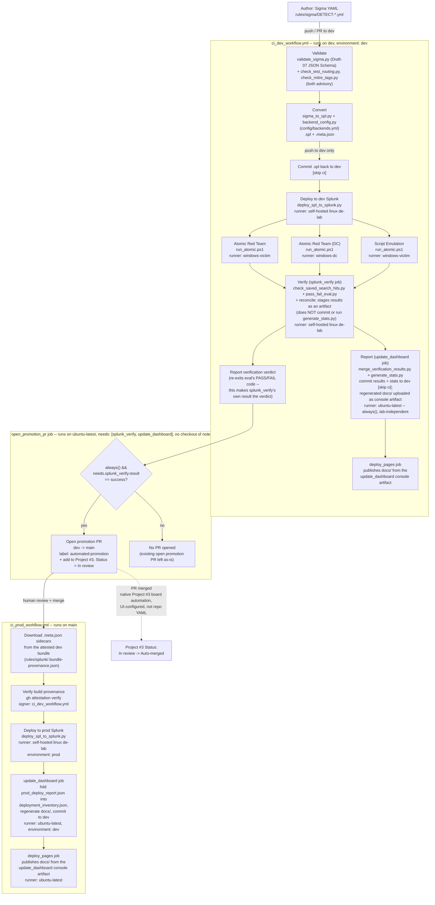
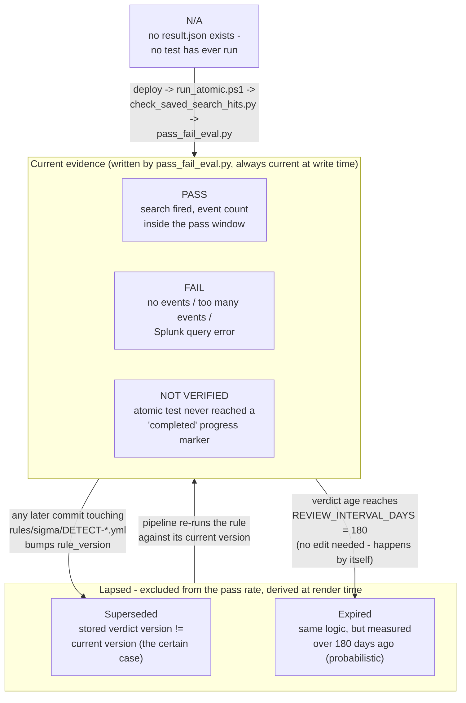

# Pipeline Overview

This is the end-to-end path a detection takes from a Sigma YAML file in `rules/sigma/` to a verified, production-deployed Splunk saved search. It is driven entirely by two GitHub Actions workflows (`ci_dev_workflow.yml`, `ci_prod_workflow.yml`) — there is no manual deploy step anywhere in the happy path. (A promotion PR's board item does pick up one further, purely cosmetic transition after merge — Status `In review` → `Auto-merged` — but that's done by Project #3's own native, UI-configured board automation, not by any workflow YAML in this repo; see stage 10 below.)

## The two-branch model: dev proves it, main ships it

Every change is authored against `dev`. The full validate → convert → deploy → attack → verify loop runs there, against the **dev** Splunk app. Only after that loop reports an overall PASS does CI open a pull request promoting the change to `main`, which triggers a second, much smaller workflow that deploys the same already-verified SPL to the **prod** Splunk app. `main` never runs Atomic Red Team tests or verification itself — it trusts what `dev` already proved.

**What separates dev from prod, precisely.** Not two servers: one Splunk instance, two apps. `SPLUNK_BASE_URL`, `SPLUNK_USERNAME`, `SPLUNK_PASSWORD` and `SPLUNK_VERIFY_TLS` are *repository* secrets, shared by both; only `SPLUNK_APP` is scoped to the GitHub Actions environment (`dev` / `prod`) and differs between them — and it is a *variable* (`${{ vars.SPLUNK_APP }}`), not a secret, since an app namespace is a routing label rather than a credential (audit item 2.18). So the isolation is Splunk's app namespace — real for saved-search objects, which are distinct per app — and nothing more. The two apps share the search head, the indexes and the credentials, and the same account can write to both.

**The value is the app's directory name, not its display label.** `vars.SPLUNK_APP` is `detection_engineering` in the `dev` environment and `prod` in the `prod` one. On the Splunk side the dev app's *label* is `dev` while its folder name is `detection_engineering`, and the REST path (`servicesNS/{owner}/{app}/…`) is built from the folder name — copying the label out of Splunk's app list into the variable would produce a 404 rather than a wrong-namespace write. Now that the value is a variable rather than a masked secret, the two environments' values are readable and directly comparable, which is what makes the dev-vs-prod cross-check noted in [`threat_model.md`](threat_model.md) something a human can actually perform.

That is a reasonable arrangement for a lab, but it should be read for what it is: the app name is the only thing keeping a dev deploy out of prod. In particular `reconcile.py --apply`, which *deletes* saved searches, is aimed by that same value.

**TLS verification is no longer decided by the absence of a setting** (audit item 2.14). All five workflow references to `SPLUNK_VERIFY_TLS` — four in `ci_dev_workflow.yml`, one in `ci_prod_workflow.yml` — used to read `${{ secrets.SPLUNK_VERIFY_TLS || 'false' }}`. That fallback did not mean "no preference": it translated a *missing* secret into a positive instruction to skip certificate verification, one layer above four scripts that had all already chosen `env_bool("SPLUNK_VERIFY_TLS", default=True)`. The `|| 'false'` is gone from all five, so an unset secret now renders empty, `env_bool` falls through to verifying, and the connection either checks the certificate or fails visibly. Turning verification off remains possible — it just has to be stated, by setting the secret to `false`. The second half of the item was the silence: `deploy_spl_to_splunk.py`, `check_saved_search_hits.py`, `wait_for_indexing.py` and `reconcile.py` now each print which mode they are running in, and emit a `::warning` annotation when verification is off. `SPLUNK_VERIFY_TLS` stays a **repository secret** (an owner decision, not a technical constraint — unlike `SPLUNK_APP` it does not need to differ per environment), currently set to `true`.



**Pages now has three publishers, sharing one concurrency group (as of `ci_prod_workflow.yml`'s
`update_dashboard`/`deploy_pages` jobs).** `docs/` reaches GitHub Pages from: `deploy_pages`, the
last job in `ci_dev_workflow.yml` (`needs: [update_dashboard]`, gated on
`needs.update_dashboard.result == 'success'` — it publishes the `console-<run_id>` artifact that
`update_dashboard` uploads, so it runs whenever that job successfully regenerated and committed the
dashboard, and skips cleanly when there was no rule change or the commit failed); `publish_console`
in `ci_code_checks.yml`; and now `deploy_pages` in `ci_prod_workflow.yml`, which runs after every
successful prod deploy via its own `update_dashboard` job (see stage 9 below). All three declare
`concurrency: { group: pages, cancel-in-progress: false }`, so a run from any of the three queues
behind another rather than racing it to publish a different snapshot. A previously-existing standalone
`deploy_pages.yml` workflow — which fired independently on any push to `dev` touching `docs/**` — was
deleted early on for a related reason: it existed to catch docs-only edits that don't match
`ci_dev_workflow.yml`'s own trigger paths (`rules/sigma/**`, several `scripts/**` paths,
`docs/schemas/sigma_schema.json` — notably *not* `docs/**` broadly), but in practice the pipeline's
own write-back step touches `docs/index.html` on every real run, which re-triggered the standalone
workflow independently and made a normal successful run publish Pages twice. The accepted tradeoff
still holds: a genuinely docs-only edit (e.g. hand-editing a file under `docs/architecture/`) doesn't
trigger its own Pages publish on its own — it waits for the next real pipeline or prod-deploy run to
publish alongside it.

**Platform quirk worth knowing before you add another job downstream of `splunk_verify` (two fix attempts, only the second one actually worked):** `open_promotion_pr` currently gates on `always() && needs.splunk_verify.result == 'success'` — both the `always()` and the explicit `result` check are load-bearing, and this took two separate commits to get right.

*First fix attempt (commit `34d7afc`) — necessary but not sufficient.* The original gate read `needs.splunk_verify.result == 'success' && needs.splunk_verify.outputs.exit_code == '0'`. `splunk_verify`'s own `if:` starts with `always()` — it must still run even when an upstream atomic-test job failed or was skipped — and cross-job `outputs:` declared on an `always()`-gated job were observed, empirically, to not reliably propagate into a downstream job's `if:` context: a run with a genuine 5/5 PASS and "Final verdict: PASS" already printed in `splunk_verify`'s own log still had `open_promotion_pr` skip with zero steps recorded when its gate read that `outputs.exit_code` check. Commit `34d7afc` dropped the `outputs.exit_code` clause, leaving just `needs.splunk_verify.result == 'success'`, and removed the now-unread `outputs.exit_code` job-level output from `splunk_verify` entirely. This was a real bug fix — the `outputs.exit_code` read genuinely was unreliable — but it turned out **not** to fully solve the skip.

*Second fix attempt (commit `54a2759`) — the actual fix.* Even after dropping the `outputs:` read, `open_promotion_pr` was *still* observed to skip on a confirmed-good run (run `30154222981`, run_attempt 1: `splunk_verify` had a real 5/5 PASS, `result: success`, and `open_promotion_pr` still recorded zero steps). The remaining cause: `open_promotion_pr`'s `if:` at that point (`needs.splunk_verify.result == 'success'`) contained none of `always()`/`success()`/`failure()`/`cancelled()`, so GitHub Actions auto-added an implicit `success()` check ANDed onto it — and that implicit `success()` was still evaluating false in this scenario, where `atomic_verify_dc` (one of `splunk_verify`'s own upstream `needs`) had been `skipped` because the batch had no DC-targeted tests. `deploy_pages`, at the time of that fix, had run reliably every single time — including runs with a skipped `atomic_verify_dc` — because it already used an explicit `always() && (needs.splunk_verify.result == 'success' || needs.splunk_verify.result == 'failure')` gate rather than leaning on implicit `success()`. `open_promotion_pr` was changed to mirror that proven pattern: `always() && needs.splunk_verify.result == 'success'` (still its gate today). `deploy_pages` has since been rewired to `needs: [update_dashboard]` / `always() && needs.update_dashboard.result == 'success'` when the dashboard write-back moved to its own job — but it kept the explicit-`always()`-plus-`result` shape, which is the part that matters here.

The exact GitHub Actions mechanism connecting an upstream-skip several hops back in the DAG to an implicit-`success()` failure several jobs downstream hasn't been independently verified beyond what's observed here — treat this as an empirically-confirmed workaround (matching the uncertainty the workflow's own comments already flag), not a fully-proven platform mechanism. **Forward-looking guidance for any future job you add that depends on `splunk_verify` (or on any job that itself has `always()` and a `needs:` chain containing jobs that can legitimately be `skipped`): always write an explicit `always()` in the job's own `if:` plus an explicit `needs.<job>.result == '...'` check — never rely on GitHub Actions' implicit `success()`, and never read cross-job `outputs:` from a job whose own `if:` starts with `always()`.**

## Stage by stage

**1. Author.** Detections are written as Sigma YAML under `rules/sigma/`. Most rules have a real `detection:` block Sigma can compile. Rules too sophisticated to express that way still live in `rules/sigma/*.yml` (with a required-but-unused placeholder `detection:` block) and instead set `custom.splunk.raw_query` to the literal SPL text.

**2. Validate — `scripts/validate/validate_sigma.py`.** Checks the rules against `docs/schemas/sigma_schema.json`, a Draft-07 JSON Schema. Invoked from CI via a PowerShell wrapper, `scripts/validate/validate_sigma.ps1`. Nothing downstream runs on a rule that fails schema validation.

Two *advisory* checks run alongside it in the same job, both answering questions the schema structurally cannot, and both reporting rather than gating:

- **`scripts/validate/check_test_routing.py`** (step: `Check every rule has a job that can run its test`) — is there a test job that will actually claim this rule's `(type, runner)` pair? The serviced matrix is parsed out of the workflow itself, so it cannot go stale.
- **`scripts/validate/check_mitre_tags.py`** (step: `Check MITRE ATT&CK tags against the technique map`, audit item 4.3) — do the rule's ATT&CK tags name real, current techniques and tactics? The schema *looks* like it enforces this, but its tactic enum and `^attack\.[Tt]\d{4}(\.\d{3})?$` technique pattern sit beside a free-text `anyOf` branch, so `attack.t1059.999` and `attack.t1O59.001` both validate; `generate_stats.py`'s `extract_techniques()` regex is looser still (`attack\.t\d+`), so a mistyped technique does not disappear — it renders as a badge and a Navigator cell, i.e. as *covered*. The checker reads the committed `outputs/reports/mitre_technique_map.json` and performs **no network I/O at all** (a validator that fetches would go green for the wrong reason the day the fetch quietly failed); a missing or unusable cache is its own exit `2`, not a repo full of broken rules. It runs over every rule rather than the changed ones, because what invalidates a tag is usually upstream — a technique revoked, the cache refreshed — rather than this push. CI invokes it without `--strict`: a wrong tag misfiles a working detection on the matrix instead of breaking it, and the rule is worth deploying while the tag is argued about. All 27 rules are clean as of its introduction.

Note the two checks disagree about severity by design elsewhere: `check_test_routing.py` is a hard failure inside the pytest suite (a *committed* rule that stops routing means a job was renamed) while staying advisory in the pipeline.

Normally only the rules the push changed are processed. The run widens to *every* rule in the repo when the push touches one of seven files that can change what a rule converts to or what it is called in Splunk — `sigma_schema.json`, `validate_sigma.py`, `validate_sigma.ps1`, `sigma_to_spl.py`, `rule_naming.py`, and (added by audit item 3.7) `scripts/convert/backend_config.py` and `config/backends.yml` — because each of those invalidates every `.spl` already converted. The last two decide what the converter emits without being the converter: `backend_config.py` resolves which backend and pipeline every rule is built with, and `backends.yml` is the data it resolves from, so editing either changes all 27 outputs while `sigma_to_spl.py` itself stays untouched. That is an explicit list, not a directory glob: widening the run means re-deploying and re-attacking all 27 rules on the lab VMs, so it should happen for files that genuinely change rule output and no others — audit item 2.19 was exactly a glob here matching a file that changes no output. See the `mode` logic in the `Determine changed Sigma files` step.

The workflow's own `paths:` trigger goes the other way and is now globbed (`scripts/validate/**`, `scripts/convert/**`, `config/**`, …) rather than naming `scripts/convert/sigma_to_spl.py` alone. The asymmetry is deliberate: a hand-listed module goes stale the moment a second one appears — under the old filter a `config/backends.yml` edit would have changed every rule's SPL and started no run at all — and being wrong on the trigger costs one cheap validate-and-convert run, while being wrong on the rebuild list costs a full lab run against every rule.

A manual run (`workflow_dispatch`, Actions tab) picks its own scope, because it has no before/after to diff:

- **`unverified`** (the default) — only rules whose verification is missing or stale. Each committed `outputs/results/<detect_id>/result.json` records the `rule_version` it was measured against — now the rule's own Sigma YAML `version:` field (register item 3.5, closed), not a commit count — so "needs a run" is answerable without a diff. `scripts/state/select_unverified.py`, which implements this scope, now reads `version:` straight from the rule dict too (commit `4bc4ea5` deleted its old `git_version()` commit-count scheme), so its drift comparison matches `result.json`'s `rule_version` for real; see its entry in [`scripts_reference.md`](scripts_reference.md). This is the normal way to catch up after rules were merged while the lab was switched off; see `LAB_ONLINE` below. Selecting nothing is a legitimate outcome and the run says so.
- **`all`** — every rule. Still the right choice after a converter or schema change, because those invalidate previously converted SPL *without* changing any rule's version, so the staleness check cannot see them.

There is a third way in, which overrides both: the **`rules`** input takes a comma- or space-separated list of `detect_id`s and re-runs exactly those through the whole pipeline, without needing to touch them. Naming rules explicitly is a more specific instruction than either bulk mode, so it wins over `scope`.

It is free text rather than a dropdown because the platform offers no alternative: `workflow_dispatch` inputs are static YAML and `type: choice` is single-select — there is no multi-select input type, so a dropdown could only ever offer one rule, and keeping its options in step with `rules/sigma/` would mean CI rewriting its own workflow file on every rule change. The safety a dropdown would have given comes from validation instead: `scripts/state/resolve_rule_selection.py` fails the run on an unknown id and prints every valid one, and one bad token discards the whole selection — a partial run would look like the request was honoured. It accepts a `detect_id`, a bare filename or a path, case-insensitively, and parses no YAML: rule files are named `<detect_id>_<slug>.yml`, so resolution is a glob.

The `unverified` selection is computed by `scripts/state/select_unverified.py`, which biases towards selecting: if the current version cannot be established at all — no `version:` field, an unreadable rule — the rule is included rather than skipped. A needless re-run costs lab time; a wrong skip leaves a rule everyone believes was verified and was not.

**3. Convert — `scripts/convert/sigma_to_spl.py`.** Compiles each validated rule into `rules/splunk/<name>.spl` (pure query text, via `pysigma` with the Splunk backend, or emitted verbatim for `custom.splunk.raw_query` rules) plus a `<name>.meta.json` sidecar carrying the metadata that deploy/verify/atomic-runner need (`detect_id`, title, severity, MITRE tags, testing config), all sourced from the Sigma YAML. Only the `.spl` file is committed to git (back to `dev`, by the `Commit converted SPL outputs to dev` step); `.meta.json` is regenerated fresh on every run and never committed.

*Which backend, and which pipeline, is configuration rather than code* (audit item 3.7). `scripts/convert/backend_config.py` loads `config/backends.yml` and hands the converter a resolved backend: the `sigma convert -t <target>` target, the per-rule pipeline override key, the `logsource.service` → pipeline map (`sysmon` → `splunk_sysmon_acceleration`, `security` → `splunk_windows`) and the default for everything unmapped — for Splunk deliberately empty, i.e. `--without-pipeline`, because the CIM field mapping is not universal. Those values are the ones that used to be constants in `sigma_to_spl.py`, moved character for character: all 27 committed `.spl` files stayed byte-identical (sha256, 27/27). Adding a second backend is now a new block in the YAML rather than an edit to the file every rule is converted by; the tests introduce an `elastic`/`esql` backend purely from config.

Two properties of that loader are load-bearing. **Nothing falls back**: there is no built-in default to land on, and unknown keys are rejected too, because `by_services:` instead of `by_service:` is valid YAML that would quietly route every rule to the default pipeline. And the config is loaded **before the conversion loop**, exiting `2` on any problem — a half-converted `rules/splunk/` is exactly what a promotion-PR reviewer would see diffed against `main`, and exactly what `deploy_to_prod`'s build-provenance attestation (which proves *dev built this file*, not that dev's config was correct) would end up vouching for if it slipped through — so a setup failure has to happen before the first file is written. The converter also prints which backend and config file it resolved. `--backend` and `--backends-config` override the choice and the file; both workflows pass neither, so both use `config/backends.yml`'s `default_backend`.

**4. Deploy — `scripts/deploy/deploy_spl_to_splunk.py`.** Pushes each SPL file to a live Splunk instance as a saved search, via Splunk's REST API, using credentials injected as GitHub Actions secrets scoped to a `dev` or `prod` GitHub **environment** (the app namespace itself is an environment *variable*, `vars.SPLUNK_APP`). The saved search name is computed by the shared `scripts/lib/rule_naming.py` helper from `detect_id` + title (never the filename), so the deploy step and the verify step (`check_saved_search_hits.py`, which imports the same helper) always agree on what to look for.

**5. Attack — `scripts/atomic/run_atomic.ps1`.** Executes the Atomic Red Team test(s), or a script-emulation-style test, referenced in a rule's `custom.testing` metadata against a live Windows host — always a `-PreflightOnly` dry run first, then the real execution. This is what generates the telemetry the deployed saved search is supposed to catch. `atomic_verify` and `atomic_verify_dc` have no checkout/clean step — they just download the pipeline bundle artifact and run `run_atomic.ps1` directly in the self-hosted Windows runner's own persistent workspace disk, so nothing resets `outputs/verify/atomic_progress` between runs on its own. To keep that directory honest, the real (non-preflight) run clears every existing `*.json` marker out of `$ProgressDir` immediately after the preflight-only early exit and before writing any `started` markers for the current run's rules — otherwise a marker left over from an earlier, unrelated run (for a `detect_id` not even in this run's `$SplFiles` scope) would still be sitting there, get swept into this run's uploaded progress-marker artifact alongside the genuine ones, and be misread downstream as this run's own ground truth. This stage only runs on `dev`; the prod deploy is never attacked.

**6. Verify — `scripts/verify/check_saved_search_hits.py` + `pass_fail_eval.py`.** After waiting for Splunk to catch up (`Wait for Splunk indexing`, which polls rather than sleeping — see below), `check_saved_search_hits.py` queries Splunk for events matching each saved search. The search window is anchored to when testing actually began: every test job stamps its own start (`Mark test-phase start`, epoch seconds) as a job output, and the `Compute verification time window` step takes the earliest of them, minus a 60s clock-skew margin, as `--earliest`. That matters because the test phase regularly outlasts any fixed window — each atomic job may run to its `timeout-minutes: 10`, the victim runner is shared so atomic and emulation serialise, and the indexing wait comes on top; a fixed `-5m` measured back from query time excluded whatever ran first, failing rules for being early rather than for missing the attack. Note this is the *verification dispatch* window only — a rule's own `custom.splunk.earliest` still defines the schedule of the deployed saved search in Splunk and is untouched by this. `pass_fail_eval.py` turns those matches — plus each atomic job's own progress markers (now guaranteed, per stage 5 above, to reflect only `detect_id`s actually in scope for that run), which act as ground truth for a `NOT_VERIFIED` gate when a test job was killed by its `timeout-minutes` before finishing — into a per-rule verdict. `NOT_VERIFIED` has a second route, on the measurement side rather than the attack side: `check_saved_search_hits.py` classifies every query error as either `unmeasured` (the search never reached `DONE` within its 120s budget, the network dropped, Splunk answered unparseably) or `rule_error` (the saved search isn't deployed, or the search job errored inside Splunk). The first becomes `NOT_VERIFIED`, the second stays `FAIL`. The distinction matters because a search that never finished says nothing about the detection, while a missing saved search is a real defect that should stay red. Results are read only in `DONE` state — `FINALIZING` still has an incomplete result set, and counting it would undercount events and fail working rules. That verdict is written to `outputs/results/` as `DETECT-*` result files, and returns a process exit code that gates the promotion PR step. Each `result.json` also carries forward the `rule_version` and `git_sha` that came down the chain from the `.meta.json` sidecar via `hits.json`, which is what lets stage 7 tell later whether the verdict still describes the rule as it exists now. `pass_fail_eval.py` itself has no notion of a verdict lapsing — at the moment of measurement, every verdict is current by definition.

**7. Report — `scripts/docs/generate_stats.py` (in the `update_dashboard` job).** `splunk_verify` no longer runs this or commits anything — it stages this run's result files as the `verify-results-<run_id>` artifact and stops (register item 4.4). A separate `update_dashboard` job (`ubuntu-latest`, `always()`, gated only on `has_spl == 'true'`, so it runs even when the lab was off) downloads that artifact, merges it via `merge_verification_results.py`, and runs `generate_stats.py`. That aggregates every rule and result into `outputs/reports/stats.json`, `mitre_technique_map.json`, and `navigator_layer.json`. It also regenerates the README stats block and `docs/index.html` — which it assembles from `scripts/docs/assets/page.template.html`, `page.css` and `page.js` (audit item 3.4 phase 1: the page used to be a 4709-line string literal inside this script, which meant no linter, editor or diff ever saw the front end as code). The `update_dashboard` commit carries `outputs/results/`, `outputs/reports/` and `stats.json`; `docs/index.html` and README's STATS block are regenerated on disk but travel to Pages as the `console-<run_id>` artifact rather than in that commit (item 4.4, 2026-08-24). If that job fails to land its commit, `persist_results_fallback` commits the raw `outputs/results/` alone so the evidence is not lost. `load_page_template()` inlines the stylesheet and the script into the markup, so the published page is still one self-contained file, and `render_html_summary()` then substitutes the `@@MARKER@@` placeholders exactly as before. The extraction was verified by byte-identity of the generated page; phase 2 — folding 16 of the 20 markers into a single JSON block — is deliberately still open, because it necessarily changes the output and cannot be proven the same way. This is where a verdict's *standing* is derived (see the next section): `_build_rule_detail()` reads the rule's current `version:` field straight from its Sigma YAML and compares it with the `rule_version` recorded in that rule's `result.json` (a mismatch = **Superseded**), and `_verdict_age_days()` checks the recorded `run_timestamp` against `REVIEW_INTERVAL_DAYS` (past it = **Expired**). Either one excludes the verdict from the pass rate without counting it as a failure.

**8. Promote — the `open_promotion_pr` job.** A separate job from `splunk_verify` (not a step inside it), running on plain `ubuntu-latest` — a checkout plus `gh` CLI. It's gated with `needs: [splunk_verify, update_dashboard]` and `if: always() && needs.splunk_verify.result == 'success'`. `update_dashboard` is in `needs:` for *ordering only* — this job reads `outputs/reports/stats.json` off `dev` for the PR body, and that file is committed by `update_dashboard`, not `splunk_verify`; the verdict gate stays keyed to `splunk_verify.result` alone. When that holds — i.e. `splunk_verify` completed and its last step, `Report verification verdict`, re-exited `pass_fail_eval.py`'s real PASS/FAIL code as `0` — its single step, `Open promotion PR to main and mark it In review`, checks whether a `dev`→`main` PR is already open and, if not, runs `gh pr create --base main --head dev --title "Promote verified detections from dev to main" --label automated-promotion`. This PR does not auto-merge — a human reviews and merges it, and that merge is what actually ships to prod. The same step then immediately runs `gh project item-add 3 --owner martonbence --url <PR URL>` to add the new PR to [Project #3](https://github.com/users/martonbence/projects/3) (`PVT_kwHOA_8eh84BeHTL`), followed by `gh project item-edit --field-id PVTSSF_lAHOA_8eh84BeHTLzhYj6O0 --single-select-option-id 4fdb6324` to set that item's Status field to `In review` (verified against the live Project #3 schema via `gh project field-list`). So an auto-opened promotion PR is labeled **and** placed on the board pre-triaged, in one step. See the "Platform quirk" callout above for why this job was split out of `splunk_verify`, why its gate reads `result` rather than a cross-job `outputs:` value, and why the `always()` in front of that `result` check is not optional.

**9. Ship to prod — `ci_prod_workflow.yml`.** Triggered on `push` to `main` touching `rules/sigma/**` (in practice: merging a promotion PR, though any other direct push to `main` under that path filter also triggers it, and a manual `workflow_dispatch` deploys the full current library from `git ls-files` regardless). Four jobs: `announce_lab_offline`, `deploy_to_prod`, `update_dashboard`, `deploy_pages`.

`deploy_to_prod` **no longer re-converts Sigma and diffs the result** (register item 3.2, stage C). It downloads the gitignored `.meta.json` sidecars `deploy_spl_to_splunk.py` needs from the exact dev-workflow run recorded in `rules/splunk/.bundle-provenance.json` — a pointer file `dev` commits alongside the `.spl` it describes — then runs `gh attestation verify` against every committed `.spl` file, signer-pinned to `ci_dev_workflow.yml`. That is a Sigstore build-provenance check that the file about to be deployed was actually produced by the dev workflow with a matching digest, not hand-edited or converted outside it; a mismatched signer, mismatched repo, or tampered file is rejected. A failure stops the deploy exactly as hard as the old `git diff --exit-code -- rules/splunk` drift gate did — this step replaced that gate, and lets prod skip installing the whole Sigma conversion toolchain (it now installs only `requests`, from `.github/requirements-deploy.txt`, rather than the full `.github/requirements.txt`). Prod deploys only after every file's attestation passes. No validation, testing, or verification runs here — it trusts the `dev`-branch run that already passed, and the attestation check is what makes that trust checkable rather than assumed. The deploy runs with `--report`, writing per-rule outcomes to `outputs/deploy/prod_deploy_report.json`, uploaded as an artifact under `always()` since a failed deploy is when the record matters most.

`update_dashboard` (`needs: deploy_to_prod`, `if: always() && needs.deploy_to_prod.result != 'skipped'`) closes a gap that existed before it did: nothing previously updated `outputs/reports/deployment_inventory.json`'s `prod` section after a prod deploy succeeded — the only writer was `ci_prod_audit.yml`, a `workflow_dispatch`-only, live-reconcile workflow that has to be run by hand — so the dashboard kept showing prod on its previous rule version right after a deploy that had already succeeded. This job folds that run's own `prod_deploy_report.json` into the inventory (`--deploy-report` only, deliberately no `--reconcile` — it trusts the deploy that triggered it and leaves the live-Splunk reconcile to `ci_prod_audit.yml`), regenerates `docs/index.html`/`stats.json` and `docs/team-ops.html`, and commits the result to `dev` (not `main` — `dev` is where the dashboard machinery lives). The `always()` plus explicit `result != 'skipped'` check matters for the same partial-failure reason `persist_results_fallback` cares about in `ci_dev_workflow.yml`: `deploy_spl_to_splunk.py` only returns non-zero at the very end if *any one* file failed, so a run that deployed 26 of 27 rules still makes `deploy_to_prod` report `failure`, and that run's successes are exactly what the dashboard most needs to pick up.

`deploy_pages` (`needs: update_dashboard`, `if: always() && needs.update_dashboard.result == 'success'`) then publishes the regenerated console. See the Pages note above — this is now one of three publishers sharing the `pages` concurrency group.

**10. Track promotion on the project board at merge — Project #3's native board automation (not repo YAML).** Once the promotion PR is merged, its Project #3 item's Status field moves from `In review` to `Auto-merged` automatically. This is done entirely by Project #3's own built-in "Workflow" automation (GitHub Projects' native, UI-configured rule — set once under the Project's own Settings → Workflows: "Pull request merged" → set Status to `Auto-merged`), not by any GitHub Actions workflow in this repo. A repo workflow (`project_status_automerged.yml`) previously attempted to do this same thing from CI, but its run history (checked via the GitHub API) shows it only ever executed once in the repo's whole history — and that one run was skipped — while every real `dev`→`main` promotion PR since has still correctly landed on `Auto-merged`, because the native Project workflow was doing the job the entire time. The dead workflow file has been removed; nothing in `.github/workflows/` is involved in this transition. Because this is platform-side Project configuration rather than code in this repo, its exact trigger semantics aren't something this document can further describe beyond what's stated on the Project's own Settings page.

**11. Publish — GitHub Pages.** `docs/index.html`, a self-contained rule browser and MITRE ATT&CK Navigator, is published from `dev` by the `deploy_pages` job inside `ci_dev_workflow.yml` after a normal pipeline run, and from `main` by `ci_prod_workflow.yml`'s own `deploy_pages` job after a prod deploy's dashboard update — see the Pages note above for why there are now three publishers sharing one concurrency group rather than one.

## Retirement: the reverse path

Stages 1–11 describe a rule arriving. Nothing in them describes one leaving, and for most of this
pipeline's life nothing did: deleting a rule, or merely editing its `title`, left objects behind
that kept running, scheduling and alerting, with no step anywhere noticing. Retirement is therefore
not a stage in the forward chain but a pair of cleanups hanging off it, one on each side of the
boundary — Splunk and the repo.

**Why it needs its own mechanism at all.** The `Determine changed Sigma files` step diffs with
`--diff-filter=AMRC`, which excludes deletions. A commit that only deletes a rule produces an empty
`rule_files` list, `has_rules=false`, and every downstream job skips. The single event that creates
the mess is precisely the one the forward pipeline cannot see.

**Splunk side — `scripts/state/reconcile.py`.** Runs at the end of `splunk_verify`, `always()` and
`continue-on-error`, so drift is still reported when verification itself failed and a Splunk hiccup
in a reporting step can never fail a run whose real work succeeded. It builds desired state from
`rules/sigma/*.yml` (not the gitignored `.meta.json` sidecars, which don't exist outside a run)
using the same `saved_search_name()` the deploy uses, reads actual state from
`servicesNS/{owner}/{app}/saved/searches` with `count=0` (without which Splunk's default 30-row page
would make every rule past the first page look missing), and sorts every name into five buckets:

| Bucket | Meaning | What happens |
|---|---|---|
| `in_sync` | repo and Splunk agree | nothing |
| `missing` | the repo defines it, Splunk doesn't | reported; usually a rule that hasn't completed a full dev run yet |
| `orphan_renamed` | the `detect_id` is still in the repo, only the title-slug moved | **deleted automatically** by `--apply` |
| `orphan_removed` | the `detect_id` is gone from the repo entirely | **disabled and marked**, and only when a human passes `--apply-removals` |
| `unmanaged` | no CI marker in the description — someone's hand-built search | reported so the numbers add up, never touched |

The asymmetry between the two orphan buckets is the whole design. A rename orphan's rule is alive
under a new name, so the leftover is safe to delete unattended — but only once the replacement is
verified present in Splunk, because a failed deploy plus an eager cleanup would leave a
just-edited rule with no saved search at all. A removal orphan's rule is gone, which is not always
intentional, so it is disabled (reversible, and it keeps the object's Splunk-side scheduling and
alert configuration) rather than deleted, and never without someone asking. Objects the pipeline
did not create are reported and left alone.

Rename orphans are a *standing* condition rather than a migration: the Splunk object name
deliberately includes the title slug, because that is what an analyst sees in the search bar and in
alert lists, so every title edit produces one. That is why `--apply` runs unattended on every dev
run.

**Repo side — `scripts/state/prune_orphans.py`.** Runs in `prepare_validate_convert`, with its own
trigger condition and its own commit rather than riding along with the SPL commit step, which is
gated on `has_spl` and would never be reached on a deletion-only push. It removes
`rules/splunk/*.spl` files and `outputs/results/<detect_id>/` directories with no corresponding
rule — leftovers that otherwise keep being deployed to prod (which reads `git ls-files`) and keep
counting towards the dashboard's coverage. It compares current state rather than a diff, so it is
idempotent and picks up anything an earlier run missed, and it refuses to run against an empty
rules directory rather than treating the entire library as orphaned.

**`status: deprecated` closes the loop.** The schema always allowed it, but nothing read it, so a
rule parked as deprecated deployed and ran exactly like a stable one. The deploy now skips those
rules — in prod too, since prod regenerates the sidecars and runs the same script — and
`reconcile.py` drops them from desired state, so an object left live for a deprecated rule surfaces
as a removal orphan and can be retired deliberately. Their `.spl` and results are *not* pruned: the
rule is still in the repo, and its measurement history is still its own.

## Verdict lifecycle: the states, and a pass rate with a moving denominator

The pipeline's whole claim is that its numbers are measured rather than asserted. That claim only survives if a measurement can stop counting — a verdict describes the rule as it was at the moment the attack ran, and nothing that happens afterwards re-runs it. Two different things end a verdict's standing, and it is worth treating them as one concept with two diagnoses: a verdict is a certificate that can be **superseded** (the rule was replaced under it — certain) or **expire** (it simply got too old — probabilistic). Same consequence, same remedy, therefore the same bucket in every calculation; only the label and the reasoning differ.



Precedence: a rule that is both superseded and expired counts as **Superseded** — it's the stronger, more certain claim.

### The states, precisely

| State | Written by | Meaning | Counted in `pass_rate_pct`? |
|---|---|---|---|
| **PASS** | `pass_fail_eval.py` (`evaluate()`: `min_pass ≤ event_count ≤ max_pass`; the `Evaluate Pass/Fail` step invokes it with `--min-pass 1 --max-pass 10`, matching the script's own defaults) | The deployed saved search actually fired on the telemetry the Atomic test generated, and didn't fire so much that it's obviously noisy. | Numerator and denominator — if current. |
| **FAIL** | `pass_fail_eval.py` (`event_count < min_pass`, `event_count > max_pass`, or a non-null `error`) | A real, negative result about the rule as it currently stands. | Denominator only — if current. |
| **NOT VERIFIED** | `pass_fail_eval.py`'s `atomic_test_completed()` gate, reading the merged `atomic-progress-*` markers | *We don't know.* The Atomic Red Team test never flushed a `{"status": "completed"}` marker — most commonly the `Run Atomic Red Team tests...` step was killed by its `timeout-minutes` partway through a multi-rule batch. The detection logic was never exercised, so neither PASS nor FAIL would be an honest answer. Note that for CI **gating** purposes it is still treated like a non-PASS (`all_pass` goes false, exit code 1) — the distinction is about reporting honesty, not about letting an unverified rule through the promotion gate. | Denominator only — if current. |
| **Superseded** | Not written anywhere — *derived* in `generate_stats.py` at render time (`verdict_is_superseded`) and re-derived in the browser (`isVerdictSuperseded()`) | The stored `rule_version` in `outputs/results/<detect_id>/result.json` differs from the rule's current `version:` field, read straight from its Sigma YAML. The verdict itself is a genuine past measurement; it just isn't about the current logic. The certain case: what was tested is provably not what is deployed. | Excluded from both numerator and denominator. |
| **Expired** | Also derived, never written (`verdict_is_expired` / `isReviewDue()`) | The rule hasn't changed, but `_verdict_age_days(run_timestamp) >= REVIEW_INTERVAL_DAYS` (180). The probabilistic case: nothing in the rule moved, but telemetry, Splunk config and attacker tooling may have. Checked only when the verdict isn't already superseded — superseded wins. | Excluded from both. |
| **N/A** | Absence of `result.json` | No test has ever run for this rule. | Excluded from both. |

### The two inputs, and why both are derived at render time

Superseding needs a version; expiry needs a timestamp. Both travel in the same `result.json`, and both are compared against a *present-day* value that the result file cannot know:

```
rules/sigma/X.yml { version: "1.7", ... }    the Sigma YAML's own version: field -- author-set,
                                             auto-bumped by .githooks/pre-commit whenever
                                             detection:/logsource:/raw_query actually changes
      |
      v
sigma_to_spl.py::build_meta_dict()           pops version: straight into meta["rule_version"] --
                                             no computation, just a read
      |
      v   rules/splunk/X.meta.json  { "rule_version": "1.7", "git_sha": ... }   (CI-runtime only)
deploy_spl_to_splunk.py                      writes "Rule version: 1.7" into the deployed Splunk
                                             saved search's description
check_saved_search_hits.py                   copies rule_version/git_sha into hits.json
      |
      v
pass_fail_eval.py                            copies them into outputs/results/<detect_id>/result.json,
                                             and stamps run_timestamp
      |
      v
generate_stats.py                            SUPERSEDED: _build_rule_detail() reads rule.get("version")
                                                         straight from the rule's current YAML,
                                                         compares with the one stored in result.json
                                             EXPIRED:    _verdict_age_days(run_timestamp) >= 180
      |
      v
docs/index.html (browser)                    same two predicates re-evaluated against the READER's
                                             clock: isVerdictSuperseded() / isReviewDue()
```

There is one version number now, not two (register item 3.5, closed). `sigma_to_spl.py`'s sidecar and `generate_stats.py`'s superseded check both read the same Sigma YAML `version:` field directly, rather than each independently deriving `1.<commits-1>` from `git log --follow` the way `sigma_to_spl.py::_compute_rule_version()` and `generate_stats.py::compute_rule_version()` used to (both called into the now-deleted `scripts/lib/rule_version.py`). What keeps that field trustworthy is `.githooks/pre-commit` bumping it automatically at commit time whenever `detection:`/`logsource:`/`custom.splunk.raw_query` actually changes — backstopped in CI by `scripts/validate/check_version_bump.py`, whose `logic_diff()`/`version_of()` the hook imports rather than reimplements — not two call sites independently agreeing on a formula. Age is computed by `_verdict_age_days()` in whole UTC calendar days, written deliberately to match the page's `verdictAgeDays()` arithmetic so the build-time figure and the browser's live one can only differ by the elapsed time between them, never by how the subtraction is done.

Deriving both in `generate_stats.py` rather than in `pass_fail_eval.py` isn't an implementation convenience — it's the only place they *can* live. Both are properties of the gap between measurement time and read time; at write time that gap is zero. `pass_fail_eval.py` therefore stays untouched by this concept: it records what it measured, the version it measured against, and when, and nothing else.

**Expiry goes one step further and is re-derived in the reader's browser.** A superseded verdict changes state only when someone commits, which the pipeline sees; an expired one changes state simply because time passed, which the pipeline cannot see after it has finished. So `docs/index.html` recomputes both the pass rate and the coverage fraction client-side from `RULES` on every page load, using the same predicates the table rows and the `Evidence` facet use — the `@@PASS_RATE@@` value baked into the overlay by the template is only a starting value the JS overwrites. `stats.json` and the README badges deliberately stay build-time snapshots (a badge is a snapshot by definition). This means a months-old page can legitimately report a *lower* pass rate than the badge generated alongside it; the page is the more current of the two, and that divergence is intended rather than a bug to reconcile.

Three consequences worth stating plainly:

- **`splunk_verify`'s own exit code — and therefore the promotion gate — is not lapse-aware.** `pass_fail_eval.py` only sees the rules in *this run's* scope, and for those the verdicts are current by construction. A rule superseded three runs ago, or one whose verdict quietly expired, doesn't block promotion; it just stops contributing to the published pass rate. This is a reporting property, not a gate.
- **The version now bumps only on a real logic change (audit item 3.5, closed).** `detection:`, `logsource:`, and `custom.splunk.raw_query` are the only fields that move `version:` — automatically, via `.githooks/pre-commit` at commit time, backstopped in CI by `check_version_bump.py` for the cases the hook can't reach (`--no-verify`, a fresh clone before the one-time `git config core.hooksPath .githooks`, or an edit made through the GitHub web UI). A fixed typo in `description:` no longer supersedes a verdict the way a rewritten `detection:` block does. `Superseded` can now be read as "the logic actually changed since this was measured" — a stronger claim than the old commit-count scheme could safely make — with the residual caveat that this precision depends on the hook (or the CI backstop) actually having run; see `threat_model.md` for what happens when neither did.
- **The review interval is one global constant.** `REVIEW_INTERVAL_DAYS = 180` in `generate_stats.py`, injected into the page as `@@REVIEW_DAYS@@` and reused for the verification-age chart's band edges (quarter/half/full interval). There is no per-rule or per-severity override: a fast-moving technique and a stable one expire on the same schedule.

### What the published numbers mean now

`pass_rate_pct` is **current PASS ÷ rules whose verdict is still current evidence**, not "all PASS ÷ all rules." The old denominator silently inherited every verdict ever recorded, so the headline stayed high while the measurements under it aged out; at the time of this change 15 of 27 rules carried verdicts from an older version of themselves, which is the difference between a reported 96% and a measured 92% (11 current PASS out of 12 current verdicts).

Adding the age test to the same denominator is what stops the number from freezing in the other direction: with only the version check, a library nobody edits and a pipeline that stopped running would together report the same green figure indefinitely. Now that scenario decays to zero within 180 days on its own. As of today that half of the rule hasn't fired — every lapsed verdict is superseded (15) and none has expired (0) — but the formula no longer depends on anyone noticing.

`stats.json` carries both readings, so nothing downstream has to recompute anything:

The verdict-related keys form three layers. Which layer a key belongs to is the only thing you need to know to read it correctly:

**Layer 1 — whole library, lapsing ignored.** Raw verdict counts over every rule, lapsed or not. These meanings have never changed and are deliberately frozen, so anything already querying them (older badges, external references) keeps returning the same quantity.

| Key | Definition | Today |
|---|---|---|
| `verified_pass` / `verified_fail` | Every PASS / FAIL verdict on record. | 26 / 1 |
| `verified_not_verified` | NOT_VERIFIED verdicts (attempted, test never completed). | 0 |
| `never_tested` | Rules with no `result.json` at all. | 0 |
| `not_verified` | `verified_not_verified + never_tested`, kept for the existing "Not Verified" badge's URL query. | 0 |

**Layer 2 — current verdicts only.** Counted with one consistent rule applied uniformly: a verdict that has been superseded or has expired doesn't count, whatever it said. There is no per-verdict-type exception here — that symmetry is the point.

| Key | Definition | Today |
|---|---|---|
| `verified_pass_current` | PASS verdicts that are neither superseded nor expired. Backs the "Pass" badge. | 11 |
| `verified_fail_current` | FAIL verdicts that are neither superseded nor expired. Backs the "Fail" badge. | 1 |
| `verified_superseded` | Rules whose stored verdict version ≠ current version. | 15 |
| `verified_expired` | Rules whose verdict is not superseded but is ≥ `REVIEW_INTERVAL_DAYS` old at generation time. | 0 |
| `verified_stale` | `verified_superseded + verified_expired` — every verdict that has stopped being evidence, by either route. Backs the "Needs Re-run" badge (`BC8CFF`). | 15 |
| `verified_current` | `total_verifiable − verified_stale − never_tested` — rules holding a current verdict of any kind. The pass rate's denominator; a current `NOT_VERIFIED` counts here but not in the numerator, which is why `verified_pass_current + verified_fail_current` need not equal it. | 12 |

**Layer 3 — derived percentages.**

| Key | Definition | Today |
|---|---|---|
| `pass_rate_pct` | `verified_pass_current ÷ verified_current`. | 92 |
| `verification_current_pct` | `verified_current ÷ total_verifiable` — how much of the library the pass rate is even speaking for. Backs the "Verified Current %" badge, coloured via `verification_current_color`. | 44 |
| `confirmed_working_pct` | `verified_pass_current ÷ total_verifiable` — the strictest reading, with no denominator selection at all. Published in `stats.json` for consumers, but deliberately not surfaced anywhere on the README badge row or the rule browser: as a headline it would re-fuse the two questions the pair above separates. | 41 |

Note what the pass rate deliberately does **not** do: lapsed verdicts are dropped from the denominator rather than counted as failures. Counting them as failures would be the mirror image of the bug being fixed — they aren't broken, they're unmeasured — and it would make the headline get *worse* every time someone tidies a rule, which is how a metric teaches people to ignore it.

The reason `verification_current_pct` is published as its own README badge next to Pass Rate, rather than being left for a reader to derive: a single percentage is always quoted alone. Screenshot, chat message, slide — whatever context said "of what we measured" gets stripped, and the caveat disappears with it. Two adjacent badges make the coverage of the measurement travel with the measurement. For the same reason the count badges were moved onto layer 2 together — **Pass** from `verified_pass` to `verified_pass_current`, **Fail** from `verified_fail` to `verified_fail_current` — and a **Needs Re-run** badge (`verified_stale`, drift purple `BC8CFF`) was added. That badge is labeled for the consequence, not the diagnosis: the page deliberately never coined an umbrella term for superseded + expired, and a badge holds one word — the thing the two cases genuinely share is the to-do, not a category. Moving only one of the two counts would have been worse than moving neither: Pass and Fail read side by side as a ratio, so counting them over different populations would invent an apparent discrepancy out of nothing. The layer-1 keys still exist and still mean what they always meant; the badges simply no longer ask them.

### Two rings, two denominators: the `Evidence` and `Verification` charts

The rule browser used to answer both questions with one doughnut — what the measurement found *and* whether it still holds — which forced single slices to carry two meanings at once. They are now two charts, side by side in the Rule Overview section's second row:

| Card | Population | Segments | Center overlay |
|---|---|---|---|
| **Evidence** | The whole library (27) | `Current` (12, `#3fb950`) / `Superseded` (15, `#bc8cff`) / `Expired` (0, `#2dd4bf`) / `Never tested` (0, `#8b949e`) | `44%` / `Current` |
| **Verification** | Current verdicts only (12) | `Pass` (11) / `Not Verified` (0, `#d29922`) / `Fail` (1, `#f85149`) | `92%` / `Pass Rate`, with `12 of 27 current` on the sub-line |

**The differing denominators are the design, not an inconsistency.** A lapsed PASS is not a pass that happens to be old — it's an absence of present-tense evidence, so it is counted once, on Evidence, and never as a pass on Verification. This is what finally makes the headline honest against its own picture: `92% Pass Rate` describes exactly the ring it sits in, with nothing for the reader to correct mentally. Had Verification kept all 27 verdicts, summing its slices would yield 26/27 = 96% — the inherited figure this whole change exists to retire. Hence the overlay naming its own denominator on the sub-line, *inside the same overlay element* (`.verify-overlay-sub`) rather than in a tile of its own, so percentage and fraction screenshot together.

**Invariant worth preserving in any future redesign: the Verification ring's total always equals the Evidence ring's `Current` slice.** It holds by construction — a single pass over `RULES` classifies each rule for Evidence first and only increments the verdict tally on the `current` branch, so the two rings cannot be populated from disagreeing predicates.

Both charts are computed client-side from `RULES` using the same `isVerdictSuperseded()` / `isReviewDue()` predicates the table rows and the `Evidence` facet use, rather than from separate template placeholders. Verification's overlay is likewise recomputed (`liveCurrent`, `livePassRate`) rather than left at the template's `@@PASS_RATE@@`, so the headline can't contradict its own ring on a page left open while verdicts aged past the interval. One implementation detail with teeth: because Evidence reuses the same `.verify-canvas-wrap` class and now precedes Verification in the DOM, the overlay write is scoped through `chart-verify`'s own parent element — a document-wide `querySelector` would silently write the pass rate into Evidence's ring instead.

Superseded and Expired get a segment each rather than sharing one under an umbrella word: same standing, different diagnosis, and naming both plainly beats coining a term a reader has to look up. Superseded keeps the drift purple worn by the row-level `△` marker and the `Verdict` facet accent; Expired takes the teal the retired Review facet used to carry. The existing `n > 0` filter drops empty segments, so `Expired` simply isn't drawn until something crosses the review interval — which is why Evidence currently shows two segments, not four.

Neither card carries a subtitle: `confirmed_working_pct` is still published in `stats.json`, but it is no longer restated anywhere on the page — a third figure beside a percentage and a fraction is one number too many for a single glance, and it's derivable from the two that remain.

**Layout.** Rule Overview is two rows of three cards on a fixed 3-column grid (`.dash-section-grid-row2`): Rule Type · Rules by Severity · Status, then Evidence · Verification · Verification Age. The grid collapses to 2 columns below 1250px and to 1 below 820px. The second row's order is deliberate and reads as a sentence: how much evidence we have · what it says · how old it is — with Verification Age standing as the distribution behind Evidence's `Expired` slice.

### The `Evidence` facet: one question, four answers

The rule browser used to carry two separate facets asking overlapping questions — `Verdict → Sync` (Current / Outdated, by rule version) and `Review` (Up to date / Overdue / Never tested, by age). Both are gone, replaced by a single `Verdict → Evidence` facet with the values **Current / Superseded / Expired / Never tested**. Besides being one question instead of two, this fixes vocabulary that ran backwards against intuition: the old "Outdated" meant *the rule changed*, while the verdicts that were literally old were filed under "Overdue." The `Evidence` chart described above is these same four values in ring form, so the facet and the dashboard can be read against each other directly.

The same value is what the table's markers encode (hollow verdict badge for either lapse, `△` for superseded, `●` for expired) and what CSV/JSON exports carry in a single `Evidence` column, replacing the former `Review Status` + `Verdict Sync` pair. The per-rule `verdict_at` timestamp and both version fields remain exported alongside it, so a consumer can re-derive the classification independently.

### The NOT VERIFIED gate, and how it reaches every tested rule

`pass_fail_eval.py` runs a gate *before* scoring a rule's event count, because the two answer
different questions. The count answers "did the detection fire?"; the gate answers "was it even
attacked?" Without it, an attack that never ran produces zero events, and zero events read as FAIL —
a confirmed negative manufactured from something that never happened.

```python
if (
    summary.get("testing_enabled")
    and tester in ("atomic", "emulation")
    and not atomic_test_completed(progress_dir, detect_id)
):
    verdict = NOT_VERIFIED
```

**This used to read `tester == "atomic"`**, which left the 8 emulation-tested rules (of 27) outside
it entirely: `emulation_verify` ran their commands but nothing recorded whether it got to them, so
"the infrastructure didn't run the test" and "the detection didn't fire" were indistinguishable in
the published numbers. Register item 2.8 closed that, and the fix had to go bottom-up rather than
just widening the condition — on its own, that would have parked all 8 rules at NOT_VERIFIED
forever, because no marker was ever written for them:

1. `run_atomic.ps1` now carries the `detect_id` through emulation collection and writes markers for
   those rules too. The collected commands used to be a flat list with no idea which rule they
   belonged to, which is *why* no marker could be written. Keys are `detect_id|index`, not the test
   name — names are free text, and two tests in one rule may share one.
2. The marker is written in a `finally`, so a command that threw still counts as *attempted*. The
   marker records that the attack ran, not that it worked; a failed command deserves FAIL on the
   Splunk evidence, and NOT_VERIFIED is reserved for "we never got to try".
3. `emulation_verify` uploads the markers — it had no upload step at all, unlike the two atomic jobs.
4. `splunk_verify` downloads them into the same directory as the atomic ones; the three jobs cover
   disjoint sets of rules and the markers are per-`detect_id` files, so they pool cleanly.

The gate also requires `testing_enabled` now. A rule with `type: atomic, enabled: false` is attacked
by nothing, so no marker is written for it, and the old condition would have parked it at
NOT_VERIFIED permanently. No rule is in that state today; the condition should still say what it
means.

Markers additionally record their own `tester`, which matters for the one case where a marker exists
but a `hits.json` does not — `check_saved_search_hits.py` never got to query that rule. The
synthesized summary used to assume `atomic`, which was true by construction while emulation rules
had no markers, and stopped being true here.

## Named workflow jobs and steps

### `ci_dev_workflow.yml`

| Job | Runner | Key steps (literal `name:` values, bolded ones are the substantive work) |
|---|---|---|
| `prepare_validate_convert` | `ubuntu-latest` | Checkout, Setup Python, Determine changed Sigma files (`determine_changed_rules.py`), Cache pip packages, Install Python deps, **Prune repo artefacts of deleted rules** (deliberately *not* gated on `has_rules` — a deletion-only push produces no rule files, which is exactly when this is needed; installs deps itself for the same reason, and commits separately), **Validate Sigma rules**, **Check every rule has a job that can run its test** (advisory), **Check detect_id uniqueness** (item 4.5 — a **hard gate**, no `--strict`; every rule, not just the changed ones), **Check MITRE ATT&CK tags against the technique map** (item 4.3 — advisory, no `--strict`, offline, every rule), **Check version bump discipline** (item 3.5 — a **hard gate**; runs whenever `has_base_diff == 'true'`, over `changed_rule_files`), **Convert Sigma rules to Splunk SPL**, Regenerate meta sidecars for unchanged rules, **Build pipeline bundle** (`build_pipeline_bundle.py`), Attest SPL provenance, Record which run produced this bundle (writes `rules/splunk/.bundle-provenance.json`), Commit pipeline outputs to dev, Detect test types in pipeline bundle (one `check_test_routing.py --job-flags` call — item 2.10), Smoke-test the pipeline bundle, Upload pipeline bundle, Warn that the lab is switched off (only when `LAB_ONLINE` is `false`) |
| `deploy_to_splunk` | `self-hosted, linux, de-lab` | Download pipeline bundle, Setup Python, Install deploy deps, **Validate SPL syntax against Splunk before deploying** (`check_spl_syntax.py`, item 4.2 — a **hard gate**, same scope as the deploy), **Deploy selected SPL files to Splunk**, Upload dev deploy report |
| `atomic_verify` | `self-hosted, X64, Windows, victim, atomic, windows-victim` | **Mark test-phase start** (epoch seconds, exposed as the `started_at` job output — first step so a job later killed by `timeout-minutes` still reports when it began), Download pipeline bundle, **Run Atomic Red Team tests embedded in deployed SPL metadata**, Upload atomic progress markers |
| `atomic_verify_dc` | `self-hosted, X64, Windows, dc, windows-dc` | **Mark test-phase start** (own host, own clock — hence a separate stamp), Download pipeline bundle, **Run Atomic Red Team tests on Domain Controller**, Upload atomic progress markers |
| `emulation_verify` | `self-hosted, X64, Windows, victim, windows-victim` | **Mark test-phase start** (shares the victim runner with `atomic_verify`, so the two serialise — which is what stretches the test phase past any fixed window), Download pipeline bundle, **Run Script Emulation tests embedded in deployed SPL metadata**, Upload emulation progress markers |
| `splunk_verify` | `self-hosted, linux, de-lab` | Checkout, Download pipeline bundle, Download dev deploy report, Download atomic progress markers (victim), Download atomic progress markers (DC), Download emulation progress markers, Setup Python, Install deps, **Compute verification time window** (takes the earliest `started_at` across the three test jobs, minus a 60s clock-skew margin, as `--earliest`; falls back to `-15m` with a warning if none reported), **Wait for Splunk indexing** (polls until an event at or after the window start appears in the indexes under test, up to 180s, then warns and continues), **Query Splunk for matched events**, **Evaluate Pass/Fail**, Anonymize matched events before upload (`anonymize_matched_events.py`, item 3.10), Upload matched events artifact, **Reconcile Splunk state against the repo** (`reconcile_step.py`; `always()` + `continue-on-error`; runs with `--apply`, which cleans up rename orphans only), Upload reconciliation report, **Stage verification results for transport** (uploads *only this run's* result files + `history.jsonl` deltas as the `verify-results-<run_id>` artifact — this job **no longer commits anything or runs `generate_stats.py`**; register item 4.4 moved the write-back to `update_dashboard`), Upload verification results, **Report verification verdict** (re-exits `pass_fail_eval.py`'s exit code — makes the job's own `result` the PASS/FAIL verdict) |
| `update_dashboard` | `ubuntu-latest`, `environment: dev` | `needs: [prepare_validate_convert, splunk_verify]`, `if: always() && … && needs.prepare_validate_convert.outputs.has_spl == 'true'` — deliberately *not* conditioned on `splunk_verify`'s result, so it still regenerates the dashboard when the lab was off or verification failed. Checkout (`fetch-depth: 0` — `generate_stats.py`'s `update_trend_history()` mines up to 500 commits to seed the trend caches, and `.claude/generate_dashboard.py`'s activity feed reads the last 40; `generate_stats.py` no longer runs any per-rule `git log` since register item 3.5), Setup Python, Install deps, Download verification results, Download dev deploy report, Download reconciliation report, **Merge verification results, generate stats and commit** (`merge_verification_results.py` — resets to `origin/dev`, overlays this run's verification delta, rebuilds the deployment inventory via `deployment_inventory.py`, re-runs `generate_stats.py`, commits to `dev`; `docs/index.html` and `README`'s STATS block are regenerated on disk but **no longer in this commit** — item 4.4, 2026-08-24), **Generate team-ops dashboard for Pages** (`.claude/generate_dashboard.py`), **Upload console artifact for Pages** (`console-<run_id>` = the `docs/` tree `deploy_pages` publishes) |
| `persist_results_fallback` | `ubuntu-latest`, `environment: dev` | `needs: [splunk_verify, update_dashboard]`, `if: always() && needs.splunk_verify.result != 'skipped' && needs.update_dashboard.result != 'success'`. **Zero steps on a normal run.** Only when `update_dashboard` failed/was cancelled: Checkout, Download verification results, **Commit verification results** — the raw `outputs/results/` from the artifact only, *not* a regenerated dashboard, so the honest outcome is fresh evidence on the branch and a dashboard that visibly did not update. Does not cover a run cancelled by hand between the two jobs — the residual risk, smaller than the one it replaces. |
| `open_promotion_pr` | `ubuntu-latest` | `needs: [splunk_verify, update_dashboard]` (the second for *ordering only* — this job reads `stats.json` off `dev`, which `update_dashboard` commits), `if: always() && needs.splunk_verify.result == 'success'` — see the "Platform quirk" callout for why both the `always()` and the explicit `result` check are load-bearing. Checkout, Setup Python, **Open promotion PR to main and mark it In review** (`open_promotion_pr.py`: `gh pr create` then `gh project item-add`/`item-edit`) |
| `notify_pipeline_status` | `ubuntu-latest`, `environment: dev` | `needs: [splunk_verify, update_dashboard, persist_results_fallback]`, `if: always() && … && (needs.update_dashboard.result == 'success' || needs.update_dashboard.result == 'failure')`. **Post pipeline summary to Slack** — the run verdict (`splunk_verify`'s own `result`) plus library counts read from `stats.json` via the contents API. A missing `SLACK_WEBHOOK_URL` warns and exits 0. |
| `deploy_pages` | `ubuntu-latest` | `needs: [update_dashboard]`, `if: always() && … && needs.update_dashboard.result == 'success'`. **Download console artifact** (`console-<run_id>`, no checkout), configure-pages, upload-pages-artifact, deploy-pages. One of three GitHub Pages publishers sharing the `pages` concurrency group — see the note above. |

`atomic_verify`, `atomic_verify_dc`, and `emulation_verify` each only run if `prepare_validate_convert`'s `has_atomic_tests` / `has_atomic_dc_tests` / `has_emulation_tests` output is `true` for the changed rules, and all three are `continue-on-error: true` so a single flaky test host doesn't block `splunk_verify` from running. `splunk_verify` no longer inspects their results at all: what gates it is that the SPL was built and the deploy succeeded. A failed attack job is not a reason to skip measurement — the progress-marker mechanism is what turns "the attack never ran" into an honest `NOT_VERIFIED` instead of a `FAIL`.

### `ci_prod_workflow.yml`

| Job | Runner | Key steps |
|---|---|---|
| `announce_lab_offline` | `ubuntu-latest` | Runs only when `LAB_ONLINE` is `false`. Say that prod was not updated — exists because `deploy_to_prod` (and, in turn, `update_dashboard`/`deploy_pages` behind it) is skipped on this path, and an entirely skipped run is indistinguishable from a healthy one in the runs list. |
| `deploy_to_prod` | `self-hosted, linux, de-lab`, `environment: prod` | Checkout, Setup Python, Install deploy runtime deps (`.github/requirements-deploy.txt` — `requests` only), Install a modern gh CLI (pinned 2.97.0, checksum-verified — `de-lab`'s own installed gh predates the `attestation` subcommand), **Download meta sidecars from the attested dev bundle** (`rules/splunk/.bundle-provenance.json` names the dev run and artifact), **Verify build provenance of every SPL file about to be deployed** (`gh attestation verify`, signer-pinned to `ci_dev_workflow.yml`, up to 8 in parallel), **Deploy all SPL files to prod Splunk** (`--report`, which also renders the per-rule table into the step summary), Upload prod deploy report (`always() && steps.deploy.outcome != 'skipped'`, 90 days) |
| `update_dashboard` | `ubuntu-latest`, `environment: dev` | `needs: [deploy_to_prod]`, `if: always() && needs.deploy_to_prod.result != 'skipped'`. Checkout dev (`GH_PAT_DEV_PUSH`, `fetch-depth: 0`), Setup Python, Install deps, Download prod deploy report (`continue-on-error: true` — a missing report means "nothing new to fold in", not a hard failure), **Update deployment inventory, regenerate dashboard, and commit** (`deployment_inventory.py --env prod --deploy-report ...`, no `--reconcile`; then `generate_stats.py` and `.claude/generate_dashboard.py`; retried up to 3 times against `origin/dev`), Upload console artifact for Pages (`console-${{ github.run_id }}`, 1 day) |
| `deploy_pages` | `ubuntu-latest` | `needs: [update_dashboard]`, `if: always() && needs.update_dashboard.result == 'success'`. Download console artifact, configure-pages, upload-pages-artifact, deploy-pages (no explicit step `name:`s — third-party actions). Shares the `pages` concurrency group with the dev workflow's `deploy_pages` and `ci_code_checks.yml`'s `publish_console`. |

### `ci_code_checks.yml`

The pipeline's own CI, rather than the pipeline. `ci_dev_workflow.yml` only does substantive work when a *rule* changes -- its `changes` step derives a list of Sigma files, and an empty list makes every downstream job skip -- so the code running the pipeline was never exercised. Adding `scripts/docs/**` to that workflow's `paths:` would not have fixed it: the run starts, then skips everything. Hence a separate, rule-independent workflow, which is also what keeps it fast (`ubuntu-latest`, no Splunk, no self-hosted runner, no live attacks).

Triggered on `push` (any branch but `main`) and `pull_request` touching `scripts/**`, `tests/**`, `config/**`, `pyproject.toml`, `.github/requirements*.txt`, `.github/workflows/**`, `.github/PSScriptAnalyzerSettings.psd1` or `.github/actionlint.yaml`. `config/**` earned its place late: when register item 3.7 moved the backend decision out of code and into data, the test that guards it moved with it — `tests/test_backend_config.py` asserts that `config/backends.yml` still reproduces the constants it replaced. Until the filter covered that directory, a lone `backends.yml` edit started the dev pipeline, whose own `paths:` did include it, while the suite that would have caught the mistake never ran. A gate has to watch the file the answer lives in, not the file it used to live in.

Six jobs. The first four are separate jobs rather than steps in one, because steps run in sequence and a `ruff` failure would otherwise mask a PowerShell or workflow one until the next push:

| Job | Runner | Key steps |
|---|---|---|
| `static_analysis` (`name: Static analysis and tests`) | `ubuntu-latest` | Checkout, Setup Python (pip cache keyed on both requirements files), Install deps (`.github/requirements.txt` + `.github/requirements-dev.txt`), **Ruff**, **Pytest** |
| `powershell_analysis` (`name: PowerShell analysis`) | `ubuntu-latest` | Checkout, Install PSScriptAnalyzer (pinned 1.25.0), **Parse check** (every `.ps1` through PowerShell's own parser), **PSScriptAnalyzer** (settings from `.github/PSScriptAnalyzerSettings.psd1`) |
| `workflow_analysis` (`name: Workflow analysis`, item 4.10) | `ubuntu-latest` | Checkout, Install actionlint (pinned 1.7.12, checksum-verified against the release's own `checksums.txt`), **Verify shellcheck is present** (actionlint delegates every `run:` block to shellcheck, so its silent absence would mean passing while checking strictly less), **Run actionlint**. Exists because the workflow YAML — where most of this pipeline's logic actually lives — was previously read by nothing but GitHub Actions itself, at run time. |
| `dependency_audit` (`name: Dependency audit`) | `ubuntu-latest` | Checkout, Setup Python, Install pip-audit (pinned 2.10.1), **Audit pinned dependencies** over both requirements files. Advisory *by exit-code translation*, not by `continue-on-error`: findings become a `::warning` plus the full report in the step summary, while pip-audit failing to **run** still fails the job — an audit that never happened must not look like one that found nothing. (`continue-on-error` was tried first and rejected: the step still rendered as a red X, so an advisory check looked exactly like a broken one.) |
| `regenerate_console` (`name: Regenerate Console`) | `ubuntu-latest` | `needs: [static_analysis, powershell_analysis, workflow_analysis]` — deliberately not `dependency_audit`, which is advisory and must not hold up a republish — and only on a `push` to `dev`. Declares `environment: dev`, which is load-bearing: `GH_PAT_DEV_PUSH` is an environment secret rather than a repository one, so a job that omits the environment receives an empty string and `actions/checkout` fails with `Input required and not supplied: token`. Checkout (`fetch-depth: 0`, for the same trend-history backfill reason as `splunk_verify`), Setup Python, Install deps, **Regenerate and commit if changed** -- resets to `dev`'s tip, re-runs `generate_stats.py`, stages `outputs/reports/`, `README.md` and `docs/index.html`, and commits with `[skip ci]`. Exposes a `published` output. |
| `publish_console` (`name: Publish Console`) | `ubuntu-latest` | `needs: regenerate_console`, gated on `published == 'true'`. Checks out `dev` and publishes `docs/` via `configure-pages` / `upload-pages-artifact` / `deploy-pages`. Shares the `pages` concurrency group with the dev workflow's publish job so the two queue rather than race. |

`regenerate_console` exists because a change to `generate_stats.py` alone never regenerated the published Console. `publish_console` exists because Pages serves an uploaded artifact, not the branch -- committing `docs/index.html` updates the repo but not the live site.

The "did anything change?" test is not a plain `git diff --quiet`. `generate_stats.py` stamps the current time and HEAD's sha into everything it writes, so two runs over identical sources are never byte-identical and a naive check would commit on every push. The job normalises timestamps and shas out of both sides before comparing. It deliberately does not filter diff *lines* that look like timestamps: `index.html` carries `COVERAGE_HISTORY` and `RULE_GROWTH_HISTORY` as one enormous line each, holding the real data alongside a timestamp, so a line-level filter would silently discard genuine coverage changes.


There is no third workflow file in `.github/workflows/` for the promotion PR's post-merge board transition — see stage 10 above for why (it's Project #3's own native, UI-configured automation, not repo code).

## Runners, named

| Label set (as written in the YAML) | Role |
|---|---|
| `ubuntu-latest` | GitHub-hosted. Used for `prepare_validate_convert`, `open_promotion_pr` and `deploy_pages` in the dev workflow, `announce_lab_offline`/`update_dashboard`/`deploy_pages` in the prod one (only `deploy_to_prod` in that workflow needs the lab), and every job in `ci_code_checks.yml` — nothing here needs lab network access. |
| `self-hosted, linux, de-lab` | Self-hosted Linux box with a network path to Splunk. Used by `deploy_to_splunk` and `splunk_verify` (dev) and by `deploy_to_prod` (prod) — the same runner serves both environments, and so does the same Splunk server. What differs is the GitHub Actions `environment:` (`dev` vs `prod`) and therefore only `SPLUNK_APP`, the one setting scoped to the environment — an environment *variable*, not a secret (audit item 2.18), holding the app's **directory name** (`detection_engineering` on dev, whose Splunk label is merely `dev`; `prod` on prod). The URL, the credentials and `SPLUNK_VERIFY_TLS` are repository-wide secrets. |
| `self-hosted, X64, Windows, victim, atomic, windows-victim` | The Windows victim host that executes Atomic Red Team tests, used by `atomic_verify`. |
| `self-hosted, X64, Windows, victim, windows-victim` | The same physical victim host, used by `emulation_verify` for script-emulation-style tests — note the label set here omits `atomic` compared to `atomic_verify`'s; that's what the workflow file actually specifies, not a documentation inconsistency. |
| `self-hosted, X64, Windows, dc, windows-dc` | The domain-controller host, used only by `atomic_verify_dc` for techniques that specifically require DC context. |

### `LAB_ONLINE`: running when the lab is not

The four self-hosted machines above are not always on, and GitHub does not fail a job that has no runner to pick it up — it queues it. `timeout-minutes` does not help, because it starts counting when a job *starts*, not while it waits; and since the dev workflow's `concurrency` group uses `cancel-in-progress: false`, one such run blocks every later push to `dev` until GitHub drops it about a day later.

Setting the repository variable `LAB_ONLINE` to `false` skips the lab-bound half of the pipeline, so a push still validates, converts and commits its SPL instead of queueing behind an absent runner. It must be a **repository** variable, not an environment one: job-level `if:` conditions are evaluated before a job's `environment:` is resolved, so an environment-scoped variable would not be visible and the gate would quietly do nothing.

In `ci_dev_workflow.yml` it is applied in exactly one place — `deploy_to_splunk`'s `if:` — because that job is the gateway to every self-hosted runner and the dependency graph carries the decision the rest of the way: the three attack jobs need it and carry no `always()`, `splunk_verify` requires `deploy_to_splunk.result == 'success'`, and `open_promotion_pr` and `deploy_pages` both require a `splunk_verify` result they will not get. Nothing is promoted or published from a run that measured nothing.

Only the literal string `false` disables. An unset variable means the lab is up, so the normal state needs no configuration and a typo in the variable name fails towards running rather than towards silently skipping every deploy.

Two things to know about the switch:

- A rule merged while it is `false` reaches the repo but **never reaches Splunk**, because a normal push only deploys what that push changed. The way back is a manual run (`workflow_dispatch`) once the lab is up; its default `unverified` scope picks up exactly those rules, however many accumulated.
- Skipped jobs are not failures, so a run with the lab off looks green in the jobs list. The `Warn that the lab is switched off` step in `prepare_validate_convert` therefore emits a `::warning` and a step-summary block spelling out what did not happen.

**`ci_prod_workflow.yml` honours the same variable**, because `deploy_to_prod` runs on that same `de-lab` machine and inherits the problem exactly. Skipping is strictly better than queueing there too: both mean prod is not updated, but one of them says so within a minute instead of looking busy for a day, and does not block the run that would have deployed. Prod's recovery path already existed for a different reason — its `workflow_dispatch` (item 2.5) deploys from `git ls-files` rather than from a diff, so one manual run applies the full current library on `main`, including whatever was merged while the switch was off.

`deploy_to_prod` is the one job that needs the lab, so `LAB_ONLINE=false` skips it and cascades down the chain behind it: `update_dashboard`'s `if: needs.deploy_to_prod.result != 'skipped'` then also skips, and so does `deploy_pages` behind that — so a lab-offline run does nothing at all except report that fact. `announce_lab_offline`, on `ubuntu-latest`, runs under the exactly complementary condition. Without it there would be no job left to report and the run would be indistinguishable from a healthy one.

## Custom Claude Code subagents involved in building/maintaining this pipeline

Not part of the runtime CI pipeline — this is the AI-agent team that builds and maintains it, working under a human lead. [`TEAM.md`](../../TEAM.md) (the named roster, with bios and a collaboration diagram) and [`CLAUDE.md`](../../CLAUDE.md) (the delegation contract) are the source of truth; per-agent frontmatter (`name`/`description`/`tools`) lives in `.claude/agents/*.md`. Re-read those rather than trusting the summary here if it looks stale. [`agent_workflow.md`](agent_workflow.md) is the practical "how work actually flows" companion — the delegation model, the review gate, and worked examples from this repo's own history.

Ten named specialists, plus a reference stub for the lead:

- **Yuki** — `yuki-detection-engineer` — authors new Sigma rules end to end (`scripts/new_rule.py` scaffold → `detection:` logic or the `custom.splunk.raw_query` fallback → MITRE tags). Never self-approves.
- **Bjorn** — `bjorn-detection-content-reviewer` — reviews rule *quality* (logic soundness, false-positive risk, ATT&CK tag accuracy, overlap, test coverage); also the review gate for Jamal/Sienna/Kai's functional/structural changes, and repo-wide file-hygiene audits. Reviews only, never authors.
- **Jamal** — `jamal-devops-engineer` — the four GitHub Actions workflows and every pipeline script they call (validate / convert / deploy / verify / state-reconcile / docs-gen), the Splunk deploy step, the Atomic Red Team CI stage.
- **Chloe** — `chloe-docs-maintainer` — this document, the rest of `docs/architecture/*.md`, `README.md` prose (outside the generated STATS block), and the GitHub Wiki.
- **Sienna** — `sienna-frontend-engineer` — the rule browser (`docs/index.html`, `scripts/docs/generate_stats.py`, `scripts/docs/assets/`), the MITRE Navigator view, and the internal `.claude/team-ops.html` dashboard.
- **Kai** — `kai-github-ops` — the GitHub platform itself: branches, PRs, merge conflicts, secrets, self-hosted runner registration, releases. Not workflow *content* (that's Jamal).
- **Yara** — `yara-ideation` — whole-repo strategic ideation (pipeline, tooling, rule browser, detection coverage). Proposes only, never implements.
- **Masha** — `masha-threat-intel` — external CTI research turned into a prioritized "what to detect next" brief; the outward-looking counterpart to Yara's internal gap analysis.
- **Priya** — `priya-security-scanner` — security audits of the repo's *own* code and config (semgrep, `pip-audit`, secret scanning), not the detection rules' subject matter.
- **Kwame** — `kwame-audit-compliance` — audits the remediation registers under `audit/` against real repo state, catches drift, reports accurate progress and the real next item. Verifies and reports, never implements.
- **Gaz** — `gaz-reference` — **reference file only, never dispatched via the Agent tool.** Gaz is the top-level Claude Code session that talks to the user and delegates to the ten above; the file exists only so `.claude/agents/` mirrors the roster in `TEAM.md`/`CLAUDE.md`.

The MCP servers these agents use are declared in [`.mcp.json`](../../.mcp.json) at the repo root — `github` (Kai's PR/branch/release mechanics; Priya's secret-scanning and code search), `semgrep` (Priya's static analysis), `playwright` and `chrome-devtools` (Sienna's rule-browser visual/behavioural verification and Lighthouse audits) — plus a user-scoped `context7` for library documentation lookup. The exact per-agent tool subsets are in each agent's `tools:` frontmatter line; [`agent_workflow.md`](agent_workflow.md) cross-references which agent invokes which.

See [`data_flow.md`](data_flow.md) for the concrete files/artifacts moving between pipeline stages, [`threat_model.md`](threat_model.md) for what's in/out of scope from a security standpoint, and [`agent_workflow.md`](agent_workflow.md) for how the team above is coordinated.
